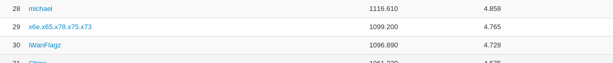
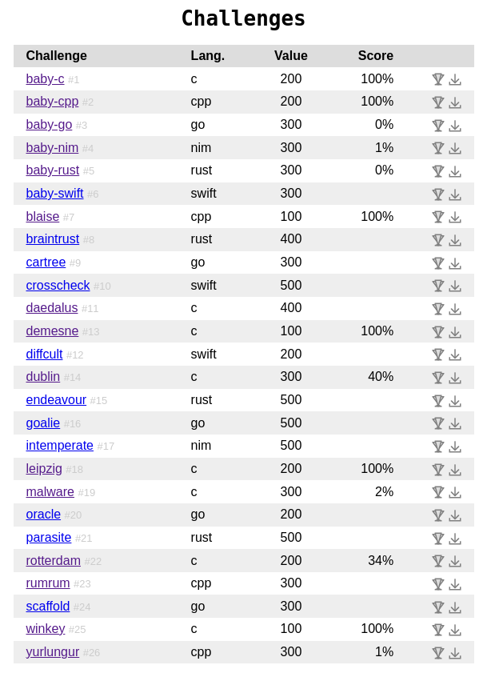

# Decompetition v2.0

The CTF was experimental and created for reverse engineers to take part in and spend time solving challenges. The challenge binaries that needed reversing were written in C, C++, Go, Rust or Swift. I really enjoyed taking part in a different CTF format and thank the organisers for creating fun challenges. I ranked at 29th position.




The goal of the challenges were to produce the source code for a given binary that compiles down directly to the same/similar assembly as the binary. The interface was pretty cool and provided us with the assembly for the binary, our own submitted code and a `diff` between them. The challenges and platform for submission can be found [here](https://decompetition.io/). 

I only tried reversing the C and C++ binaries due my lack of knowledge in other languages, and because I started really late (just 6 hours before the ending). These were my scores on the problems:




I used IDA and Ghidra for decompiling the binaries. I mostly just copy pasted the decompilation and played around the ordering of operations to try and get higher scores by understanding the assembly of the binary on paper. These were my final submissions for the problems:


### baby-c (200pts, 100%)

```c
#include <ctype.h>
#include <stdio.h>

int main () {
  char x = 1;
  int c;

  while (1) {
    c = getc(stdin);

    if (c == -1)
      break;
    
    if (((*__ctype_b_loc())[c] & 0x2000)) { // alternatively use isspace(c)
      putc(c, stdout);
      x = 1;
    }
    else {
      if (x) {
        putc(toupper(c), stdout);
        x = 0;
      }
      else
        putc(tolower(c), stdout);
    }
  }
  return 0;
}
```


### baby-cpp (200pts, 100%)

```cpp
#include <iostream>
#include <cmath>

int main (int argc, char** argv) {
  if (argc != 2) {
    std::cerr << "USAGE: ./grade n" << std::endl;
    std::exit(2);
  }

  int x = std::atoi(argv[1]);
  int y = 1;

  if (x <= 0) {
    std::cerr << "Don't be so negative." << std::endl;
    std::exit(2);
  }

  for (int i = std::sqrt <int> (x); i > 1; --i) {
    if (!(x % i)) {
      y += x / i;
      y += i;
    }
  }

  if (y == x) {
    std::cout << "Perfect!" << std::endl;
    return 0;
  }
  
  std::cout << "Needs improvement." << std::endl;

  return 1;
}
```


### blaise (100pts, 100%)

```cpp
#include <iostream>

int main (int argc, char** argv) {
  int64_t x = 0;
  int64_t y = -1;
  
  if (argc == 3) {
    x = std::atoll(argv[1]);
    y = std::atoll(argv[2]);
  }
  else if (argc == 2)
    y = std::atoll(argv[1]);
  
  if (x < 0 || y < 0 || x > y) {
    std::cerr << "USAGE: ./blaise (range)" << std::endl;
    std::exit(1);
  }

  for (int64_t i = x; i <= y; ++i) {
    int64_t p = 1;
    int64_t q = i;
    int64_t r = 1;

    while (q) {
      std::cout << p << '\t';
      p *= q;
      p /= r;
      --q;
      ++r;
    }

    std::cout << 1 << std::endl;
  }

  return 0;
}
```


### demesne (100pts, 100%)

```c
#include <stdio.h>
#include <string.h>
#include <stdlib.h>

int rrrand (int *p) {
  unsigned int x = 214013 * *p + 2531011;
  *p = x;
  x >>= 16;
  
  if (x > 0x7FFF)
    x -= 0x8000;
  
  return x;
}

int main (int argc, const char **argv) {
  int v, t, r, m, p;
  char s[32];

  if (argc <= 1) {
    puts("Please provide a seed.");
    return -1;
  }
  
  t = strtol(argv[1], 0, 0);
  s[0] = 0;
  s[8] = 0;
  s[16] = 0;
  s[24] = 0;
  
  for (int i = 0; i <= 15; ++i) {
    memset(s, 0, 32);
    
    v = t ^ i;
    r = rrrand(&v);
    m = r % 5 + 5;
    
    for (int j = 0; j < m; ++j) {
      p = rrrand(&v);
      s[j] = p % 26 + 'a';
    }

    strcat(s, ".biz");
    puts(s);
  }

  return 0;
}
```


### dublin (300pts, 40%)

```c
#include <stdio.h>
#include <stdint.h>
#include <stdlib.h>

#define long unsigned long

long insert (int a1, long* a2, long* a3) {
  long* v5 = (long*) malloc(0x10uLL);
  *(long *)v5 = *a3 ^ *a2;
  *(int *)(v5 + 8) = a1;
  if (a2)
    *(long*)a2 ^= *v5 ^ *a3;
  if (a3)
    *(long*)a3 ^= *v5 ^ *a2;
  return v5;
}

long walk(long* a1, const char *a2) {
  long result;
  int v4;
  int v5;
  long v6;
  const char *v7; // [rsp+20h] [rbp-10h]
  long v8; // [rsp+28h] [rbp-8h]

  v6 = 0LL;
  v4 = 1;
  while ( a1 )
  {
    v7 = (const char *)0;
    if ( v4 % 100 <= 9 || v4 % 100 > 20 )
    {
      v5 = (v4 - 1) % 10;
      if ( v5 <= 2 )
        v7 = 3 * v5;
    }
    printf("%5d%s %s is %d\n", v4, v7, a2, *(unsigned int *)(a1 + 8));
    v8 = v6;
    v6 = a1;
    result = *(long *)a1 ^ v8;
    a1 = result;
    ++v4;
  }
  return result;
}

int main (int argc, const char **argv, const char **envp) {
  int v4;
  long* v5 = 0;
  long* v6 = 0;
  long* v7 = 0;
  long* v8 = 0;
  long* v9 = 0;

  while (1) {
    v4 = 0;
    
    if (scanf("%d", &v4) != 1 )
      break;
    
    while (v8 && *(int*)(v8 + 8) > v4) {
      v9 = v8;
      v8 = v7;
      
      if (v7)
        v7 = *(long*)v7 ^ (long)v9;
    }

    while (v8 && *(int*)(v8 + 8) < v4) {
      v7 = v8;
      v8 = v9;
      
      if (v9)
        v9 = *(long*)v9 ^ (long)v7;
    }
    
    if (v8) {
      if (*(int*)(v8 + 8) <= v4)
        v7 = v8;
      if (*(int*)(v8 + 8) > v4)
        v9 = v8;
    }

    v8 = insert((unsigned int)v4, v7, v9);
    
    if (!v7)
      v5 = v8;
    if (!v9)
      v6 = v8;
  }

  if (v5 && v6) {
    puts("Forward:");
    walk(v5, "smallest");
    puts("Reverse:");
    walk(v6, "largest");
  }

  return 0;
}
```


### leipzing (200pts, 100%)

```c
#include <stdio.h>
#include <stdlib.h>
#include <unistd.h>
#include <signal.h>

#define __USE_POSIX
#include <setjmp.h>

sigjmp_buf RESTART;

long int COUNTER = 0;
long int CURRENT = 0;

void dec () {
  ++COUNTER;
  CURRENT /= 2ll;
  siglongjmp(RESTART, 21);
}

void inc () {
  ++COUNTER;
  CURRENT *= 3ll;
  ++CURRENT;
  siglongjmp(RESTART, 21);
}

void chk () {
  if (CURRENT <= 1) {
    printf("%ld", COUNTER);
    fflush(stdout);
    raise(2);
  }
  siglongjmp(RESTART, 22);
}

void pty () {
  if ((CURRENT & 1) != 0)
    siglongjmp(RESTART, 12);
  siglongjmp(RESTART, 10);
}

int main (int argc, char** argv) {
  volatile __pid_t pid;
  int sig;
  
  if (argc != 2) {
    fwrite("Nein!\n", 1, 6, stderr);
    raise(6);
  }

  COUNTER = 0;
  CURRENT = atoi(argv[1]);

  if (CURRENT <= 0) {
    fwrite("Nein...\n", 1, 8, stderr);
    raise(6);
  }

  signal(10, dec);
  signal(12, inc);
  signal(21, chk);
  signal(22, pty);

  pid = getpid();
  sig = sigsetjmp(RESTART, 1);

  if (!sig)
    sig = 21;
  
  kill(pid, sig);

  return 0;
}
```


### rotterdam (200pts, 34%)

```c
#include <fcntl.h>
#include <getopt.h>
#include <unistd.h>
#include <stdio.h>

int slenk (const char* s) {
  int size = 0;

  while (s[size++]);

  return size;
}

int domp (const char* p, const char* q) {
  int x = slenk(p);
  write(2, p, x - 1);
  
  int y = slenk(q);
  write(2, q, y - 1);
  
  return write(2, "\n", 1);
}

char rote (int a1, char a2) {
  int offset;

  if (a2 <= 90 && a2 >= 65)
    offset = 65;
  else if (a2 <= 122 && a2 >= 97)
    offset = 97;
  else
    return a2;
  
  return (a2 - offset + a1) % 26 + offset;
}

void pype (int x, int y) {
  char buf;

  for (long i = read(x, &buf, 1); i; i = read(x, &buf, 1)) {
    buf = rote(y, buf);
    write(1, &buf, 1);
  }
}

int slurp (char *a1) {
  int v4 = 0;
  
  while (*a1 != '\0') {
    int v5 = *(a1++) - 48;
    
    if (!(v5 >= 0 && v5 <= 9))
      return 0;
    else
      v4 = v4 * 10 + v5;
  }

  return v4;
}

int reed (int a1, char* const* a2)
{
  struct option longopts;
  int longind;
  int v4;
  int v5;
  int v6;
  const char *v8;
  int v9;
  long v10;
  int v11;
  const char *v12;
  int v13;
  long v14;
  int v15;
  long v16;
  int v17;
  long v18;
  int v19;

  longopts.name = "encrypt";
  longopts.has_arg = 0;
  longopts.flag = 0LL;
  longopts.val = 101;
  v8 = "decrypt";
  v9 = 0;
  v10 = 0LL;
  v11 = 100;
  v12 = "key";
  v13 = 1;
  v14 = 0LL;
  v15 = 107;
  v16 = 0LL;
  v17 = 0;
  v18 = 0LL;
  v19 = 0;
  v4 = 0;
  v5 = 0;
  while ( 1 )
  {
    v6 = getopt_long(a1, a2, "edk:", &longopts, &longind);
    if ( v6 < 0 )
      break;
    if ( v6 == 107 )
    {
      v5 = slurp(optarg);
      if ( v5 <= 0 || v5 > 25 )
      {
        domp("Invalid key: ", optarg);
LABEL_12:
        _exit(1);
      }
    }
    else
    {
      if ( v6 > 107 )
        goto LABEL_12;
      if ( v6 == 100 )
      {
        v4 = 1;
      }
      else
      {
        if ( v6 != 101 )
          goto LABEL_12;
        v4 = 0;
      }
    }
  }
  if ( !v5 )
  {
    write(2, "Key required.\n", 0xEuLL);
    _exit(1);
  }
  if ( v4 )
    return (unsigned int)(26 - v5);
  return (unsigned int)v5;
}

int main (int argc, const char **argv) {
  unsigned int v4;
  int fd;
  int index = 1;

  if (argc > index) {
    while (argc > index) {
      fd = open(argv[index], 0);
      
      if (fd < 0)
        domp("Could not open file: ", argv[index]);
      else{
        pype(fd, v4);
        close(fd);
      }
      
      ++index;
    }
  }
  else
    pype(0, v4);

  return 0;
}
```


### winkey (100pts, 100%)

```c
#include <stdio.h>
#include <string.h>
#include <stdlib.h>

int ctoi (char x) {
  return x - '0';
}

long check (char* key) {
  char s1[6] = {};
  char s2[4] = {};
  char s3[8] = {};
  char s4[6] = {};

  sscanf(key, "%5c-%3c-%7c-%5c", s1, s2, s3, s4);

  if (strlen(s1) != 5 || strlen(s2) != 3 || strlen(s3) != 7 || strlen(s4) != 5)
    return 0xFFFFFFFFLL;
  
  int p, q;

  sscanf(s1, "%3d%2d", &p, &q);
  if (p <= 0 || p > 366)
    return 0xFFFFFFFFLL;
  
  if (q > 3 && q <= 94)
    return 0xFFFFFFFFLL;
  
  if (strcmp(s2, "OEM"))
    return 0xFFFFFFFFLL;
  
  if (ctoi(s3[0]) || !ctoi(s3[7]) || ctoi(s3[7]) > 8)
    return 0xFFFFFFFFLL;

  int x = ctoi(s3[1]) + ctoi(s3[2]) + ctoi(s3[3]) + ctoi(s3[4]) + ctoi(s3[5]) + ctoi(s3[6]);
  
  if (x % 7)
    return 0xFFFFFFFFLL;
  
  return 0;
}

int main (int argc, char** argv) {
  if (argc <= 1) {
    puts("No key supplied?");
    return -1;
  }
  else {
    if ((unsigned int)check(argv[1]) == -1) {
      puts("Invalid Key :(");
      return -1;
    }
    else {
      puts("Access Granted!");
      return 0;
    }
  }
  
  return 0;
}
```

