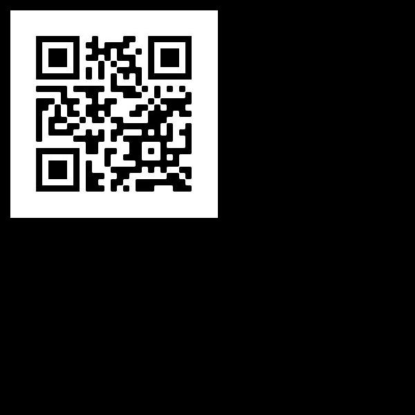

# Engineer CTF

There were many CTFs this weekend - PragyanCTF, UMDCTF, EngineerCTF, FooBarCTF and D^3CTF. We tried taking part in all of them but due to our in-semester assessments, we were under a lot of time pressure to study and focus on university subjects. Nonetheless, we still took part and tried our best for a few hours to grind out some challenges in all of them.

This is about the EngineerCTF challenges - a beginner friendly CTF organised but NIT Surathkal. We ranked #10 on the leaderboard. Could've done much better though but let's just use the ISAs as an excuse :p


Here's our writeups for all the challenges we managed to solve.


## Challenges

### Forensics

- [x] THE CAT KNOWS THE CULPRIT (50)
- [x] I can do this all day (253)
- [x] Father's Day Dilemma (295)
- [x] Heavens and Earth (396)
- [x] Save our Souls! (421)
- [x] I see numbers only (498)
- [ ] Plain Sight (300)
- [ ] What's the fact?! (500)

### Cryptography

- [x] TVA's trap (202)
- [x] Shakespear and Encoding (267)
- [x] Locked Out (308)
- [x] Who is attacking (399)
- [ ] A little bit of XOR (296)
- [ ] climb the HILL (400)
- [ ] SecretNumber (400)
- [ ] The Invincible Device (500)

### MISC

- [x] whatisthis (217)
- [x] What's in this (480)
- [x] Time (275)
- [x] Not really random (495)
- [ ] I am Groot (287)

### RE-pwn

- [x] Packman 1 (100)
- [x] Lights Off (227)
- [x] Lost Password (338)
- [x] Packman 2 (482)
- [x] Hacker Beluga (488)

### OSINT

- [x] Vacation (185)
- [x] Memory Lane (264)
- [x] X and Y (298)
- [x] Broken Pieces (479)
- [ ] Tongues and Relativity (300)
- [ ] Detective (400)
- [ ] Be Like Bill :) (400)

### Web

- [x] You're too blind to see (204)
- [x] Hack the Auth (257)
- [x] Favourite Website (278)

### Sanity

- [x] Join our Discord (50)
- [x] Sanity Check (50)


#### THE CAT KNOWS THE CULPRIT

> Detective Jake Peralta and his partner Charles Boyle are assigned a Grand Larceny case, by their captain Raymond Holt. Upon their arrival to crime scene they find that there are no clues for them to catch the victim, so they leave the crime scene and at the exif exit door they find an image along with a note saying "THE CAT KNOWS THE CULPRIT."

We are provided with a challenge file `clue.jfif`.


Running `exiftool` and looking at _Comment_ or running `strings clue.jfif | grep CTF` gives us our flag.

**Flag:** `CTF{It_1s_D0UG_JUdY}`


#### I can do this all day

> **Tony Stark:** a hacker who's faster than ultron? he could be anywhere GLOBAL. And as this is the center of everything, I'm just a REGULAR guy looking for a needle in the world's biggest haystack.
>
> **World Hub Tech:** How do you find it? <with puzzled EXPRESSION>
>
> **Tony Stark:** pretty simple. you bring a magnet.
>
> Flag format: CTF{...}

We are provided with a zip file that unzip into multiple text files. We can run `grep -r CTF` or `strings * | grep CTF` and find the flag.

**Flag:** `CTF{d3cry471ng_nu3l34r_c0d35}`


#### Father's day dilemma

> Samuel had two children, Dot and Dash, who were extremely fond of numbers. However, they only liked numbers that were greater than 8. For some reason, Dot used to find the number 10 espcially pleasing, it was the same for Dash with the number 12. On Father's day, they came up with a problem for their father to enjoy. Looking at his children, Samuel knew that the problem wouldn't be easy to solve and at the same time would involve numbers.
>
> Can you help Samuel find the hidden message in the file? The answer format is CTF{hidden message}, all caps, no spaces.

We are given two files - `index.html` and `styles.css`. 

```html
<!DOCTYPE html>
<head><meta name="loadbalancer_contact" content="Akshay Revankar <akshayrevankar@nitk.ac.in>">
    <link rel = "stylesheet" href = "styles.css">
    <title>Problem-Problem</title>
</head>
<body>
    <h1>Capture the Flag!</h1>
    <div>
        CTF in computer security is an exercise in which "flags" are secretly hidden in purposefully-vulnerable programs or websites.
          Competitors steal flags either from other competitors or from the organizers.
            Several variations exist, including hiding flags in hardware devices.
            Competitions exist both online and in-person, and can be advanced or entry-level.
          The game is based on the traditional outdoor sport of the same name.
        Flags are often stylised with a combination of letters and numbers such as FYC2022{y0u_h@v3_f0uND_th3_fl@G!}.
    </div>
    <br>
    <div>
        Security CTFs are usually designed to serve as an educational exercise to give participants experience in securing a machine.
          Often, the tasks involve conducting and reacting to the sort of attacks found in the real world.
            Classic CTF activities include reverse-engineering, packet sniffing, protocol analysis, programming, cryptoanalysis among others.
            In an attack/defense style competition, each team is given a machine to defend—typically on an isolated competition network.
            Teams are scored on both their success in defending their machine and on their success in attacking the other team's machines.
        A variation from classic flag-stealing is to "plant" own flags on opponent's machines.
    </div>
    <br>
    <div>
        Hardware challenges usually involve getting an unknown piece of hardware, figuring out how to bypass part of the security measures.
            Examples include using debugging ports or using a side-channel attack.
          Jeopardy-style competitions are closer to programming competitions.
            The teams do not directly attack each other, but rather solve challenges posed by the organizers.
          Time is generally not a factor in scoring these competitions, but "first blood" bonus points are often given to the first solver.
        They are extremely interesting to take part in.
    </div>
    <br>
    <div>
        Wargame is another cybersecurity challange played by many people.
            In hacking, the competitors must exploit a system or application, or gain or prevent access to a computer system.
            A wargame usually involves a CTF logic, based on pentesting, URL attacks, password cracking, scripting, IP address spoofing etc.
            Wargames are also used as a method of cyberwarfare preparedness.
        The NATO Cooperative Cyber Defence Centre of Excellence holds an annual event, Locking Shields, which is a live-fire cyber exercise.
    </div>
    <br>
    <div>
        Encoding techniques are often mixed with questions in such events.
            Encoding is the process of converting data from one form to another.
            We can encode the characters of the alphabet into different forms depending on the technique.
            It is not necessary to encoded characters using characters only, one can always use symbols for the same purpose.
        Who knows, the above text might have something to do with the question in hand.
    </div>
    <br>
    <div>
        There is nothing of much importance here.
          If you are really going to look, look carefully somewhere else within the same file.
            That is not to say, that the text here has no significance, it is indeed important.  
          The hidden text in file is almost there.
          Maybe viewing this file in a different way might help, the sentences do seem oddly structured.
        Best of luck!
    </div>
</body>
```

```css
body{
    background-color: rgb(0, 0, 0);
    font-size: 17px;
    line-height: 23px;
}

body h1{
    color: white;
    text-align: center;
    font-size: 40px;
    font-family: 'Pacifico', cursive;
    padding: 16px;
}

body div{
    font-family: 'Pacifico', cursive;
    text-align: center;
    display: inline-block;
    padding: 10px;
    color: white;
}
```


The hint from the challenge description says "dots" and "dashes", which means the challenge might be related to Morse Code. We can notice that each sentence begins with a variable number of spaces. Considering 10 spaces as a `.` and 12 spaces as `-`, we decrypt the morse code to get the flag. I wrote a small script to convert the spacing into morse code.

```python
with open('index.html') as file:
    content = file.readlines()

l = []

for i in content:
    j = 0
    for c in i:
        if c == ' ':
            j += 1
        else:
            break
    l.append(j)

for i in l:
    if i == 10:
        print('.', end = '')
    elif i == 12:
        print('-', end = '')
    else:
        print(' ', end = '')
```

**Flag:** `CTF{PJCOOL}`


#### Heavens and Earth

> The Heavens and the Earth had finally met, and the Angels were finally going to reveal to mankind their purpose. But oh god! A car in 3rd gear broke the railfence, and hit the train the Angels had arrived on (Wait What!?). The heavens and the earth separated again...
>
> Oh, by the way, I swear I did not hide anything in the image
>
> Enwrap the words inside CTF{} and use underscore as the separator.

We are provided with an image.


There is a zip file hidden in the image which can be figured out using something like `binwalk`. Unzipping the file gives us two images.


There was nothing hidden in the extracted images. If we just take those pixels where the two images are not the same and create a new image, we get a ciphertext.


The challenge statement hints toward railfence cipher and decoding it gives us the flag.

**Flag:** `CTF{J0IN_W3B_CLUB}`


#### Save our Souls!

> WAV is a proud soldier of Bunker 8, responsible for defending the west border of his country. They were attacked by the enemy at night without any prior information and hence were hit hard. WAV immediately tried contacting Headquarters but his message got corrupted in between and now the Headquarters are unable to respond to their soldiers' message.
>
> Help the Headquarters to decipher the message and help their men! The answer format is CTF{message}, the message exactly in the same format as obtained, no spaces.

We are given a `.wav` file. Opening it in `sonic-visualiser` and adding a stereogram layer shows us the flag.


**Flag:** `CTF{WE-NEED-REINFORCEMENTS}`


#### I see numbers only

> Mr. Codeshankar was trying to suspiciously send some data to mafia leader Mr. Pythonarayan. Thankfully he was caught red-handed along with the data he was trying to send. But what was he actually sending though?[Secret Data](https://drive.google.com/file/d/1kL7XxBsk_jKo7B7i8XU1Wj6vdd3RGxu7/view)

We are given a zip file, which gives us five `.xls` files. Upon opening the files and viewing them, it seems like all values are between `0` and `255`, which somewhat indicates that it might correspond to pixel values of an image. Let's create an image from the pixel values! We can use `pandas` to read the `.xls` file and `pillow` to create the image.

```python
import pandas
from PIL import Image

img = Image.new('RGB', (30 * 5, 62))
pixels = img.load()

for file in range(5):
    df = pandas.read_excel(f'{file}.xls')
    array = df.to_numpy().transpose()

    for j in range(30):
        for i in range(62):
            pixels[file * 30 + j, i] = (255 - array[j][i], 0, 0, 255)

img.save('img.jpg')
```

This gives us our flag.


**Flag:** `CTF{1T5ALL1NNUMBER5}`


#### TVA's Trap

> Nadia is caught in a time loop as the guest of honor at a seemingly inescapable party one night in New York City. In order to get out she has to decode the following text message she gets. The TVA being noobs don’t understand that just encoding is not exactly secure. Can you get the flag and help Nadia get to base ?Flag format: CTF{...}
>
> [View Hint](javascript:;)
>
> [View Hint](javascript:;)
>
> [ 8-6-4.txt](https://ectf.nitk.ac.in/files/06c2d886f810b26119aa9e7daf02c98a/8-6-4.txt?token=eyJ1c2VyX2lkIjoyMjksInRlYW1faWQiOjEwOCwiZmlsZV9pZCI6OH0.YiZiwg.omZ3FASqhzKweNRxuM10IxoQ0jI)

We are provided with a text file.

```


               Vm0weE5GbFdWWGhUV                                                          0doWFYwZG9WVll3            WkRSWFJ
               sbD           NZV                    VZ      PV                            2xa                       c1N   sWl
               dSM           1JQ                     Vj    J4                             YWR                      WRn    NhR
               mRX           TTF                      Ke  Vd                              WZD                     RZV     1JX
               Um5KYVJtaG9UVmhCZ                       Wxk                                V1VrZFRiVlpIV2t        oV2      FGS
               nNj           Rmh                     VV   kV                              KTF         lqR       mFj       bGt
               6YU           ZST                    lZ     YQ                             lpW         VzE      wVj        FkS
               FNr           bFJ                   he       mx                            hVm         pOb     2FG         UnN
               XbUZUUjFaSVpFWmFU                                                          bFpZUWxsV1Z6QXh     VakpHU0ZadVJsSldSM
                                                                                                                          001
```

The text looks like it says "8 x 64", which could probably mean that the flag is encoded 8 times with base 64 encoding. Decrypting the same yields the flag.

**Flag:** `CTF{w3c-ctf-z0z2_3ry9t0}`


#### Shakespear and Encoding

> Brutus planned to kill Caesar. However, he hesitated, for he was afraid that Caesar would say `01000100 01010101 01000111 01111100 01011010 00110001 01010110 00101110 01110101 01110000 01110000 00101110 01000011 01110011 01110110 00110010 01110110 01010100 01111110`. What did he say?

The message looks like it is the binary representation of the flag that is probably encrypted using caesar cipher. Converting the binary numbers into characters, we get: `DUG|Z1V.upp.Csv2vT~`. We know that the flag begins with `CTF` and the characters `DUG` are just one character ahead. Subtracting 1 from each character gives us the flag.

**Flag:** `CTF{Y0U-too-Bru1uS}`


#### Locked Out

> Coulson is locked out of Ragtag. Can you help him get back to BASE by finding the flag. He found this image in BIN.Flag format: CTF{...}
>
> [ flag.png](https://ectf.nitk.ac.in/files/b8c4dc3f48419910234bf325eb2da638/flag.png?token=eyJ1c2VyX2lkIjoyMjksInRlYW1faWQiOjEwOCwiZmlsZV9pZCI6Nn0.Yib6AA.G_h6hdpeiCMZDEvDEH8tysBhgO0)

We are provided with a png file that contains a QR-code. We can use `zbarimg flag.png` to figure out what the QR code is about. The output is as follows:

```
QR-Code:aHR0cHM6Ly9kcml2ZS5nb29nbGUuY29tL2ZpbGUvZC8xRDBtTkp0YThkRFRDY2VCREkycG9YS3AyYlJhMEcya0Ivdmlldz91c3A9c2hhcmluZw==
```

Decoding the base64 string, we get a link `https://drive.google.com/file/d/1D0mNJta8dDTCceBDI2poXKp2bRa0G2kB/view?usp=sharing`. Visiting the drive link gives us a file containing numbers in binary.

```
01100011 00100000 00111101 00100000 00110111 00110100 00110010 00110100 00110110 00111001 00111001 00110010 00110011 00111000 00110110 00110100 00110110 00111001 00110101 00110101 00110010 00110000 00110001 00110011 00110111 00110000 00110110 00111001 00110101 00110010 00110001 00110011 00110100 00110011 00110001 00111001 00111000 00110111 00110110 00110111 00110001 00110001 00110100 00110010 00111000 00110001 00110010 00110010 00110011 00110000 00110001 00110100 00110011 00110011 00110000 00110110 00111000 00110110 00110111 00110101 00110110 00110000 00110100 00111000 00110010 00111001 00110011 00110011 00110000 00110101 00110110 00110010 00110110 00110110 00110010 00111001 00111001 00110011 00111000 00110000 00111001 00110010 00110110 00110110 00111000 00110100 00110110 00111000 00111001 00110001 00110010 00111001 00110011 00110001 00110101 00110100 00111001 00111000 00110011 00110110 00110011 00110100 00110011 00111001 00110000 00110100 00110110 00111001 00110010 00110010 00110001 00110100 00110011 00111001 00110111 00111001 00110010 00110110 00111001 00110011 00111000 00110110 00110001 00111000 00110000 00110100 00110111 00110111 00110010 00110011 00110101 00110110 00110111 00110010 00110111 00110001 00110101 00110100 00110010 00111000 00110011 00110011 00110111 00111001 00110001 00111001 00110101 00110111 00110011 00111000 00111000 00110101 00110111 00110100 00110001 00111000 00110101 00110101 00001010 01101110 00100000 00111101 00100000 00110001 00110100 00110111 00111000 00110011 00110111 00110000 00110011 00110100 00110000 00110011 00110110 00110101 00110111 00110110 00110111 00110001 00111000 00111000 00110010 00110110 00110000 00110000 00110110 00110000 00110000 00110100 00110100 00110110 00110000 00110110 00110001 00111000 00111000 00110110 00110001 00110101 00110110 00110010 00110011 00110101 00110101 00110011 00110001 00110011 00110010 00110101 00111000 00110101 00110010 00110001 00111001 00110100 00111000 00110000 00110000 00110010 00111000 00110111 00110000 00110000 00110001 00110111 00111000 00111000 00110111 00110110 00110101 00110010 00110010 00110001 00110000 00111000 00110100 00110001 00110000 00110111 00110110 00110011 00110001 00110001 00110101 00110011 00110011 00110011 00110000 00110110 00110101 00111000 00110011 00110010 00110101 00111000 00110011 00110000 00110100 00110100 00110011 00110001 00110011 00110010 00110001 00110110 00110100 00111001 00110111 00110001 00110000 00111000 00110100 00110001 00110011 00110111 00110100 00110110 00110010 00110000 00110100 00110110 00110110 00110000 00110111 00110100 00110101 00111000 00110000 00110001 00111001 00110111 00110111 00110101 00111000 00110101 00110001 00111001 00110101 00110010 00111001 00110011 00110011 00110010 00110101 00110100 00111001 00110100 00110001 00110101 00110110 00111000 00110000 00110101 00110110 00111000 00111001 00111001 00001010 01100101 00100000 00111101 00100000 00110000 01111000 00110001 00110000 00110000 00110000 00110001
```

Converting the binary to characters gives us:

```
c = 7424699238646955201370695213431987671142812230143306867560482933056266299380926684689129315498363439046922143979269386180477235672715428337919573885741855
n = 14783703403657671882600600446061886156235531325852194800287001788765221084107631153330658325830443132164971084137462046607458019775851952933254941568056899
e = 0x10001
```

This is related to standard RSA encryption. The prime factorization of the modulus `n` can be found on [Factor DB](http://factordb.com). As we know the factors, we can easily break the encryption using the standard decryption technique or even run [RsaCtfTool](https://github.com/Ganapati/RsaCtfTool) with attack as `factordb` and solve the challenge.

```python
import os
os.system(f'rsatool -n {n} -e {e} --uncipher {c} --attack factordb')
```

```python
#!/usr/bin/python3

from Crypto.Util.number import long_to_bytes

c = 7424699238646955201370695213431987671142812230143306867560482933056266299380926684689129315498363439046922143979269386180477235672715428337919573885741855
n = 14783703403657671882600600446061886156235531325852194800287001788765221084107631153330658325830443132164971084137462046607458019775851952933254941568056899
e = 0x10001

p = 121588253559534573498320028934517990374721243335397811413129137253981502291629
q = 121588253559534573498320028934517990374721243335397811413129137253981502291631

phi = (p - 1) * (q - 1)
d = pow(e, -1, phi)
m = pow(c, d, n)

print(long_to_bytes(m).decode())
```

**Flag:** `CTF{r0n_4D1_130N4rd}`


#### Who is attacking

> the ~~international~~ french ~~space~~ water station was broadcasting a secret [message](https://drive.google.com/file/d/1ZFc7sx_bNt3vJ_8KZW9n_M-bysNC2SsC/view?usp=sharing) to its headquarters. since the message was being broadcasted very Slowly, someone Scanned the message using their very old TeleVision but all they could hear were some distorted noises.....
>
> Submit after enclosing inside CTF{} and separate the words with an underscore ( _ )

We are provided with an audio file. The challenge hints towards `SSTV` communication - a mode to communicate by converting images/videos into sounds. Using an SSTV decoder like `Robot36`, we can retrieve the image.


These are Navy Signal Flags. Using an online decoder link [this](https://www.dcode.fr/maritime-signals-code) one, we find the following text: `UZ1G4 1N SL74VF1FY`. This is a Vigenere cipher which can be decryted using the key `SSTV`.

**Flag:** `CTF{CH1N4_1S_AT74CK1NG}`


#### whatisthis

> Intelligence has found same weird material from Mr. Codeshankar (yes,him again). So it is your task now to find out whats contained in it. The link is [here](https://drive.google.com/file/d/1fFAexozA987VAgDI2AnOcr4ei2TLUO6Q/view?usp=sharing)

We are provided with a zip archive, unzipping which gives us multiple files and folders. We don't know how the challenge was intended to be solved but doing `grep -r CTF` found the flag :)

**Flag:** `CTF{D0cker_ent3r5_the_p4rty}`


#### Time

> Foxfire is currently chilling out in Mbabane. She did an awesome google search to find out something special. We've got hold of the search url. Now at what time did she search?
>
> Flag format: CTF{yyyy-mm-dd-HH}

We are provided with a text file which contains a link related to a Google search. Since we are required to find the time the search was made, we can take a look at the query parameters and find the timestamp, convert it to human readable form and get ourselves a flag.

```
https://www.google.com/search?q=ectf+nitk&sxsrf=APq-WBucQC97ty5WJujCZdH3xgNKkG4DcA%3A1646337798523&source=hp&ei=Bh8hYqykHc64mAXkkoTgCg&iflsig=AHkkrS4AAAAAYiEtFvYpL6BEakDJQ-fOP-eWa7kvFyAO&ved=0ahUKEwisv6Kd3qr2AhVOHKYKHWQJAawQ4dUDCAg&uact=5&oq=ectf+nitk&gs_lcp=Cgdnd3Mtd2l6EAMyBAgjECcyBAgjECc6BAgAEEM6CwguEMcBEK8BEJECOgoILhDHARCvARBDOgUIABCRAjoLCAAQgAQQsQMQgwE6CAgAEIAEELEDOgcIABCxAxBDOhAIABCABBCHAhCxAxCDARAUOgUIABCABDoGCAAQFhAeOggIABAWEAoQHlAAWMMKYPUNaABwAHgAgAHcAYgBqgySAQUwLjcuMpgBAKABAQ&sclient=gws-wiz
```

The time stamp is `1646337798523`. That is, the search was made on `2022-03-03 at 20:03:18 PM`.

**Flag: **`CTF{2022-03-03-20}`


#### Not really random

> Do you really think random numbers generated by computers are random?

We are provided with two text files.

```python
import random 
import time 
import hashlib

seed = round(time.time())

random.seed(seed, version=2)

while True:
    rand = random.random()
    has = hashlib.sha256(str(rand).encode()).hexdigest()
    flag = f"CTF{{{has}}}"
    if "7a2" in has:
        with open("./flag", "w") as f:
            f.write(flag)
            break
    else:
        print(f"Bad random value: {rand}")
```

```
Bad random value: 0.33567959567961436
Bad random value: 0.8913897703358419
Bad random value: 0.3032054069265432
Bad random value: 0.6860829464688437
Bad random value: 0.2658087107328536
Bad random value: 0.8903005048882441
Bad random value: 0.914630909612433
Bad random value: 0.9688578899818961
Bad random value: 0.7925090397955323
Bad random value: 0.10136501216336935
Bad random value: 0.568451491382639
Bad random value: 0.16898065821921437
Bad random value: 0.5541712073794856
Bad random value: 0.029926361216790154
Bad random value: 0.18218590474521223
Bad random value: 0.49713845657579536
Bad random value: 0.7631162105077507
Bad random value: 0.7386939443532723
Bad random value: 0.5815609491717452
Bad random value: 0.5905894610211082
Bad random value: 0.09018146469820387
Flag created 🎉
```

As can be seen, the random number generation isn't secure because the seed is provided as an integer number. We can simulate going back in time by changing the seed backwards and noticing if the generated hashes match that of logged `Bad random values`. Here's the script to find the right flag:

```python
import random
import time
import hashlib

t = round(time.time())

l = [
    hashlib.sha256(str(0.33567959567961436).encode()).hexdigest(),
    hashlib.sha256(str(0.8913897703358419).encode()).hexdigest(),
    hashlib.sha256(str(0.3032054069265432).encode()).hexdigest(),
    hashlib.sha256(str(0.6860829464688437).encode()).hexdigest(),
    hashlib.sha256(str(0.2658087107328536).encode()).hexdigest(),
    hashlib.sha256(str(0.8903005048882441).encode()).hexdigest(),
    hashlib.sha256(str(0.914630909612433).encode()).hexdigest(),
    hashlib.sha256(str(0.9688578899818961).encode()).hexdigest(),
    hashlib.sha256(str(0.7925090397955323).encode()).hexdigest(),
    hashlib.sha256(str(0.10136501216336935).encode()).hexdigest(),
    hashlib.sha256(str(0.568451491382639).encode()).hexdigest(),
    hashlib.sha256(str(0.16898065821921437).encode()).hexdigest(),
    hashlib.sha256(str(0.5541712073794856).encode()).hexdigest(),
    hashlib.sha256(str(0.029926361216790154).encode()).hexdigest(),
    hashlib.sha256(str(0.18218590474521223).encode()).hexdigest(),
    hashlib.sha256(str(0.49713845657579536).encode()).hexdigest(),
    hashlib.sha256(str(0.7631162105077507).encode()).hexdigest(),
    hashlib.sha256(str(0.7386939443532723).encode()).hexdigest(),
    hashlib.sha256(str(0.5815609491717452).encode()).hexdigest(),
    hashlib.sha256(str(0.5905894610211082).encode()).hexdigest(),
    hashlib.sha256(str(0.09018146469820387).encode()).hexdigest(),
]

while True:
    random.seed(t, version = 2)
    bad = False

    for i in range(21):
        rand = random.random()
        has = hashlib.sha256(str(rand).encode()).hexdigest()
        if has != l[i]:
            bad = True
            break
    
    if bad:
        t -= 1
        continue

    rand = random.random()
    has = hashlib.sha256(str(rand).encode()).hexdigest()
    flag = f'CTF{{{has}}}'

    print(t)
    print(flag)
    break
```

**Flag:** `CTF{a13a806d175841731b24a01e9af240bc81750967542550a4b3bb77a29a9d291b}`


#### What's in this

> Intelligence has found some wierd material from Mr. Codeshankar(yes, it's him yet again. Sorry, running out of names). Well, Codeshankar isn't giving away the secret so easily this time.[Wierd material](https://drive.google.com/file/d/1I-DVkxxdd9hBNQWptCR4Tr_Ju-k_AwoS/view?usp=sharing)

We are provided with a zip archive. Extracting the archive recursively using `binwalk`, we find a few files and folders provided. We do not know the intended solution but just doing `grep -r CTF` finds us the flag.

**Flag:** `CTF{1t5_all_1n_l4yers}`


#### Packman 1

> Packman found this binary pellet but he is "sus" about this. Help the Packman "unpack" the situation. The link is [here](https://drive.google.com/file/d/1xhFx0atxYlyEHYfLeZlYqfL8hRRbbk1U/view)

We are provided with a `u-boot legacy uImage` file. We can use something like `binwalk` to extract all required files but that's not necessary for this challenge. Simply doing `string * | grep CTF` gives us the flag.

**Flag:** `CTF{ee_lo_p3ll3t_kh4o}`


#### Lights Off

> Jett has forgotten her password for her bedroom lights. She isn't able to turn off the lights without them. Help her to find out what is the password by reverse engineering the given algorithm. Login to the server to enter the password so jett can turn off the lights.
>
> ```
> nc 40.114.6.167 5555
> ```

We are provided with a challenge file.

```c
int magic(char arr[], int a)
{
    int i;
    int k = strlen(arr);
    int flag = 0;
    a = 25;
    for (int i = 0; i < k / 2; i++)
    {
        if ((i % 2 ? arr[i] + a : arr[i] - a) != ((k - 1) % 2 ? arr[k - i - 1] + a : arr[k - i - 1] - a))
        {
            return 0;
        }
    }
    if (k % 2 == 1 && a < 24 && k == 4)
    {
        return 0;
    }

    return 1;
}
```

The function is fairly easy to reverse. It is adding or subtracting the value `25` based on the parity of positions and doing comparisons. At the time of writing this, the challenge servers have been taken offline and retriving the flag is not possible.


#### Lost Password

> Bob lost his super-secret password to access his coolcoin wallet. Bob knows the password is somewhere in the main file! Help bob retrieve the password so he can spend his coolcoin!

We are provided with a challenge binary. Using `strings` on the binary gives us the first half of the flag. Opening up the binary in IDA or Ghidra gives us the second part of the flag.

Strings output:

```
...
mingw.exe
WRONG!
What you doin?? Need Argument
:*3$"
CTF{HaC
GCC: (Ubuntu 9.3.0-17ubuntu1~20.04) 9.3.0
crtstuff.c
...
```

IDA pseudocode:

```c
int __cdecl main(int argc, const char **argv, const char **envp)
{
  int i; // [rsp+1Ch] [rbp-34h]
  int v5[10]; // [rsp+20h] [rbp-30h]
  unsigned __int64 v6; // [rsp+48h] [rbp-8h]

  v6 = __readfsqword(0x28u);
  v5[0] = 158;
  v5[1] = 134;
  v5[2] = 165;
  v5[3] = 178;
  v5[4] = 160;
  v5[5] = 180;
  v5[6] = 161;
  v5[7] = 208;
  if ( argc == 2 )
  {
    printf("Checking %s\n", argv[1]);
    if ( !strcmp(argv[1], "mingw.exe") )
    {
      for ( i = 0; i <= 7; ++i )
        putchar(v5[i] - 83);
    }
    else
    {
      puts("WRONG!");
    }
  }
  else
  {
    puts("What you doin?? Need Argument");
  }
  return 0;
}
```

Providing `mingw.exe` as parameter to the binary gives us the remaining part of the flag: `K3R_MaN}`

**Flag:** `CTF{HaCK3R_MaN}`


#### Packman 2

> Packman found the sus thing in the pellet. Now help him find the "password" for the "root" of this problem. Flag format: CTF{password} Link is [here](https://drive.google.com/file/d/1xhFx0atxYlyEHYfLeZlYqfL8hRRbbk1U/view)

We are provided the same file as the **Packman 1** challenge. Unzipping the file gives us a linux file system. Since we are asked to find the password for the root user, we take a look at `/etc/shadow` to find password hashes that might be present. In this case, we do find a password entry for the root user `root:rJ0FHsG0ZbyZo:10933:0:99999:7:::`.

The challenge requires us to brute force the hash `rJ0FHsG0ZbyZo` to find the flag. This is a Unix-5 (DES) hash. We can using something like John-the-Jumbo or Hashcat to perform the bruteforcing.

```bash
echo rJ0FHsG0ZbyZo > hash
john hash # takes about 10-15 mins
john hash --show
```

**Flag:** `CTF{ismart12}`


#### Hecker Beluga

> Skittle has a password validator but it is easily reversible. His friend Beluga noticed this, help beluga to show his hecker skills by getting the password.
>
> Flag format: CTF{password}

We are provided with a file that supposedly validates Skittle's password.

```python
def ValidatePassword(password):
    valid = False
    print("Attempting to validate password...")

    if(len(password[::-2]) != 8):
        print("Nah, you're not even close!!")
        return False

    pwlen = len(password)
    chunk1 = 'key'.join([chr(0x98 - ord(password[c])) 
                            for c in range(0, int(pwlen / 2))])
    print("".join(c for c in chunk1[::4]))
    if "".join([c for c in chunk1[::4]]) != '&e"3&Ew*':
        print("Seems you're a terrible reverse engineer, come back after gaining some skills!")
        return False

    chunk2 = [ord(c) - 0x1F if ord(c) > 0x60
                  else (ord(c) + 0x1F if ord(c) > 0x40 else ord(c))
                  for c in password[int(pwlen / 2) : int(2 * pwlen / 2)]]
    rand = [54, -45, 9, 25, -42, -25, 31, -79]
    for i in range(0, len(chunk2)):
        if(0 if i == len(chunk2) - 1 else chunk2[i + 1]) != chunk2[i] + rand[i]:
            print("You're not a real hecker, try again! " + str(i))
            return False
        
    print("Password accepted!")
    return True

print("\n************** Password Validator ***************")
print("Please enter password")
while True:
    if  ValidatePassword(input()):
        exit()
    else:
        print("Try again!")
```

Firstly, let's realise that the length of the password is 16. It looks like it could also be 15 characters because that passes the first check as well but then we can easily figure out that `chunk1` has length 8 and so does `chunk2`.

Let's try reversing `chunk1`. We can see that the first `8` characters of the password are joined together with `key` as separator after subtracting their ascii value from `0x98`. However, in the next if statement every 4th character is considered i.e. the original 8 characters of password subtracted from `0x98`. We can simply perform `0x98 - ascii_value` to retrieve the original 8 characters, where `ascii_value` is the ascii values of the characters `&e"3&Ew*`. This gives us the first 8 characters: `r3verS!n`.

Now, onto reversing `chunk2`. During the CTF, I just figured out the values manually by using pen and paper but you can also use the Z3 SAT Solver to find the password automatically. Here is my script to find the values of `chunk2`.

```python
from z3 import *

r0 = Int('r0')
r1 = Int('r1')
r2 = Int('r2')
r3 = Int('r3')
r4 = Int('r4')
r5 = Int('r5')
r6 = Int('r6')
r7 = Int('r7')

s0 = Int('s0')
s1 = Int('s1')
s2 = Int('s2')
s3 = Int('s3')
s4 = Int('s4')
s5 = Int('s5')
s6 = Int('s6')
s7 = Int('s7')

s = Solver()

s.add(r0 == 54)
s.add(r1 == -45)
s.add(r2 == 9)
s.add(r3 == 25)
s.add(r4 == -42)
s.add(r5 == -25)
s.add(r6 == 31)
s.add(r7 == -79)

s.add(s0 + r0 == s1)
s.add(s1 + r1 == s2)
s.add(s2 + r2 == s3)
s.add(s3 + r3 == s4)
s.add(s4 + r4 == s5)
s.add(s5 + r5 == s6)
s.add(s6 + r6 == s7)
s.add(s7 + r7 == 0)

print(s.check())
print(s.model())
```

Once we have the values, we can reverse the offset addition and subtraction part that is performed on `chunk2` to retrieve the original last 8 characters.

```python
s = [0] * 8

s[7] = 79
s[6] = 48
s[5] = 73
s[4] = 115
s[3] = 90
s[2] = 81
s[1] = 126
s[0] = 72

for i in s:
    if i <= 0x40:
        pass
    elif i <= 0x5f:
        i += 0x1f
    else:
        i -= 0x1f
    print(chr(i), end = '')
```

**Flag:** `CTF{r3verS!n6g_pyTh0n}`


#### Vacation

> People even try to turn their pets into celebrities, it gets annoying quite fast. That reminds me, have you come across @tig3r_and_b3ar ? Apparently their owner is a photographer, I haven’t contacted her though.
>
> [View Hint](javascript:;)

Using `sherlock`, we can find an Instagram profile by the same name as in the description. Looking at their followers, we see a person who seems to be the owner like the challenge statement describes. The link to the profile is [this](https://www.instagram.com/ashlynbardot/). The bio section of this person says:

> Ashlyn Bardot
>
> Photographer
> Contact me at ashlyn_bardot@yahoo.com

We send an email to the one provided and we get back an auto-response saying:

> Hello!
>
> I'm currently on vacation, so I can't really help at the moment.
>
> I wonder if this is what you were looking for when you contacted me: 
>
> CTF{f0und_th3_fl@g}
>
> Yours truly,
>
> Ashlyn Bardot.

**Flag:** `CTF{f0und_th3_fl@g}`


#### Memory Lane

> I miss way back when everything was simpler. Well, except for the time I almost gave away a secret on my YouTube channel. I was able to rectify it quickly, hopefully without anyone noticing... http://shorturl.at/grCQS

The provided URL redirects us to a YouTube channel. Visiting the `About` section of the channel, we find a flag but it's a fake flag. The descrition and challenge name hint us towards the Wayback Machine - a site that maintains an archive of the internet by saving its snapshots. We can use other alternatives to the Wayback Machine too. Visiting the snapshot of the about page gives us the flag.

[This](https://web.archive.org/web/20220119102148/https://www.youtube.com/channel/UCI_q2zwb5xxgBW0TzfJtw7g/about) is the snapshot we visit.

**Flag:** `CTF{th3_g00d_0ld_t1mes}`


#### X and Y

> *
> Technology* and *daily services* built out of it daily evolved because it was *secure* for users.
>
> 127.0.0.1 <--> X <--> 49960de5880e8c687434170f6476605b8fe4aeb9a28632c7995cf3ba831d9763
>
> 54.239.28.85 <--> Y <--> 77589d4e82c0d5dd2e1cc40e6375b1b11fadaaa2fb9b01c828739e8337292069
>
> Flag format: CTF{ Y }

`127.0.0.1` is also referred to as `localhost`. Taking the sha256 hash of `localhost` matches the one present in the description.

So, we can do a reverse IP lookup and find that `54.239.28.85` is registered with `amazon.com`.

**Flag: **`CTF{amazon}`


#### Broken Pieces

> Oh no! I broke this framed image. Unless you can magically put it together, I’m in big trouble.
> Flag format: CTF{...}
>
> [ pieces.zip](https://ectf.nitk.ac.in/files/cb36928aaadb29749b7c835bd0e2fa21/pieces.zip?token=eyJ1c2VyX2lkIjoyMjksInRlYW1faWQiOjEwOCwiZmlsZV9pZCI6MTV9.YieJHQ.Z08e09yIxu58i12ELsliYMsKjcQ)

We are provided with a zip archive that contains many images that seem to be parts of the flag. Observing their naming structure, we can combine them all into one big image using something like `Pillow`. Here's my script to combine the images.

```python
from PIL import Image

new_img = Image.new('RGB', (600, 600))
new_pixels = new_img.load()

for i in range(1, 21):
    for j in range(1, 21):
        x = '{0:02}'.format(i)
        y = '{0:02}'.format(j)
        s = x + y + '.jpg'

        img = Image.open(s)
        pixels = img.load()
        w, h = img.size
        
        for p in range(w):
            for q in range(h):
                new_pixels[15 * j + p, 15 * i + q] = pixels[p, q]

new_img.save('new.jpg')
```

We end up with this image, which is not the flag as expected. Let's take a look at what the QR code is using `zbarimg new.jpg`.



The output is `QR-Code:th@nk2_f0r_h3lping`.

**Flag:** `CTF{th@nk2_f0r_h3lping}`


#### You're too blind to see

> Army pilot Stevens, recruited for a top-secret operation, finds himself in the body of an unknown man. He keeps finding himself in a 1990s music video and does not know how to get out. Help him find the flag that will help him get out of the loop. [Website link](https://chinmayasharma-hue.github.io/CTF2022.gitbhub.io/)

Visiting the provided link, we are greeted with a login screen. Taking a look at the HTML response, we can find a base64 comment `bmV2ZXJnb25uYWxldHlvdWRvd24wMTIyQGdtYWlsLmNvbSBrbm93cyB0aGUgcGFzc3dvcmQ`. Decoding it results in:

```
nevergonnaletyoudown0122@gmail.com knows the password
```

Sending an email, we receive an automated response that says `never_gonna_say_goodbye`. Further, analysing the HTML source reveals that the expected username is `Rick Astley`. Logging in with the details, we are redirected to a site that gives us the flag.

**Flag:** `CTF{W3r3_N0_57r4N63r5_70_10V3}`


#### Hack the Auth

> Alex's friend sent him a website that stores the data of many Billionaires. But he doesn't know the username and password to log in. Help him win the bounty prize by getting the credentials. [Website link](https://wec-ctf-2022-web.herokuapp.com/q1)
>
> [View Hint](javascript:;)

Visiting the provided link, we get a login page. The source code has a user validation function.

```javascript
var userAuthentication = function() {
    var username = document.getElementsByName('username')[0].value;
    var password = document.getElementsByName('password')[0].value;
    var hash = sha256(password);
    if(hash === "dfbec338b51c5643ba481625e1075236d3a9a07fbd6393763f253e99024958a4" && username === "admin") {
        window.location = "./q1?username=admin&password=" + password;
    } else {
        alert("Invalid username or password");
    }
};
```

We can try cracking the hash with common wordlists using `hashcat -m 1400 -a 0 dfbec338b51c5643ba481625e1075236d3a9a07fbd6393763f253e99024958a4 ./wordlist.txt` or use a reverse hash lookup online (like [this](https://crackstation.net/)). We find out that the password is `Thisismypassword`. Logging in with the credentials `admin` and `Thisismypassword`, we are redirected to another page. The cookies contain the flag.

**Flag:** `CTF{SHA256_AND_WEB}`


#### Favourite Website

> After a long time, Alex tries to visit his favorite website. But nobody thought he would become very unlucky. Visit the [website](https://wec-ctf-2022-web.herokuapp.com/q2) and help him get the flag.

Visiting the website, we see the following response.

```
You can get the flag when you visit our website for 12893422th time. Bad Luck!!

You have used our website for 0 times
```

Refreshing the page causes the the count to update to 1 time. The state is stored using a base64 cookie. There are many other cookies that try to hide which cookie maintains the state but we can easily figure out the correct one `gatj`.

 Decoding the cookies gives us:

```
still cannot solve this task?times=00000000&id=9bb36725-2c5b-4197-9550-263b63c97bfa7
```

Let's change the `times` attribute to `12893422`, base64 encode it and send a request again, to get the flag.


#### Join our Discord

> Join our discord for announcements and Updates! https://discord.gg/WByYbFmE

We join the discord server and find the flag in `#you-should-come-here`.

**Flag:** `CTF{Welcome_to_ectf22}`


#### Sanity Check

> Welcome to eCTF 2022.
>
> Here's you flag: CTF{Welcome}

**Flag:** `CTF{Welcome}`
