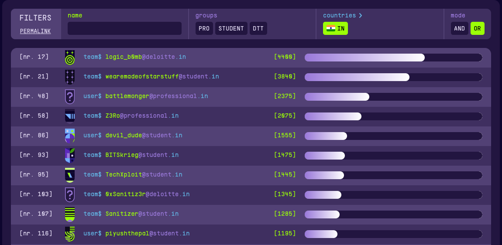

# Hacky Holidays 2022 - Unlock the City

Hacky Holidays - Unlock the City, was an 18-day long cybersecurity contest organised by Deloitte. Challenges in Hacky Harbour and Science Park were released during the start of the CTF, and Commercial Avenue followed by Downtown were released after a span of 7 days each. The event witnessed about 1200 active players grinding it out to make it to the top!

The challenge categories featured Networking, Reversing, Binary exploitation, Steganography, Scripting, OSINT, Web, Hardware, Cryptography, Cloud, Privilege Escalation, Forensics, Quantum and Miscellaneous.

I would like to thank and appreciate the Deloitte team for organizing a wonderful event with many enjoyable challenges and to provide a lot of content to learn from and improve. My team, wearemadeofstarstuff (taken from a famous Carl Sagan [quote](https://www.google.com/search?q=carl+sagan+famous+starstuff+quote)), consisted of 3 members and we tried our best at all challenges that were made available. We ended at a rank of 21 globally among all team categories (Professional, Deloitte and Student) and 1 among student teams of India.

Congratulations to the winners - top 3 teams professional and top 3 student teams. Great work!

You can find writeups of the challenges here. Challenge files have not been uploaded due to file sizes but if you'd like to work on them, feel free to contact me personally.
