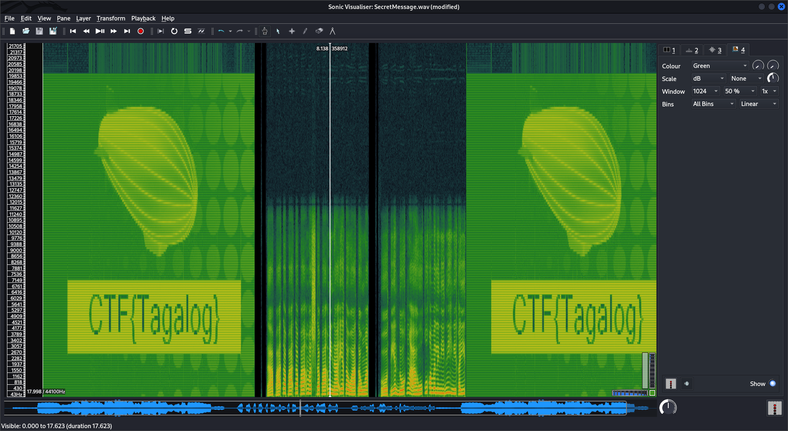

# [Easy] Audible Transmission (100 points)

> We intercepted an audio transmission the AI was sending to Rizal, however we have not been able to identify the contents of the message, are you able to help us out?
>
> Author information: This challenge is developed by [EFernandezAlija@DeloitteES](https://es.linkedin.com/in/efernandezalija).

A challenge file called `SecretMessage.wav` has been provided.

### For your eyes only [25 points]

> Are you able to see what was being sent?

Let's try to look at the file metadata and exif info to see if anything interesting is present.

```bash
┌──(arrow) 💀 [~/Desktop/ctf/hackazon-deloitte-2022/audible-transmission] 
└─$ file SecretMessage.wav 
SecretMessage.wav: RIFF (little-endian) data, WAVE audio, Microsoft PCM, 16 bit, stereo 44100 Hz

┌──(arrow) 💀 [~/Desktop/ctf/hackazon-deloitte-2022/audible-transmission] 
└─$ exiftool SecretMessage.wav 
ExifTool Version Number         : 12.40
File Name                       : SecretMessage.wav
Directory                       : .
File Size                       : 3.0 MiB
File Modification Date/Time     : 2022:07:04 16:58:03+05:30
File Access Date/Time           : 2022:07:27 14:10:47+05:30
File Inode Change Date/Time     : 2022:07:27 14:10:47+05:30
File Permissions                : -rw-r--r--
File Type                       : WAV
File Type Extension             : wav
MIME Type                       : audio/x-wav
Encoding                        : Microsoft PCM
Num Channels                    : 2
Sample Rate                     : 44100
Avg Bytes Per Sec               : 176400
Bits Per Sample                 : 16
Software                        : Lavf59.16.100
Duration                        : 18.00 s
```

Nothing interesting...

Listening to the file, we can notice that there are some very weird sounds that are being played. Let's try to "see", as per the challenge statement, the audio file by opening it up with `sonic-visualiser SecretMessage.wav` and applying a Spectogram layer.



**Flag:** `CTF{Tagalog}`.

### Code [75 points]

> We think it may have something to do with a code, can you find it?

When you hear the audio, there are three parts that sound different (also visible in the screenshot above). The first and third part have the flag but the second part sounds like an automated voice someone speaking. However, it sounds _really_ weird to be considered a normal language. The audio is actually reversed due to which it sounds the way it does.

We can reverse the audio back to normal using a tool called **Audacity** - use `Audacity > Effect > Reverse`. Also, searching for `Tagalog` on Google points us to the `Filipino` language. We can use Google Translate to translate our audio.

The rough tranlation is "make sure they don't get this code. the flag is 649444".

**Flag:** `649444`
