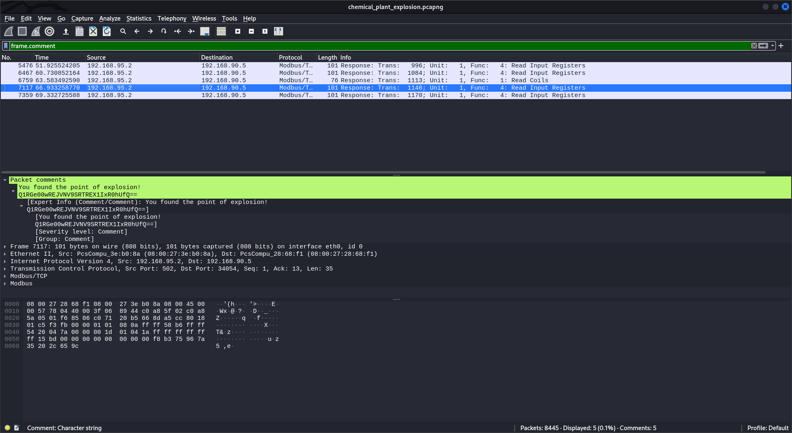
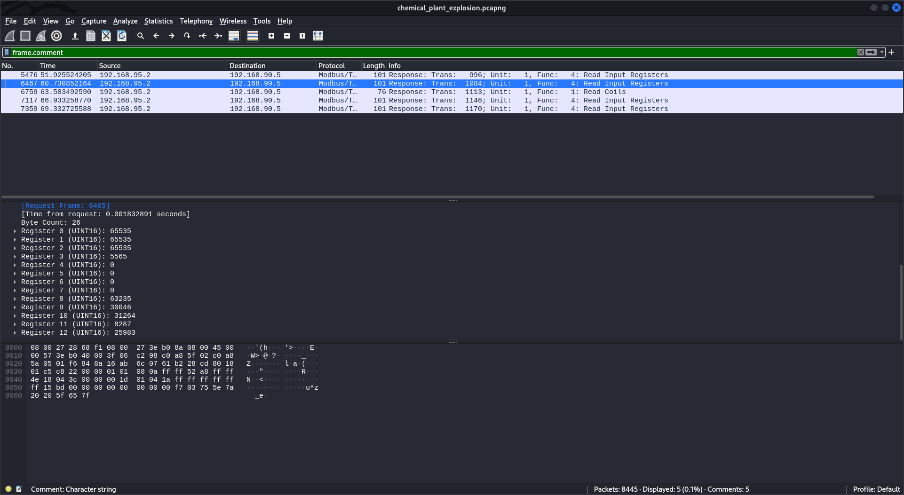
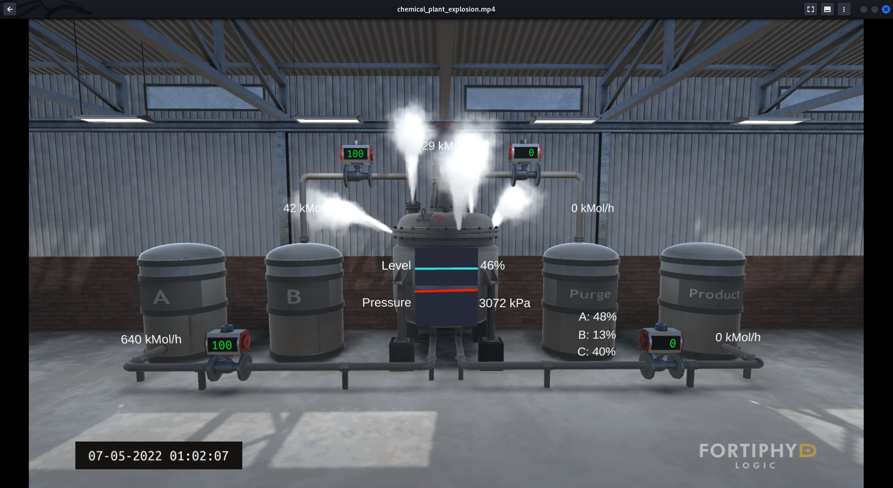

# [Easy] Chemical Plant (100 points)

> A chemical plant has exploded, can you help us investigate why this happened?
>
> Author information: This challenge is developed by [CRaghuraman@deloitteNL](https://portal.hackazon.org/www.linkedin.com/in/chandni-raghuraman).

Two challenge files `chemical_plant_explosion.pcapng` and `chemical_plant_explosion.mp4` have been provided.

### Find the Attack Point [10 points]

> Which component was altered in the plant? (Flag format: CTF{component})

We can take a look at the provided simulation video and notice that the pressure component of the chemical plant is being attacked. This gives us our first flag.

**Flag:** `CTF{pressure}`.

### Record Everything [40 points]

> We have files showing what happened during the attack. Can we pinpoint the exact moment of the attack in the network?

Run the `strings` command on the pcapng file.

```
...
local
u^z  _e
6 more seconds until the plant explodes, according to the video footage
u2^B/
q &`
u3^B/
u3^B/
...
```

We notice that some readable data is present in the packet capture. This kind of readable data is usually present as frame comments. Open up the packet capture in `Wireshark` and type `frame.comment` into the filter. We can find our second flag by looking at the comments and finding a Base64 encoding string.



Decoding the Base64 with `echo Q1RGe00wREJVNV9SRTREX1IxR0hUfQ== | base64 -d`, we find the flag.

**Flag:** `CTF{M0DBU5_RE4D_R1GHT}`

### Know the Limit [30 points]

> Can you find the setpoint value of the attacked component? HINT: A setpoint value does not change under any circumstance. (Flag format: CTF{(value)})

I'm not too sure what the value was because the CTF has concluded and there's no way for me to check flags again. If I recall correctly, it was one of the register values that can be seen in the below image.



### True or False [20 points]

> What type of data is stored in register coils? (Flag format: CTF{datatype})

The registers hold binary data.

**Flag:** `CTF{binary}`.


#### Additional Information

When watching the provided video simulation, we can see that "Fortiphyd Logic" is mentioned at the bottom-right. A quick Google search leads us to [this](https://www.fortiphyd.com/training/) site. From there, we can find a link to the [YouTube channel](https://www.youtube.com/channel/UCt8y1lf8UBoZipoLj0a8pVA) for Fortiphyd Logic. The videos uploaded on the channel show how the challenge was created and replicated - good insight and knowledge for solving the challenge.


