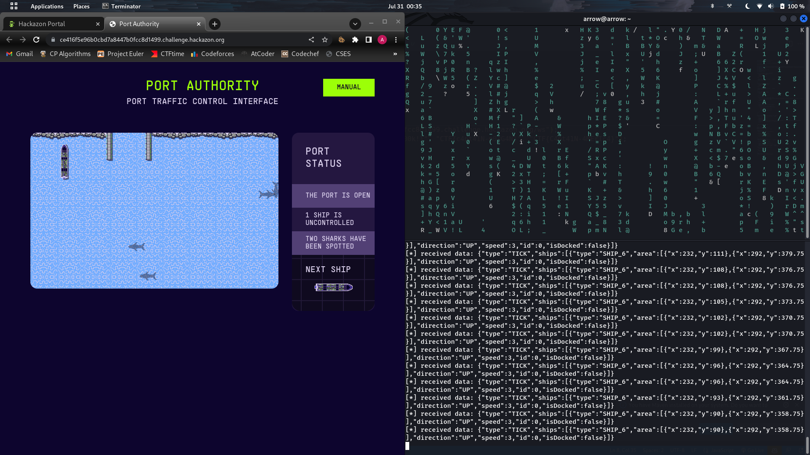
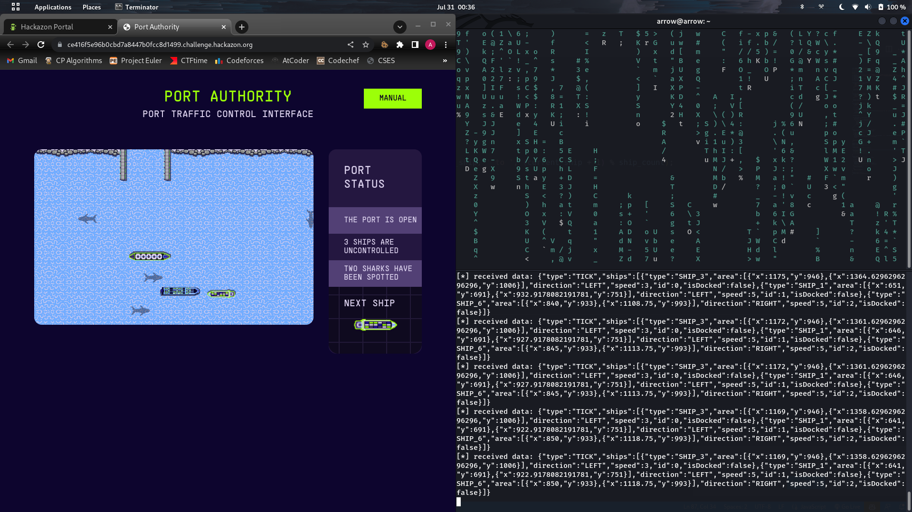
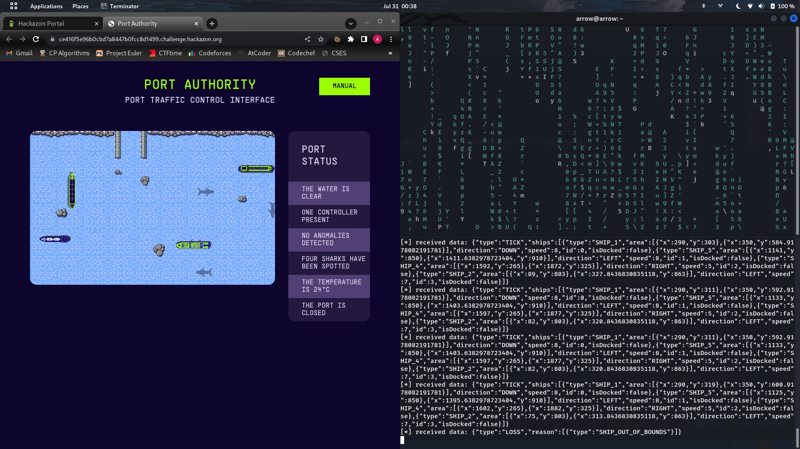
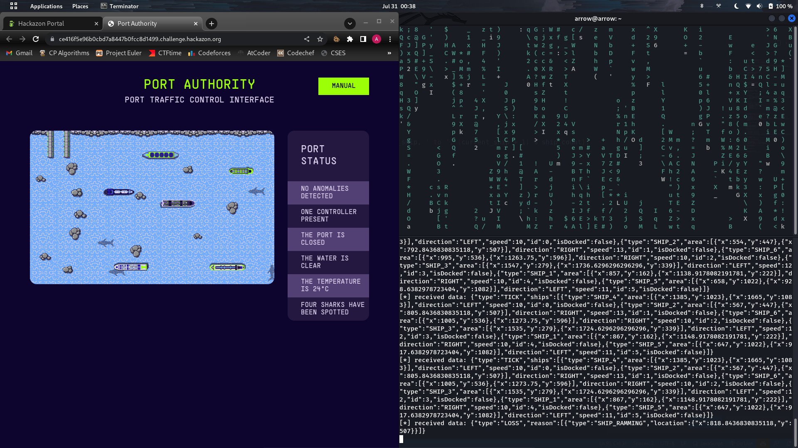

# [Hard] Port Authority (350 points)

> CHALLENGE INFORMATION
> The harbour is in total chaos, the ships are no longer on course. The AI has disabled the brakes of all the ships and corrupted our control > systems. The ships about to crash into each other, can you build a new AI that will rescue the ships and deliver the cargo?
>
> Author information: This challenge is developed by [Luuk Hofman](https://www.linkedin.com/in/luuk-hofman-01164259/) and [Diederik Bakker](https://www.linkedin.com/in/diederik-bakker/).

In order to solve the challenge, I tried implementing an automatic solver but couldn't get it to work correctly and optimally always. So, instead, I implemented a simple keyboard controlled and played the first 4 levels to victory. The controller code can be found at the bottom of this writeup.

The controls were as follows:
- TAB: Change to next boat id
- ESCAPE: Quit
- Any other key: Steer the boat to its next direction

### Level 1 [25 points]

> Do you know how websockets work?

Solved by manual play.



**Flag:** `CTF{CapTA1n-cRUCh}`

### Level 2 [25 points]

> Lets script it - don't forget the order!

Solved by manual play.



**Flag:** `CTF{capt41n-h00k!}`

### Level 3 [50 points]

> Can you deal with the rocks that appeared in our once so peaceful harbour?

Solved by manual play.


**Flag:** `CTF{c4pt41N-m0rG4N}`

### Level 4 [50 points]

> The algorithm disturbed our radar system - boats that veer too far off track are lost and never seen again. Can you give them directions in time?

Solved by manual play.



**Flag:** `"CTF{C4pt41N-4MErIc4}"`

### Level 5 [200 points]

> A huge influx of ships is coming our way - can you lead them safely to the port?

Unsolved.



```py
const keypress = require('keypress');
const WebSocket = require('ws');

const sleep = ms => new Promise(r => setTimeout(r, ms));

keypress(process.stdin);

var socket = new WebSocket("wss://2324a3dfee09fa84a657d1f48c45ccdc.challenge.hackazon.org/ws");
var passwords = ["", "CTF{CapTA1n-cRUCh}", "CTF{capt41n-h00k!}", "CTF{c4pt41N-m0rG4N}", "CTF{C4pt41N-4MErIc4}"];
var ship_count = 0;
var current_ship = 0;
var max_tick_wait_count = 50;
var tick_count = 0;
var aligned = false;

function start_game (level, password) {
  let data = JSON.stringify({
    "type": "START_GAME",
    "level": level,
    "password": password
  });

  console.log('[*] sending data: ' + data);
  socket.send(data);

};

function ship_steer (shipId) {
  let data = JSON.stringify({
    "type": "SHIP_STEER",
    "shipId": shipId
  });

  console.log('[*] sending data: ' + data);
  socket.send(data);
};

function handle_tick (data) {
  if (data['type'] != 'TICK')
    return;
  
  const ships = data['ships'];

  if (!aligned) {
    for (let i = 0; i < ship_count; ++i)
      if (i != ships[current_ship]['id'] && (ships[i]['direction'] == 'UP' || ships[i]['direction'] == 'DOWN'))
        ship_steer(ships[i]['id']);
    aligned = true;
  }
  
  ++tick_count;

  if (tick_count == max_tick_wait_count) {
    tick_count = 0;
    for (let i = 0; i < ship_count; ++i) {
      if (i != ships[current_ship]['id']) {
        sleep(3000);
        ship_steer(ships[i]['id']);
        sleep(3000);
        ship_steer(ships[i]['id']);
      }
    }
  }
};

process.stdin.on('keypress', function (ch, key) {
  console.log('[*] Keypress detected: ', key);

  if (key.name === 'escape')
    process.exit();
  if (key.name === 'tab') {
    console.log('[*] Current ship changed from ', current_ship, ' to ', (current_ship + 1) % ship_count);
    current_ship = (current_ship + 1) % ship_count;
    return;
  }
  
  ship_steer(current_ship);
});

process.stdin.setRawMode(true);
process.stdin.resume();
process.stdin.setEncoding('utf-8');

socket.onopen = (e) => {
  console.log('[*] connection opened');
  
  // start_game(1, passwords[0]);
  // start_game(2, passwords[1]);
  // start_game(3, passwords[2]);
  // start_game(4, passwords[3]);
  start_game(5, passwords[4]);
};

socket.onmessage = (e) => {
  console.log('[*] received data: ' + e.data);
  
  let data = JSON.parse(e.data);

  if (data['type'] == 'GAME_START') {
    console.log(data);
    ship_count = data['level']['ships'].length;
    console.log('[*] Number of ships: ', ship_count);
  }
  else if (data['type'] == 'WIN') {
    console.log(data);
  }
  else
    handle_tick(data);
};

socket.onclose = (e) => {
  console.log('[*] connection closed');
};
```
